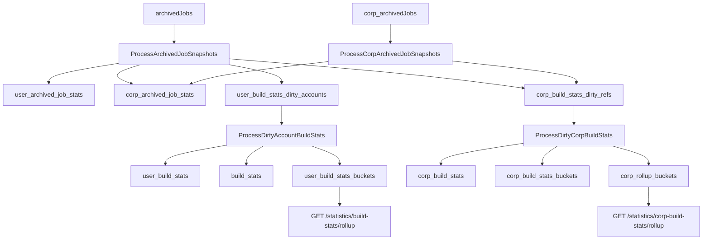
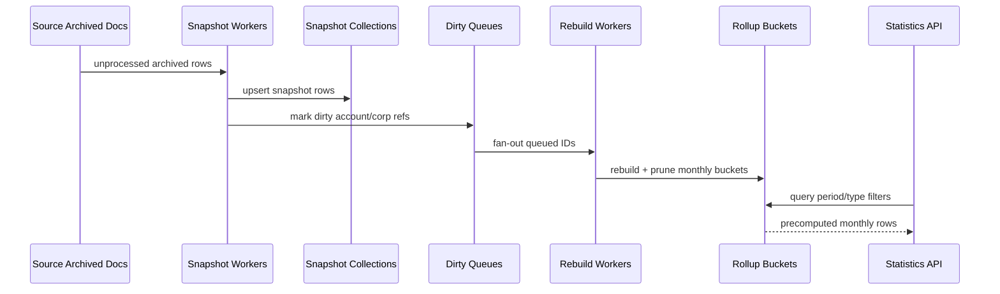

# Archived Jobs Workflow Reference

Comprehensive reference for the archived-jobs pipeline: data model, ownership rules, task flow, rebuild behavior, and API read paths.

Use this as the baseline for future archived stats work.

## Scope

This document covers:

- Archived job sources (`archivedJobs`, `corp_archivedJobs`)
- Snapshot generation (`user_archived_job_stats`, `corp_archived_job_stats`)
- Dirty queues and aggregate rebuild workers
- Monthly rollup bucket design (personal + corporation)
- Restore/removal recalculation behavior
- API endpoints that read archived aggregates
- Extras-by-category monthly aggregation behavior

## Design Goals

- Keep writes cheap and asynchronous.
- Keep dashboard/statistics reads fast via precomputed monthly rollups.
- Preserve data ownership boundaries (account vs corp-owned).
- Make recalculation idempotent and resilient to partial failures.
- Ensure delete/restore operations requeue all affected aggregates.

## High-Level Architecture

## Canonical Collections

- Source docs:
  - `archivedJobs` (account-owned archived docs)
  - `corp_archivedJobs` (corp-owned archived docs)
- Snapshot docs:
  - `user_archived_job_stats`
  - `corp_archived_job_stats`
- Dirty queues:
  - `user_build_stats_dirty_accounts`
  - `corp_build_stats_dirty_refs`
- Aggregates:
  - `user_build_stats`,
  - `corp_build_stats`
  - `user_build_stats_buckets`, `corp_build_stats_buckets`
  - `corp_rollup_buckets`

## Ownership and Routing Rules

### Snapshot destination

- Account archived job snapshots are computed by `ProcessArchivedJobSnapshots`.
- Each snapshot is routed to:
  - `corp_archived_job_stats` when it contributes to corp stats, or
  - `user_archived_job_stats` when personal-only.
- Corp-owned archived jobs are processed by `ProcessCorpArchivedJobSnapshots` and stored as corp snapshots.

### Personal vs corporation aggregation

- Personal rollups read from `user_build_stats_buckets`.
- Corporation rollups read from `corp_rollup_buckets`, filtered by:
  - `corpRef`, and
  - lane in `{ "~", accountID }` (`~` means corp-owned lane).

### CorpRef

- Corp identity is represented as opaque `corpRef` (HMAC-backed).
- API handlers resolve `corporation_id -> corpRef`.
- Workers use `corpRef` for queueing, document IDs, and pruning.

## Snapshot Build Semantics

Snapshot construction happens in `services/worker/tasks/archivedjobs/helpers/snapshot_builder.go`.

For each archived job snapshot:

- Material/install/invention/extra totals are captured.
- Transaction and broker fee lines are normalized with year/month.
- Unsold quantity/cost are computed.
- Cost attribution month is pinned (`costYear`, `costMonth`) using:
  1. Earliest linked install month
  2. Earliest transaction month fallback
  3. Archived date fallback

This avoids month skew when snapshots are recalculated later.

## Extras Category Aggregation (Monthly)

### Source of values

- Extras values come from `job.build.costs.extrasCosts[*].extraValue`.
- Category key comes from `extrasCosts[*].category`.
- Empty category is normalized to `"0"` (unassigned).

### Snapshot storage

- Per-snapshot category sums are stored in:
  - `ArchivedJobStats.ExtraCategoryTotals` (`map[string]float64`)

### Monthly rollup storage

- During personal/corp monthly accumulation, snapshot category totals are merged into:
  - `UserRollupMonthlyBucket.ExtraCategoryTotals`
  - `CorpRollupMonthlyBucket.ExtraCategoryTotals`
  - API `BuildStatsRollupTotals.ExtraCategoryTotals`

### Category metadata (labels)

- Category definitions live in `application_settings.extrasCategories`.
- Current rollup payloads aggregate by category ID.
- Label resolution is expected to be applied by consumers (or by a future API enrichment layer).

### Corp-owned jobs from user context

- Corporation docs do not currently define independent extras categories.
- For corp-related data sourced from user jobs, category IDs from that user’s job extras are preserved into snapshots/rollups.

## Worker Pipeline

### Scheduled fan-out cadence

Configured in `services/core/scheduler/archivedjobs/process_build_stats.go`:

- `:00` `ProcessArchivedJobSnapshots` fan-out per account
- `:15` `ProcessDirtyCorpBuildStats` fan-out per dirty corp ref
- `:30` `ProcessCorpArchivedJobSnapshots` fan-out per corp ref
- `:45` `ProcessDirtyAccountBuildStats` fan-out per dirty account

### Account snapshot worker

`ProcessArchivedJobSnapshots`:

- Reads unprocessed `archivedJobs` for an account.
- Builds snapshot docs.
- Upserts into snapshot collection (with mirror cleanup).
- Marks archived job as processed.
- Marks dirty account queue.
- Marks dirty corp refs (before/after union strategy).

### Corp snapshot worker

`ProcessCorpArchivedJobSnapshots`:

- Reads unprocessed `corp_archivedJobs` for one corp ref.
- Builds corp snapshots.
- Upserts to corp snapshot collection.
- Marks archived corp job as processed.
- Marks dirty corp refs.

### Dirty account rebuild worker

`ProcessDirtyAccountBuildStats`:

- Rebuilds account-level aggregates from snapshots.
- Rebuilds monthly personal rollups in `user_build_stats_buckets`.
- Prunes stale rows not produced in current pass.
- Clears processed dirty account queue entries.

### Dirty corp rebuild worker

`ProcessDirtyCorpBuildStats`:

- Streams corp snapshots and incrementally accumulates:
  - lifetime corp stats
  - timeline corp buckets
  - monthly corp rollups
- Writes `corp_build_stats`, `corp_build_stats_buckets`, `corp_rollup_buckets`.
- Prunes stale docs for targeted refs.
- Clears dirty corp queue entries.

## Recalculation Triggers (Delete / Restore / Revoke)

### Remove account archived job

`RemoveAccountArchivedJob`:

- Deletes archived source row and associated snapshot rows.
- Marks both:
  - account dirty queue
  - affected corp refs dirty queue

### Remove corp archived job

`RemoveCorpArchivedJob`:

- Deletes corp archived source row and snapshot rows.
- Marks affected corp refs dirty.
- Does not mark account dirty for pure corp-owned rows.

### Restore archived job

`PostRestoreArchivedJobHandler`:

- Rehydrates archived doc into live `user_job_documents`.
- Revokes snapshot rows (`revoked = true`).
- Deletes archived source row.
- Marks account and affected corp refs dirty.

These guarantees ensure monthly buckets and totals are recomputed after state transitions.

## API Read Path

### Statistics router

`/api/v1/statistics/*` routes include:

- `/build-stats`
- `/build-stats/timeline`
- `/build-stats/snapshots`
- `/build-stats/rollup`
- `/corp-build-stats`
- `/corp-build-stats/timeline`
- `/corp-build-stats/rollup`

### Rollup endpoint behavior

`GetBuildStatsRollupHandler`:

- Reads `user_build_stats_buckets`.
- Filters by account, period, optional `typeID`.
- Merges into totals + optional `byType`.

`GetCorpBuildStatsRollupHandler`:

- Validates corp scope from JWT.
- Resolves `corpRef`.
- Reads `corp_rollup_buckets` for lanes `{ "~", accountID }`.
- Filters by period + optional `typeID`.
- Merges into totals + optional `byType`.

## Data Lifecycle Diagram

## Consistency and Idempotency Rules

- Snapshot writes are upserts keyed by deterministic IDs.
- Aggregate rebuilds are full recomputations for targeted account/corp refs.
- Pruning removes stale docs not regenerated in the rebuild pass.
- Dirty queues are edge-triggered and safe to replay.
- Revoked snapshots are excluded from active aggregation.

## Index and Performance Notes

- Snapshot and rollup collections rely on purpose-built indexes (including partial filters where applicable).
- Corp dirty rebuild uses streaming accumulation to avoid loading full corp corpus into memory.
- Rollup endpoints avoid expensive snapshot scans by reading precompiled monthly buckets.

## Operational Checklist for Future Changes

When changing archived-job logic, verify all of:

1. Snapshot builder still emits correct fields for new data.
2. Dirty queues are marked for every mutating path (archive/remove/restore/revoke).
3. Rebuild workers accumulate new fields and prune stale docs.
4. Rollup query merge includes new totals.
5. Relevant indexes support the new read/write filters.
6. API contracts (`models.BuildStatsRollupResponse`) reflect new fields.
7. Tests cover regression cases for personal and corp paths.

## File Map (Primary)

- Scheduler:
  - `services/core/scheduler/archivedjobs/process_build_stats.go`
- Snapshot workers:
  - `services/worker/tasks/archivedjobs/snapshot_account.go`
  - `services/worker/tasks/archivedjobs/snapshot_corp.go`
  - `services/worker/tasks/archivedjobs/helpers/snapshot_builder.go`
- Rebuild workers:
  - `services/worker/tasks/archivedjobs/buildstats_account.go`
  - `services/worker/tasks/archivedjobs/buildstats_corp.go`
  - `services/worker/tasks/archivedjobs/rollup_monthly_rebuild.go`
  - `services/worker/tasks/archivedjobs/helpers/rollup_buckets.go`
- Mutating handlers/helpers:
  - `services/worker/tasks/archivedjobs/removal.go`
  - `services/api/v1endpoints/archivedjobs/restoreHandler.go`
- API:
  - `services/api/v1endpoints/statistics/router.go`
  - `services/api/v1endpoints/statistics/getBuildStatsRollup.go`
  - `services/api/v1endpoints/statistics/rollup_buckets_query.go`
- Models:
  - `services/shared/shared/models/archived_job_stats.go`
  - `services/shared/shared/models/build_stats.go`

## Maintenance Note

Keep this document updated whenever archived workflow behavior, schema, queues, or read contracts change.
