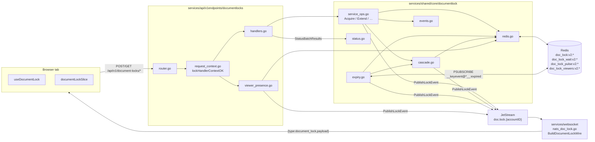
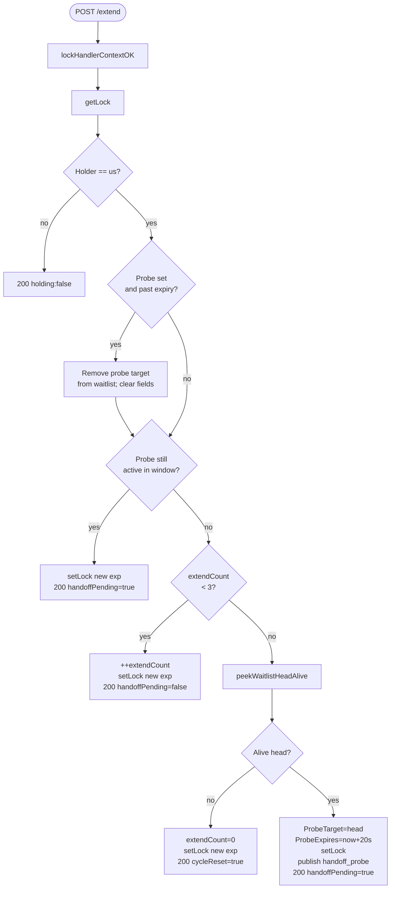

# Backend — document lock

Authoritative lock state, transition enforcement, cascade handling and TTL
promotion live in **`services/shared/core/documentlock`**. Redis is the source
of truth; the API HTTP package is a thin adapter; JetStream broadcasts to the
websocket service which fans out to the SPA.

Source tree:

```
services/shared/core/documentlock/
  deps.go, redis.go, viewer.go, status.go, payload.go, events.go
  publish.go, notify.go, cascade.go, expiry.go
  service.go, service_ops.go
  *_test.go

services/api/v1endpoints/documentlocks/
  router.go              HTTP route table
  request_context.go     auth + body parse preamble
  handlers.go            thin wrappers → documentlock.Service
  lock_json.go           writeExtendJSON for /extend
  viewer_presence.go     /viewer-arrived /viewer-departed

services/api/main.go     documentlock.StartExpirySubscriber

services/websocket/server/nats_doc_lock.go         — doc.lock consumer
services/websocket/server/natslogic/locks.go       — BuildDocumentLockWire wrapper
```

Frontend pairing: [FRONTEND.md](./FRONTEND.md). Cross-stack overview / wire
contract: [README.md](./README.md).

## Architecture



## HTTP surface

Mounted from `router.go` at `/api/v1/document-locks/{action}`.

| Method | Path | Body | Status | Notes |
|---|---|---|---|---|
| POST | `/acquire` | `{collection,docID}` | 201 granted / 200 contended | Returns `acquired`, `held`, `expiresAtUnix`, `ttlSeconds`, `viewerCount`. Group `/acquire` also runs `ReleaseStaleDependentJobLocksAfterGroupGrant`. |
| POST | `/extend` | `{collection,docID}` | 200 | Cycle: 3 free renewals → 4th renewal probes alive waitlist head. Returns `holding`, `expiresAtUnix`, `extendCount`, `handoffPending`, `probeTargetSessionID`, `probeExpiresAtUnix`, `cycleReset`. |
| POST | `/release` | `{collection,docID}` | 204 | Holder-only. Deletes the row + publishes `released`. |
| POST | `/hand-over` | `{collection,docID}` | 200 transferred / 204 noop / 204 released | Holder accepts request snackbar. Promotes alive waitlist head atomically; falls back to plain `released { reason: hand_over_no_queue }` when no live requester. Group → cascade. |
| POST | `/request` | `{collection,docID}` | 201 auto-grant / 200 already mine / 202 queued | Returns `accessRequestGranted` on grant. Group auto-grant → `ReleaseStaleDependentJobLocksAfterGroupGrant`. |
| POST | `/status-batch` | `{jobDocIDs,groupDocIDs}` | 200 | Both arrays ≤ 500. Returns `jobResults`, `groupResults` maps. |
| GET | `/status?collection=&docID=` | — | 200 | Per-doc lookup. Same shape as one row of `/status-batch`. |
| POST | `/claim-handoff` | `{collection,docID}` | 200 / 409 / 400 | Probe target acknowledges and takes the lock. Group → cascade. |
| POST | `/waitlist-pulse` | `{collection,docID}` | 204 | Refreshes `doc_lock_pulse:v2:...:sessionID` (waitlist liveness). |
| POST | `/viewer-arrived` | `{collection,docID}` | 204 | Viewer registers; ZADD + publish `viewer_joined` when newly added. Holder requests are no-op. |
| POST | `/viewer-departed` | `{collection,docID}` | 204 | ZREM + publish `viewer_left` when removal hit. Also reachable via `navigator.sendBeacon`. |

Auth + body parse share the `lockHandlerContextOK(w, r, redis)` helper —
every mutating handler bails immediately if the helper writes a 4xx/5xx.

## Redis key layout

`redis.go` declares the prefixes; `keyPartSep = "\x1e"` keeps the parts
unambiguous (Mongo collection names and doc ids cannot contain this byte).

| Key | Type | TTL | Purpose |
|---|---|---|---|
| `doc_lock:v1:{collection}:{docID}` | string (JSON `LockRecord`) | `DefaultLockTTL` | Legacy layout, still read on `GET` fallback. New writes target v2. |
| `doc_lock:v2:{accountID}\x1e{collection}\x1e{docID}` | string (JSON `LockRecord`) | `DefaultLockTTL` (5 min) | Current canonical lock row. v2 includes the accountID so the expiry subscriber can route notifications. |
| `doc_lock_wait:v2:{accountID}\x1e{collection}\x1e{docID}` | list (`sessionID` strings) | — (managed by LREM) | Request queue. RPUSH on `/request`, peeked alive and LREM on grant. |
| `doc_lock_pulse:v2:{accountID}\x1e{collection}\x1e{docID}\x1e{sessionID}` | string `"1"` | `WaitlistPulseTTL` (2 min) | Liveness check for a waitlist entry. Set by `/request`, refreshed by `/waitlist-pulse` (client) and `peekWaitlistHeadAlive` filters stale heads. |
| `doc_lock_viewers:v2:{accountID}\x1e{collection}\x1e{docID}` | sorted set (member=`sessionID`, score=`now+TTL`) | per-member score sweep | Passive viewer registry. ZADD on `/viewer-arrived`, ZREM on `/viewer-departed`, `pruneAndCountViewers` ZREMRANGEBYSCORE on every `/status` read. |

### `LockRecord`

```go
// services/shared/core/documentlock/redis.go
type LockRecord struct {
    HolderSessionID      string `json:"holderSessionID"`
    AccountID            string `json:"accountID"`
    ExpiresAtUnix        int64  `json:"expiresAtUnix"`
    ExtendCount          int    `json:"extendCount,omitempty"`
    ProbeTargetSessionID string `json:"probeTargetSessionID,omitempty"`
    ProbeExpiresAtUnix   int64  `json:"probeExpiresAtUnix,omitempty"`
}
```

`GetLock` defensively re-deletes the row if it reads a record with
`ExpiresAtUnix` already in the past (covers cases where Redis hasn't yet
processed the TTL).

## Constants

```go
DefaultLockTTL                    = 5 * time.Minute        // lease + Redis key TTL
MaxExtensionsBeforeHandoffConsult = 3                      // extends before probing waitlist
ProbeAckWaitSeconds               = 20                     // claim window for probe target
WaitlistPulseTTL                  = 2 * time.Minute        // alive marker for waitlist entries
ViewerPresenceTTL                 = 5 * time.Minute        // ZSET score window
MaxStatusBatchDocs                = 500                    // per array cap
```

The frontend mirrors these in
`frontend/src/Functions/DocumentLock/documentLockTimings.js`; pulses and
extend intervals are set below their respective TTLs.

## Handler context (`request_context.go`)

Every mutating handler starts the same way:

```go
hc, ok := lockHandlerContextOK(w, r, clients.Redis)
if !ok {
    return  // 4xx/5xx already written
}
// hc.Ctx, hc.AccountID, hc.SessionID, hc.Collection, hc.DocID, hc.Redis
```

The helper validates:

- `accountID` from JWT (writes 401 otherwise);
- `session_id` claim present (400);
- body parses + `collection` and `docID` non-empty (400);
- `clients.Redis != nil` (503).

This is the only place where the preamble error responses are written, so
every handler keeps the same shape: 4xx/5xx for missing prerequisites,
business logic from there on.

## Lease extension state machine

`handleExtend` in `handlers.go` is the only place `lockRecord` mutates the
extend / probe fields. The decision tree:



The client mirrors the cycle: every 3 renewals it expects the next `/extend`
to either reset (no queue) or probe (queue exists). The probe target receives
the WS event, auto-fires `/claim-handoff`, and the lock atomically transfers
on the server.

## Handoff (`promoteWaitlistHead`)

`redis.go::PromoteWaitlistHead` is the shared atomic transfer used by
`/hand-over` (interactive holder accept) and the expiry subscriber. It:

1. Peeks the alive waitlist head (`peekWaitlistHeadAlive` filters stale heads
   by checking their `doc_lock_pulse:v2:...` key).
2. Returns `(head, &rec, true, nil)` after writing a new `lockRecord` with
   `HolderSessionID = head`, fresh `ExpiresAtUnix`, zero `ExtendCount` and
   no probe fields. The waitlist `LREM` is best-effort — if it fails the next
   pulse-check filters the stale entry anyway.
3. Returns `(_, _, false, nil)` when no live head exists; callers decide
   whether to plain-`/release` (handover) or publish `expired` (subscriber).

The returned record is what callers feed to `buildHandoffCompletedPayload` so
all three publish sites emit a uniform shape (see [events.go](#events--reasons) in `documentlock`).

## Cascade

```mermaid
flowchart LR
  GroupHandoff["group lock rotates<br/>(handoff or TTL promotion)"]
  CD["cascadeReleaseDependentJobLocks<br/>(driver in documentlock/cascade.go)"]
  Decide["decide(rec) → (release?, attribTo)"]
  PerJob["For each jobID in group.IncludedJobIDs"]
  Del["deleteLock"]
  Pub["publish released<br/>reason=group_handoff_cascade"]

  GroupHandoff --> CD
  CD --> PerJob
  PerJob -->|"getLock"| Decide
  Decide -->|"release=true"| Del
  Del --> Pub
  Decide -->|"release=false"| PerJob
```



Two predicates live in `documentlock/cascade.go`:

- **`decideHandoffCascadeRelease(rec, oldHolderSessionID)`** — used by
  `/hand-over` and `/claim-handoff`. Releases per-job locks held by the *old
  group holder* only; jobs belonging to anyone else stay put.
- **`decideStaleAfterGrantRelease(rec, newGroupHolderSessionID)`** — used by
  `/request` (auto-grant on orphaned group), `/acquire` (first-grant), and
  the TTL promotion path in the expiry subscriber. Releases per-job locks
  held by *anyone other than* the new group holder. The previous holder's
  session id isn't available in these paths (the record was already evicted
  by Redis), so the rule is "anything misaligned with the new owner".

Both predicates feed `cascadeReleaseDependentJobLocks`, which loads the
group's `IncludedJobIDs` from Mongo, checks each per-job lock, releases the
ones the predicate flags, and publishes a `document_lock_released` event
tagged with `reason: group_handoff_cascade` and `cascadedFromGroupID`.

The cascade is failure-tolerant: per-job errors are logged but never unwind
the parent handoff. The worst case is that the next planner-sync sweep
reconciles instead of being immediate.

## TTL expiry subscriber

`expiry.go` runs one goroutine per API replica:

```go
pubsub := rdb.PSubscribe(ctx, "__keyevent@*__:expired")
```

Requires `notify-keyspace-events Ex` on the Redis instance.

On each expired key:

1. `ParseExpiredLockKey` filters out anything that isn't a `doc_lock:v2:` row.
2. `promoteWaitlistHeadOnExpiry` (thin wrapper over `promoteWaitlistHead`)
   tries to install the alive waitlist head.
3. If promoted → publish `handoff_completed { reason: ttl_promotion }`.
   Otherwise → publish `expired { reason: ttl }`.
4. If the collection is `user_job_groups` and a promotion happened, run
   `ReleaseStaleDependentJobLocksAfterGroupGrant` so per-job locks held by
   the dead holder don't linger.

All publishes route through `publishLockEvent` (which adds `accountID` and
calls `doclock.PublishDocLockNotification`), so the wire shape is uniform
with handler-driven events.

## Viewer presence (`viewer_presence.go`)

A passive viewer is anyone showing the doc read-only because another session
holds the lock. The data:

- ZSET `doc_lock_viewers:v2:{accountID}\x1e{collection}\x1e{docID}` with
  `member = sessionID, score = now + ViewerPresenceTTL`.
- `addViewer` ZADDs and returns `newlyAdded` so we only publish on a real
  transition (not on a re-mount within the TTL).
- `removeViewer` ZREMs and returns `wasPresent` for the same reason.
- `pruneAndCountViewers` ZREMRANGEBYSCORE-then-ZCARD; called on every
  `/status` and `/status-batch` read so the count returned to clients is
  always fresh.

Holders are deliberately *not* tracked as viewers: `/viewer-arrived` reads
the current `lockRecord` and bails if the requester is the holder. This
guards against a transient `readOnly` burst (during a sync) accidentally
adding the holder's own sessionID to the viewer set.

## Status payload

`handlers.go::statusPayloadForDoc(ctx, clients, accountID, collection,
docID)` builds the row returned by both `/status` and each entry in
`/status-batch`:

```jsonc
// rec present
{
  "held": true,
  "holderSessionID": "...",
  "expiresAtUnix": 1731435678,
  "ttlSeconds": 300,
  "secondsRemaining": 248,
  "extendCount": 1,
  "viewerCount": 2,
  "waitlistLen": 0,
  "probeTargetSessionID": "...",   // omitted unless probe active
  "probeExpiresAtUnix": 1731435700
}

// rec nil (no holder)
{ "held": false, "viewerCount": 0 }
```

Frontend mapping:
`frontend/src/Functions/DocumentLock/applyDocumentLockStatusFromPayload.js`.

`/status-batch` (`documentlock/status.go::StatusBatchResults`) iterates both arrays
and produces:

```json
{ "jobResults": { "<docID>": <statusRow>, ... },
  "groupResults": { "<docID>": <statusRow>, ... } }
```

with caps `len(jobDocIDs) <= 500` and `len(groupDocIDs) <= 500`. Error
cases use sentinel errors (`ErrStatusBatchEmpty`, `ErrStatusBatchTooMany`,
`ErrLocksUnavailable`) so the websocket handler can reuse the same body.

## Events / reasons

`documentlock/events.go` is the single declaration point. The websocket service does not
add or rename types; it only wraps the payload in
`{type:document_lock,payload}` (see `BuildDocumentLockWire`).

```go
LockEventAcquired         = "document_lock_acquired"
LockEventReleased         = "document_lock_released"
LockEventRequested        = "document_lock_requested"
LockEventExpired          = "document_lock_expired"
LockEventHandoffProbe     = "document_lock_handoff_probe"
LockEventHandoffCompleted = "document_lock_handoff_completed"
// viewer_presence.go:
LockViewerEventJoined     = "document_lock_viewer_joined"
LockViewerEventLeft       = "document_lock_viewer_left"

// reasons (string field on the event):
LockHandoffReasonHolderHandover = "holder_handover"
LockHandoffReasonTTLPromotion   = "ttl_promotion"      // documentlock/expiry.go
LockReleaseReasonHandOverNoQueue   = "hand_over_no_queue"
LockReleaseReasonGroupHandoffCascade = "group_handoff_cascade"  // documentlock/cascade.go
LockExpiryReasonTTL = "ttl"                            // documentlock/expiry.go
```

`buildHandoffCompletedPayload(collection, docID, newHolderSessionID,
expiresAtUnix, opts)` centralises the `handoff_completed` shape:

```go
type HandoffCompletedOpts struct {
    PreviousHolderSessionID string  // omitted on TTL promotion (record evicted)
    Reason                  string  // empty on /claim-handoff
}
```

Each emitted payload is uniform across the three sites (`/hand-over`,
`/claim-handoff`, expiry subscriber) but only includes optional fields when
set.

## Publish path

`handlers.go::publishLockEvent(ctx, clients, accountID, payload)` is the
single publish funnel. It:

1. Injects `accountID` into the payload (also encoded by subject, but kept
   on the body so the frontend's CustomEvent detail is self-contained).
2. Calls `doclock.PublishDocLockNotification` which publishes to
   `doc.lock.{accountID}` on JetStream.

The websocket service consumes `doc.lock.>` on a per-replica durable
(`nats_doc_lock.go`), unmarshals the payload, wraps it via
`BuildDocumentLockWire`, and `broadcastRawToAccount` fans it out to every
connected tab for that account.

## Testing

| Test file | Covers |
|---|---|
| `events_test.go` | `buildHandoffCompletedPayload` shape for the three call-site configurations (claim-handoff / hand-over / TTL promotion). |
| `documentlock/redis_test.go` | `ParseExpiredLockKey`, `SetLock`/`GetLock`/`DeleteLock` round-trips, waitlist helpers, pulse-driven alive-head filter, `PromoteWaitlistHead`, `LockHeldByOther`. Uses `miniredis`. |
| `cascade_test.go` | `decideHandoffCascadeRelease` and `decideStaleAfterGrantRelease` predicate tables. |

`miniredis` is used for any test touching key layout / TTL semantics so the
suite runs without a real Redis. Cascade tests are pure predicate tests (no
Mongo/Redis dependency).

## Ops + deployment notes

- **Redis keyspace events.** `notify-keyspace-events Ex` is required for the
  TTL subscriber. Without it, expired leases still vacate (Redis evicts the
  row), but the waitlist promotion + `expired`/`handoff_completed` events
  never publish — the system falls back to the client-side 45 s status
  heartbeat and feels sluggish.
- **One subscriber per replica.** `StartExpirySubscriber` runs unconditionally
  on each API replica. Concurrent processing of the same event is harmless:
  `promoteWaitlistHead` is idempotent (a second peek either returns the new
  holder unchanged or no head at all) and `deleteLock` on the cascade is a
  no-op when the key is already gone.
- **JetStream stream.** Lock events use the shared `doc.update` JetStream
  stream under subject prefix `doc.lock.>` (see
  `natscore.EnsureDocUpdateStream`). Consumer durable name comes from
  `natslogic.DocLockConsumerConfig()` and includes the replica suffix so
  every websocket replica gets every event.
- **No durable retention requirement.** Lock events are inherently transient
  — late delivery only matters for the 5 s read-only grace window. Subjects
  use `AckExplicit` with delivery-count metrics but no replay strategy.

## Adding a new lock-aware endpoint

To extend the system with a new mutating endpoint:

1. **Add the route** in `router.go`.
2. **Use the handler context.**

```go
func handleNewThing(w http.ResponseWriter, r *http.Request, clients *shared.ServiceClients) {
    hc, ok := lockHandlerContextOK(w, r, clients.Redis)
    if !ok {
        return
    }
    // … hc.Ctx, hc.AccountID, hc.SessionID, hc.Collection, hc.DocID, hc.Redis
}
```

3. **Use the helpers.** Always go through `getLock` / `setLock` /
   `deleteLock` / `promoteWaitlistHead` rather than touching keys directly —
   they handle v1/v2 dual-read, JSON round-trip and TTL semantics for you.
4. **Publish through `publishLockEvent`.** Any new event payload should
   carry `type`, `collection`, `docID` at minimum. If it's a handoff
   variation, use `buildHandoffCompletedPayload`. If it's a new
   `type`/`reason`, add the constant to `documentlock/events.go` *and*
   `frontend/src/Functions/DocumentLock/documentLockEvents.js` in the same
   change.
5. **If it transfers group ownership**, call `releaseDependentJobLocksOnGroupHandoff`
   (when you know the old holder id) or
   `ReleaseStaleDependentJobLocksAfterGroupGrant` (when you only know the
   new holder).
6. **Test it.** Predicate-shaped logic lives in named functions for a
   reason — they're easy to drive from the existing `*_test.go` files. Add
   `miniredis`-backed integration coverage for any new key shape.

## Common pitfalls

- **Forgetting the cascade on a new group-handoff path.** Any path that
  transfers a `user_job_groups` lock must call one of the two cascade
  helpers, or per-job locks held by the old holder linger until their own
  TTL (5 min) fires.
- **Touching the waitlist without a pulse refresh.** Both
  `peekWaitlistHeadAlive` and `/claim-handoff` filter heads by pulse. If a
  new code path enqueues a session without `touchWaitlistPulse`, that
  session will be silently skipped on every probe.
- **Adding a new event type backend-only.** Frontend hooks branch on `type`
  strings; an unknown type is silently dropped. Add the constant to both
  sides in the same change and update the contract table in [README.md](./README.md).
- **Reading `lockRecord` directly from Redis in another package.** The
  package-private layout is intentional; cross-package consumers must go
  through helpers like `LockHeldByOther`, `LockKeyV2`, or `DeleteDocLock` so
  the JSON round-trip + dual-read remain centralised.
- **Treating `accountID` in the payload as redundant.** The NATS subject
  also encodes it, but the publish funnel injects it onto the payload so the
  frontend CustomEvent's `detail` is self-contained — don't strip it.
