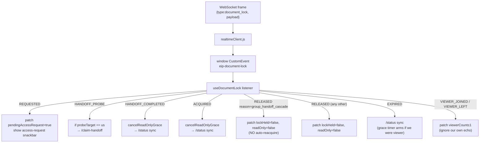
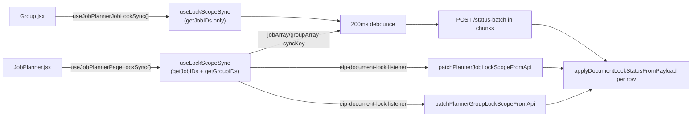

# Frontend — document lock

Per-tab edit gating, lock-state mirror, and the header affordance that lets
you request access, accept hand-overs, or take over an orphaned lock.

Source tree:

```
frontend/src/
  Functions/DocumentLock/      — pure helpers + Zustand selectors + constants
  Hooks/DocumentLock/          — useDocumentLock + sync hooks + ID-shaped read hooks
  Components/DocumentLock/     — header control + LockGatedTooltip
  Zustand/
    documentLockSlice.js       — scope state + actions
    headerDocumentLockUISlice.js — which scope drives the header
  Events/
    headerDocumentLockEvents.js
    editJobReleaseRequestEvents.js
  Functions/Endpoints/Pirivate/documentLockClient.js — REST/WS client
  Realtime/realtimeClient.js   — WS envelope → CustomEvent dispatch
```

Backend pairing: [BACKEND.md](./BACKEND.md). Wire contract: [README.md](./README.md#wire-contract-frontend--backend).

## State shape

### Per-scope (`documentLockSlice`)

Each `(collection, docID)` pair becomes one entry in
`documentLock.scopes[documentLockKey(collection, docID)]`. The merged
shape:

```js
// frontend/src/Functions/DocumentLock/documentLockScope.js
{
  readOnly: false,                       // another session holds the lock
  lockHeld: false,                       // we hold the lock
  pendingAccessRequest: false,           // someone queued while we hold
  lockExpiresAtUnix: null,               // current lease end, unix seconds
  lockTtlSeconds: null,                  // current lease length
  extendSegmentCount: null,              // renewals used (0..3)
  waitlistLen: null,                     // queue length, drives header copy
  handoffPendingHolder: false,           // probe in flight, hourglass icon
  pendingHandoffOfferClientID: null,     // probe target (sessionID)
  pendingHandoffExpiresAtUnix: null,
  handoffOfferForMe: false,              // probe target == us
  waitingInHandoffQueue: false,          // we POSTed /request, queued
  viewerCount: 0,                        // # passive viewers
}
```

Two scopes can be alive at once (the Edit Job page registers both the job
scope and the parent group scope). Each scope owns its own grace timer, extend
loop, viewer registration and so on.

### Header registrations (`headerDocumentLockUISlice`)

A single array describing which scopes the active page wants reflected in the
header lock icon:

```js
{
  registrations: [
    { collection, docID, enabled, readOnlyMessage, label, treeOwnership }
  ]
}
```

The first **enabled** entry with a non-empty `docID` is the **primary** —
drives icon visibility, popover copy, and the "Request access" / "Take over"
buttons. Subsequent entries surface as secondary rows in the popover and feed
the `secondaryContended` flag so the icon also appears when *they* have
contention (e.g. uncontested job lock but contended parent group).

Ordering rule lives in
`documentLockHeaderSelectors.js::primaryHeaderRegistration`: job scopes win
over group scopes, then registration order.

## The hook: `useDocumentLock(collection, docID, enabled, options?)`

`frontend/src/Hooks/DocumentLock/useDocumentLock.js` is the single hook a page
mounts per editable document. Pages: Edit Job (job + group), Group page,
anywhere else that wants exclusive edit semantics.

Responsibilities, all driven from one mount/unmount:

| Effect | Behaviour |
|---|---|
| **Mount / docID change** | `tryAcquire` → 201 (we hold), 200/409 with `held:true` (read-only viewer), or transient lock-vanished → patch cleared. |
| **Unmount / docID change** | Cancel grace timer, `/release` (only if we held), clear our scope, reset internal refs. |
| **Extend loop** | Every `LOCK_EXTEND_INTERVAL_MS` while we hold and tab is visible → `/extend` → patch new expiry. |
| **Status sync heartbeat** | Every `LOCK_STATUS_SYNC_INTERVAL_MS` → `/status` (self-heal). |
| **Post-expiry resync** | Every `LOCK_EXPIRY_RESYNC_INTERVAL_MS` while cached `expiresAtUnix` is already past. |
| **Visibility / online** | On `visibilitychange` → resync + maybe `/extend`; on `online` → resync. |
| **Waitlist pulse loop** | While `waitingInHandoffQueue` → `/waitlist-pulse` every `LOCK_WAITLIST_PULSE_INTERVAL_MS`. |
| **Viewer presence** | When `readOnly: true` becomes true → `/viewer-arrived`; cleanup → `/viewer-departed` (+ `sendBeacon` on `pagehide`). |
| **Vacancy snackbar** | When `lockHeld` transitions to true after we were `readOnly`, show a snackbar (request fulfilled OR another session ended). Suppressed within 2 s of an explicit grant API (see `documentLockAcquireFeedback.js`). |
| **WS event listener** | Listens on `DOCUMENT_LOCK_CUSTOM_EVENT`; branches on inner `type` (see below). |

### CustomEvent → state mapping



The `group_handoff_cascade` branch is the subtle one: we patch directly
instead of going through `/status` because `/status` would see `held:false`
and trigger our auto-reacquire path on the former group holder, defeating the
server-side cascade.

### `syncLockFromServer` — three branches

When the heartbeat or a WS event triggers a sync, the response shape decides:

1. **`held:true && holderSessionID == me`** → we hold. Patch `lockHeld:true`,
   pick up extend count / waitlist len / probe state. The header reads
   `lockHeld` and shows the holder popover.
2. **`held:true && holderSessionID != me`** → we are a viewer. Patch
   `readOnly:true`, `lockHeld:false`. Pull through `viewerCount`,
   `extendSegmentCount`, `waitlistLen`, probe fields (so the header copy can
   show "queue: N").
3. **`held:false`** — lock vanished. Three sub-branches:
   - we *were* the holder → drop our state and re-`tryAcquire` (TTL race);
   - we *were* a viewer → keep `readOnly:true`, start the grace timer;
   - we *were* neutral → just clear stale fields.

### Read-only grace (`readOnlyGrace.js`)

Two grace timers exist on the client:

- **Per-hook** (inside `useDocumentLock`, one per mounted scope).
- **Module-level planner-only** (inside `applyDocumentLockStatusFromPayload.js`,
  shared `gracePending: Map<scopeKey, timeoutId>`).

Both share the *same predicate and patch* via
`endReadOnlyGraceIfApplicable(collection, docID)` — only the timer-storage
strategy differs. The predicate is "we were a viewer (`readOnly:true,
lockHeld:false, lockExpiresAtUnix:null`) and nothing has confirmed a new
holder during the grace". If the predicate still applies when the timer
fires, the scope is patched to `readOnly: false`.

This is what makes the UI feel calm during a TTL/handoff race: the cards stay
locked for the ~5 s window, then either the new holder arrives (cancel) or
the user gets editable UI back (timer fires).

## Sync hooks — keeping planner / group lists fresh

The Edit Job and Group pages mount `useDocumentLock` for their open document,
which gets you the WS events for that document for free. The planner page and
group page need lock state for **every** card they render — they sync via
batch.



The hook chain:

| Hook | File | Purpose |
|---|---|---|
| `useLockScopeSync` | `Hooks/DocumentLock/useLockScopeSync.js` | Core: debounced batch refresh + single-scope WS refresh + login gating. |
| `useJobPlannerJobLockSync` | `Hooks/DocumentLock/useJobPlannerJobLockSync.js` | Jobs only. Used on the Group page (jobs in the group). |
| `useJobPlannerPageLockSync` | `Hooks/DocumentLock/useJobPlannerPageLockSync.js` | Jobs + groups. Used on the Planner page. Reserves slack in the first chunk for groups. |
| `patchPlannerJobLockScopeFromApi` / `patchPlannerGroupLockScopeFromApi` | `Hooks/DocumentLock/plannerLockScopeFromApi.js` | Single-scope refresh used by the WS listener inside `useLockScopeSync` (avoid re-batching on every fan-out). |

The chunked batch loop sends jobs in pages of `MAX_STATUS_BATCH_DOC_IDS`
(500), with groups attached to the first chunk only — chosen because groups
are far fewer than jobs and one batch always covers the full group set.

## ID-shaped read hooks — `useDocumentLockState.js`

`frontend/src/Hooks/DocumentLock/useDocumentLockState.js` is the parallel of
the Edit Job page's reducer-shaped hooks, but for the planner / group surfaces
that work from raw IDs (`job.jobID`, `group.groupID`, `state.jobData.activeGroupID`).

| Hook | Returns | Used by |
|---|---|---|
| `useJobLockReadOnly(jobID)` | `boolean` | `useDnD::usePlannerJobCardDrag` |
| `useGroupLockReadOnly(groupID)` | `boolean` | Planner group cards, group page wrapper |
| `useActiveGroupLockReadOnly()` | `boolean` | Search bar, group-name editor |
| `useJobCardLockState({ jobID, groupReadOnly })` | `{ cardLocked, jobReadOnly, groupReadOnly, reason }` | All four job-card frames (planner + group page) |

The composite `useJobCardLockState` also returns a pre-composed `reason`
string (`Another session holds the edit lock on this {job|group} — opens in
read-only view.`) so the card frames can pass it straight to a `<Tooltip>`
without duplicating the conditional copy.

## Edit-Job reducer hooks — `useActiveJobDocumentLock.js`

`frontend/src/Components/Edit Job/Edit Job Hooks/useActiveJobDocumentLock.js`
mirrors the same idea for the Edit Job page, which works from a reducer state
shaped like `{ activeJob: { jobID, groupID } }`. The exports:

| Hook | Returns |
|---|---|
| `useActiveJobReadOnly(state)` | Per-job lock boolean. |
| `useActiveGroupReadOnly(state)` | Group lock boolean (false for solo jobs). |
| `useActiveJobOrGroupReadOnly(state)` | `{ readOnly, jobReadOnly, groupReadOnly }` (group wins for `reason` placement). |
| `useSiblingLinkLock(state)` | `{ readOnly, reason }` for sibling-link affordances (purchasing rows, link buttons). |
| `useLockGatedHandler(handler, readOnly)` | Wraps a handler so it's a no-op while read-only. Memoised. |

All of them route through `selectDocumentLockReadOnly` underneath — the
specialisation is purely about how the consumer is shaped.

## Lock-gated tooltip helper

`frontend/src/Components/DocumentLock/LockGatedTooltip.jsx` exports two things:

- `lockReasonText({ scope = "job", action })` — uniform prefix builder that
  every disabled affordance uses. Caller supplies the action clause
  (`"archiving is disabled"`, `"manual transactions are disabled"`, …).
- `<LockGatedTooltip readOnly reason>{children}</LockGatedTooltip>` — when
  `readOnly`, wraps the children in `<Tooltip><span>…</span></Tooltip>` so MUI
  can attach hover listeners to a disabled button; otherwise renders children
  bare for zero overhead on the common path.

This is what gives every disabled lock-gated control consistent copy and
tooltip wiring across the entire Edit Job page, the job planner cards and
the group cards.

## Header control — `DocumentLockHeaderControl.jsx`

Mounted from `Header.jsx`. Subscribes to the primary header registration plus
the per-field selectors in `documentLockHeaderSelectors.js`, plus the full
scopes map for the `secondaryContended` derivation.

### Visibility rule (`showHeaderLockIcon`)

The header stays empty when an uncontested holder is editing alone. It surfaces
when *any* of the following are true:

- `viewerReadOnly` — we are read-only on this scope;
- `inconsistentHolderReadOnly` — held + readOnly (Redis/client disagree, sync settling);
- `handoffPendingHolder` — `/extend` selected a probe target;
- `pendingAccessRequest` — someone queued while we hold;
- `waitlistLen > 0` — queue exists;
- `waitingInHandoffQueue` — we are in the queue;
- `handoffOfferForMe` — probe targets us;
- `orphanedAvailable` — no holder, no queue, no pending probe — "Take over" available;
- `secondaryContended` — any *secondary* registration shows contention;
- `hasPassiveViewers` — we hold and someone is silently watching.

`scopeContended(st)` in the file is the predicate that decides whether a
non-primary registration counts as "contended" (any of the above-style flags,
or `viewerCount > 0`).

### Icons / colors

| Condition | Icon | Color |
|---|---|---|
| Lease just extended | `CheckCircleOutlined` | `success.main` (1.4 s) |
| `handoffPendingHolder` | `HourglassEmptyOutlined` | `warning.main` |
| `inconsistentHolderReadOnly` / `viewerReadOnly` | `LockOpenOutlined` | `warning.main` |
| `orphanedAvailable` | `LockOpenOutlined` | `text.disabled` |
| `secondaryContended` | `LockOutlined` | `warning.main` |
| Otherwise (we hold) | `LockOutlined` | `primary.main` |

Low-time flash: when `remainingSec ≤ 30` and we are still on the lock (holder
or viewer) the icon pulses 1 Hz.

### Adjust-state-during-render anchor cleanup

The popover anchor would otherwise hold a ref to an icon that has since
unmounted (lock-mode change). Instead of a layout effect (which would paint a
stale frame first), the component computes a `lockSignature` and clears
`anchorEl` during render if the signature changes or the existing anchor was
detached from the DOM. This is the React 19 "adjust state during render"
pattern.

## Slice actions (`documentLockSlice.js`)

Most state changes happen through `patchDocumentLockForScope` from the hook
listener. The slice exposes higher-level actions for snackbar-driven flows:

| Action | When |
|---|---|
| `requestAccess(collection, docID)` | Header popover → "Request access" / "Take over". Routes through `POST /request`, handles the 201 / 200-acquired / 202-queued branches. |
| `pulseWaitlist(collection, docID)` | Driven by the `useDocumentLock` waitlist-pulse loop while `waitingInHandoffQueue`. |
| `acceptAccessRequest(collection, docID)` | Snackbar "Accept" entry point. Routes through `requestEditJobReleaseConfirmation` so the Edit Job page can intercept and open its unsaved-changes dialog. Three outcomes: `proceed` (dialog already did the handover), `cancelled` (clear the notice locally), `not-handled` (no dialog handler → direct hand-over). |
| `handOverEditAccess(collection, docID)` | Calls `POST /hand-over`. On success, patches `readOnly:true, lockHeld:false` so the UI rebases on the new holder before the server's `handoff_completed` even arrives. |
| `claimHandoffProbe(collection, docID)` | Driven by `useDocumentLock`'s `HANDOFF_PROBE` branch when our session is the probe target. Calls `POST /claim-handoff`. |
| `clearPendingAccessNotice` / `resetDocumentLockForScope` / `resetAllDocumentLocks` | Housekeeping. |

The Accept flow uses the **release-request handler registry** in
`Events/editJobReleaseRequestEvents.js`. The Edit Job page registers a
handler that opens the unsaved-changes dialog; group page, archived jobs etc
leave it `null` and the slice falls back to the direct hand-over path.

## REST client surface

`frontend/src/Functions/Endpoints/Pirivate/documentLockClient.js` — thin
fetch wrappers around `/api/v1/document-locks/*`. Notable details:

- `getDocumentLockStatusBatch({ jobDocIDs, groupDocIDs })` uses WebSocket
  (`document_lock_status_batch` JSON frame) when the socket is open and falls
  back to `POST /status-batch` otherwise. Same Redis rows both ways.
- `getDocumentLockStatus(collection, docID)` is a single-scope wrapper that
  routes through the batch path so the WS shortcut applies to per-scope
  refreshes too. Returns a `Response` shape that mimics the legacy
  single-scope endpoint.
- `sendDocumentLockViewerDepartedBeacon` uses `navigator.sendBeacon` so the
  departure still leaves the browser during `pagehide` / `beforeunload`.
- Every fetch uses `requestWithPrivateHeaders` (adds session JWT) and
  `retry: false` — these endpoints are stateful and idempotent only on the
  server side, not at the transport level.

## Realtime envelope path

`frontend/src/Realtime/realtimeClient.js` (lines around 311–318) is the only
place that translates the WS envelope:

```js
if (parsed.type === DOCUMENT_LOCK_WS_TYPES.ENVELOPE) {
  window.dispatchEvent(
    new CustomEvent(DOCUMENT_LOCK_CUSTOM_EVENT, { detail: parsed.payload })
  );
  return;
}
```

Everything downstream listens on `eip-document-lock`. There is no other
in-process pub/sub for lock events.

## Registering a new lock-aware page

To add another document type or page to the system:

1. **Mount the engine.** `useDocumentLock(collection, docID, enabled,
   options?)` once the doc is loaded and the user is logged in. Pass
   `pendingAccessRequestMessage` if the default snackbar copy doesn't fit.
2. **Register the header context.**
   `useRegisterHeaderDocumentLockUI({ collection, docID, enabled,
   readOnlyMessage, label })` so the app bar shows the popover. For pages
   with multiple scopes, pass `{ registrations: [...] }` — the first enabled
   entry is primary, subsequent entries surface as secondary popover rows.
3. **Gate the affordances.** Pull `readOnly` via `selectDocumentLockReadOnly`
   (or one of the wrapper hooks). Wrap disabled controls in
   `<LockGatedTooltip readOnly reason={lockReasonText({ action: "…" })}>`.
4. **(If list view) Sync planner-style.** If the page renders many cards, use
   `useLockScopeSync({ getJobIDs, getGroupIDs, trackGroups, chunkSize })`
   instead of mounting a `useDocumentLock` per card.
5. **(If a release dialog is needed)**
   `registerEditJobReleaseRequestHandler(async ({ collection, docID }) =>
   …)` to intercept the Accept-Request flow and resolve `proceed` /
   `cancelled` / `not-handled`.

The full Edit Job page mounts both the job scope and the group scope this way
(jobs cascade off groups, so both must register).

## Common pitfalls

- **Forgetting to unregister the header context.** `useRegisterHeaderDocumentLockUI`
  returns the cleanup; the imperative API in `headerDocumentLockEvents.js`
  requires manual `clearHeaderDocumentLockUI()`. Without cleanup the icon
  references a stale doc after route change.
- **Resyncing on `released { reason: "group_handoff_cascade" }`.** Don't —
  it triggers auto-reacquire on the former holder. Patch the scope directly;
  this is the only event type where the hook does not go through `/status`.
- **Calling `releaseDocumentLock` directly to "hand over".** The lock will go
  neutral and any session can race in; the requester is not guaranteed to win.
  Always go through `documentLockSlice.handOverEditAccess` (POST `/hand-over`)
  — it atomically transfers ownership on the server.
- **Polling `/status` while the WS is open.** The heartbeat handles missed
  events; per-scope polling on top is wasted load. The sync hooks listen on
  `eip-document-lock` already.
- **Adding new event types.** Add the string to *both*
  `documentLockEvents.js` (frontend) *and* `events.go` (backend) and handle
  it in `useDocumentLock`'s listener. The contract table in
  [README.md](./README.md#wire-contract-frontend--backend) must stay current.
