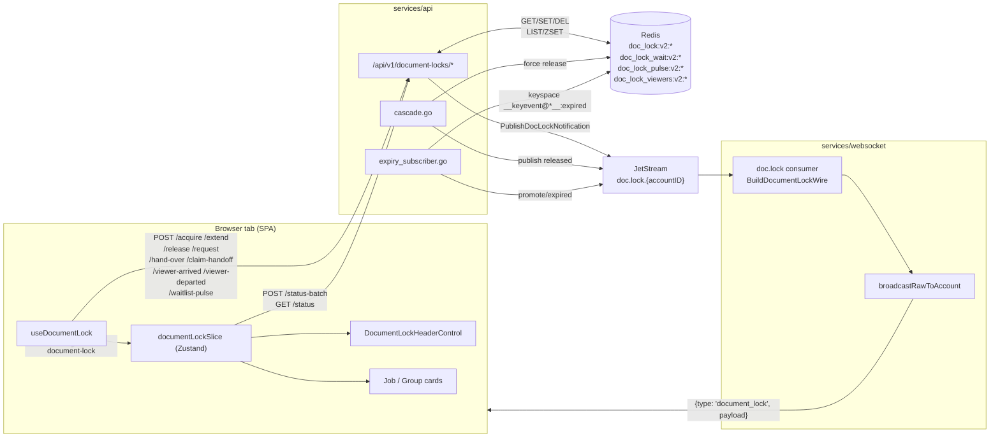
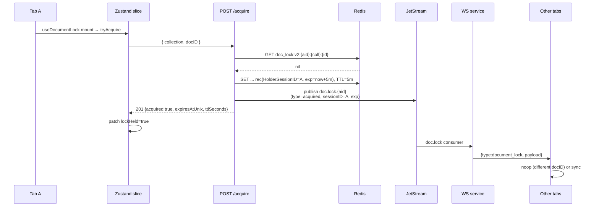
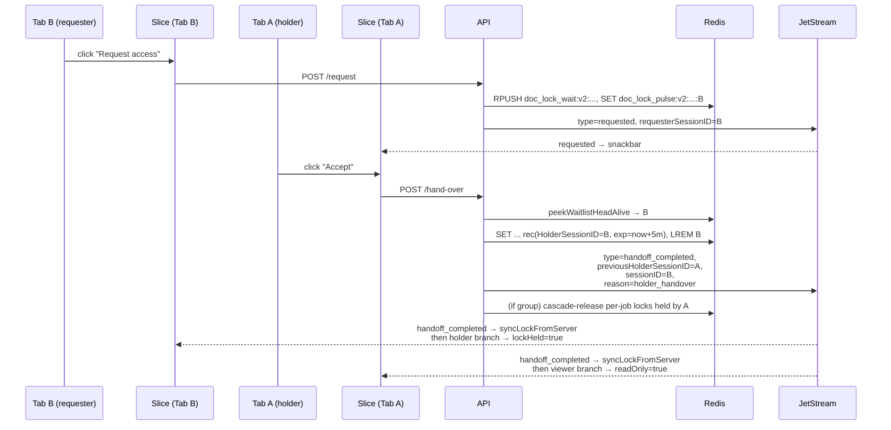
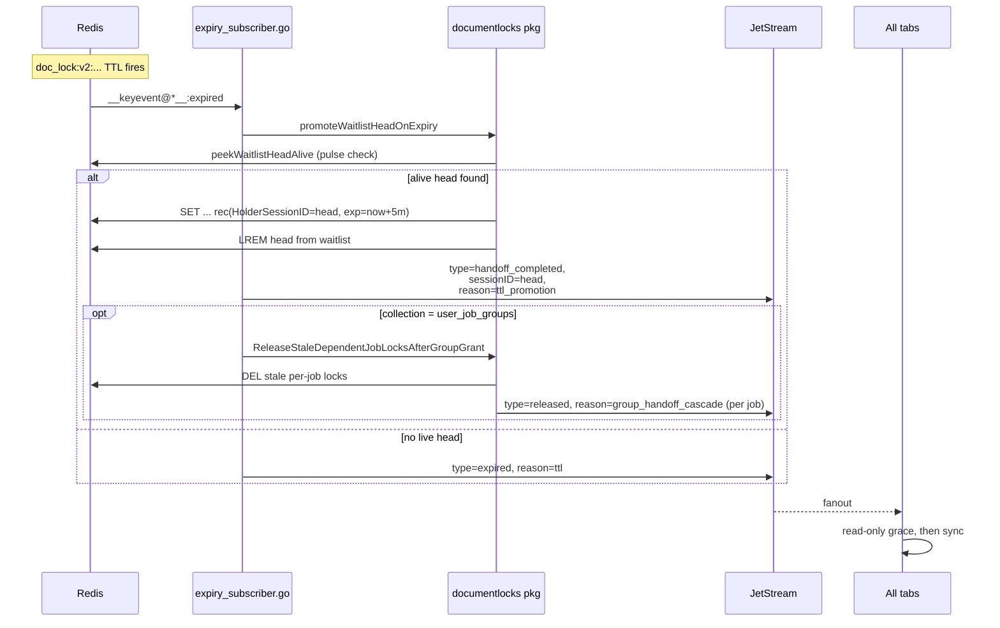
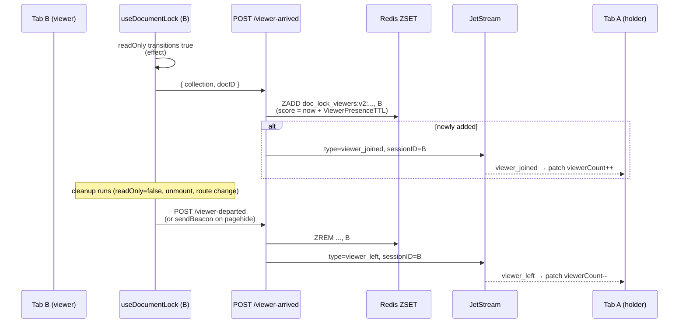

# Document lock system

Cross-tab edit coordination for `user_job_documents` (planner jobs) and
`user_job_groups` (job groups). Other sessions on the same account can see who is
editing, queue for access, watch passively, and take over cleanly when the
holder leaves or their lease expires.

The system spans three services and the SPA:

- **`services/api/v1endpoints/documentlocks`** — authoritative state in Redis,
  REST endpoints, cascade helpers, TTL-expiry subscriber.
- **`services/websocket`** — receives lock events on JetStream subject
  **`doc.lock.{accountID}`** and fans them out to every connected tab.
- **`services/core`** — not involved (locks are not Mongo documents).
- **`frontend/src/{Hooks,Functions,Components,Zustand,Events}/DocumentLock`** —
  Zustand mirror, hook, header affordance, scope-aware UI gating.

This README is the cross-stack overview. Implementation detail lives in:

- [FRONTEND.md](./FRONTEND.md) — Zustand slices, hooks, components, event flow.
- [BACKEND.md](./BACKEND.md) — HTTP endpoints, Redis key layout, handlers,
  cascade, expiry subscriber, viewer presence.

## Vocabulary

| Term | Meaning |
|------|---------|
| **`collection`** | Mongo logical collection the lock guards: `user_job_documents` or `user_job_groups`. |
| **`docID`** | Document id within `collection` (jobID or groupID). |
| **`sessionID`** | JWT `session_id` claim. Identifies *one tab*; not the user, not the device. Two tabs of the same account have different sessionIDs and can fight for the same lock. |
| **Holder** | The session in `lockRecord.HolderSessionID`. Has exclusive write access. |
| **Viewer** | A session showing the doc in read-only mode (lock held by someone else). Registered in a Redis ZSET; the holder gets a contention affordance when `viewerCount > 0`. |
| **Waitlist** | Redis list of sessions queued to take over via the "Request access" flow. The head is promoted on holder-handover and on TTL expiry. |
| **Lease** | A holder's TTL window (`DefaultLockTTL` = 5 min). Renewed by `/extend` while the tab is visible. After 3 consecutive renewals the holder consults the waitlist (handoff probe). |
| **Handoff probe** | `/extend` selects the next-in-line as `ProbeTargetSessionID`, publishes `document_lock_handoff_probe`; the targeted client auto-claims via `/claim-handoff`. |
| **Cascade** | When a *group* lock rotates (handoff or TTL promotion), per-job locks held by the old session are force-released. See [BACKEND.md § Cascade](./BACKEND.md#cascade). |
| **Read-only grace** | Client-side 5 s window after a held lock vanishes during which the UI stays read-only — bridges the gap until a `handoff_completed` / `acquired` event confirms the new owner. |

## High-level architecture



**One sentence:** Redis is the source of truth, the API enforces transitions,
JetStream broadcasts every transition through the websocket service to every
tab on the same account, and each tab mirrors what it cares about into
Zustand.

## Wire contract (frontend ↔ backend)

Inner-payload `type` strings every fan-out wraps:

| Frontend constant (`documentLockEvents.js`) | Backend constant (`events.go` / `viewer_presence.go` / `expiry_subscriber.go`) | Emitted by |
|---|---|---|
| `DOCUMENT_LOCK_EVENTS.ACQUIRED` (`document_lock_acquired`) | `LockEventAcquired` | `/acquire`, `/request` auto-grant |
| `DOCUMENT_LOCK_EVENTS.RELEASED` (`document_lock_released`) | `LockEventReleased` | `/release`, `/hand-over` fallback, cascade |
| `DOCUMENT_LOCK_EVENTS.REQUESTED` (`document_lock_requested`) | `LockEventRequested` | `/request` (lock contended) |
| `DOCUMENT_LOCK_EVENTS.EXPIRED` (`document_lock_expired`) | `LockEventExpired` | TTL with no live waitlist head |
| `DOCUMENT_LOCK_EVENTS.HANDOFF_PROBE` (`document_lock_handoff_probe`) | `LockEventHandoffProbe` | `/extend` after 3 renewals while waitlist is alive |
| `DOCUMENT_LOCK_EVENTS.HANDOFF_COMPLETED` (`document_lock_handoff_completed`) | `LockEventHandoffCompleted` | `/hand-over`, `/claim-handoff`, TTL promotion |
| `DOCUMENT_LOCK_EVENTS.VIEWER_JOINED` (`document_lock_viewer_joined`) | `LockViewerEventJoined` | `/viewer-arrived` (newly added) |
| `DOCUMENT_LOCK_EVENTS.VIEWER_LEFT` (`document_lock_viewer_left`) | `LockViewerEventLeft` | `/viewer-departed` (removal hit) |

Each payload also includes `accountID`, `collection`, `docID`, plus a subset of
`sessionID`, `holderSessionID`, `requesterSessionID`, `probeTargetSessionID`,
`expiresAtUnix`, `previousHolderSessionID`, `reason`. The WS envelope wraps it:

```json
{ "type": "document_lock", "payload": { "type": "...", ...rest } }
```

See `services/websocket/server/natslogic/locks.go::BuildDocumentLockWire`.

`reason` strings for the three flagged events:

| Reason | Emitted on | Frontend constant |
|---|---|---|
| `group_handoff_cascade` | `released` from `cascade.go` | `DOCUMENT_LOCK_RELEASE_REASONS.GROUP_HANDOFF_CASCADE` |
| `hand_over_no_queue` | `released` from `/hand-over` (requester gone) | `DOCUMENT_LOCK_RELEASE_REASONS.HAND_OVER_NO_QUEUE` |
| `ttl` | `expired` from TTL keyspace event | `DOCUMENT_LOCK_EXPIRY_REASONS.TTL` |
| `holder_handover` | `handoff_completed` from `/hand-over` | `DOCUMENT_LOCK_HANDOFF_REASONS.HOLDER_HANDOVER` |
| `ttl_promotion` | `handoff_completed` from expiry subscriber | `DOCUMENT_LOCK_HANDOFF_REASONS.TTL_PROMOTION` |

## End-to-end flows

### Acquire (uncontested)



### Acquire (contested → read-only)

The non-holder branch returns `200 {held:true, acquired:false,
holderSessionID, viewerCount}`. The hook patches `readOnly: true` and on the
next frame fires off `/viewer-arrived` (see [Viewer presence](#viewer-presence)).

### Holder accepts a request (`/hand-over`)



### Lease expiry with alive waitlist (TTL promotion)



### Read-only grace (client-side)

When a tab learns the lock is gone but the next holder hasn't been announced
yet (TTL race), it keeps `readOnly: true` for a 5 s grace window. Any
`acquired` / `handoff_completed` arriving in that window cancels the grace and
installs the new holder. If nothing arrives, the grace expires and the UI
becomes editable so the user isn't trapped on a dead lock.

Frontend code: `frontend/src/Functions/DocumentLock/readOnlyGrace.js`
and per-hook timer in `useDocumentLock.js`.

### Viewer presence



A holder shows the header lock affordance whenever
`viewerCount > 0` even without an explicit request. This is the "passive
viewer" contention signal added so silent observers still trigger the holder's
awareness UI.

## Constants — frontend / backend mapping

Frontend timings live in
`frontend/src/Functions/DocumentLock/documentLockTimings.js`. Backend lease /
TTL values live in `services/api/v1endpoints/documentlocks/lock_redis.go` and
`services/api/v1endpoints/documentlocks/viewer_presence.go`.

| Concept | Frontend | Backend | Notes |
|---|---|---|---|
| Lease length | `LOCK_LEASE_MS` = 5 min | `DefaultLockTTL` = 5 min | Must match. |
| Holder extend cadence | `LOCK_EXTEND_INTERVAL_MS` = 5 min | n/a | Triggered while tab visible + holder. |
| Lock status sync heartbeat | `LOCK_STATUS_SYNC_INTERVAL_MS` = 45 s | n/a | Self-heal for any missed WS event. |
| Post-expiry resync | `LOCK_EXPIRY_RESYNC_INTERVAL_MS` = 15 s | n/a | After cached `expiresAtUnix` passes. |
| Expiry slack | `LOCK_EXPIRY_SLACK_SECONDS` = 2 | n/a | Absorbs client/server clock skew. |
| Waitlist pulse cadence | `LOCK_WAITLIST_PULSE_INTERVAL_MS` = 35 s | `WaitlistPulseTTL` = 2 min | Client must refresh below TTL. |
| Read-only grace | `LOCK_READONLY_GRACE_MS` = 5 s | n/a | Bridges TTL-expiry races. |
| Scope-sync debounce | `LOCK_SCOPE_SYNC_DEBOUNCE_MS` = 200 ms | n/a | Coalesces planner churn. |
| Status batch ceiling | `MAX_STATUS_BATCH_DOC_IDS` = 500 | `MaxStatusBatchDocs` = 500 | Per-array cap (jobs + groups). |
| Planner chunk | `PLANNER_PAGE_JOB_CHUNK_MAX` = 450 | n/a | Reserve slack for groups in first chunk. |
| Probe ack window | n/a | `ProbeAckWaitSeconds` = 20 | Queued client must `/claim-handoff` in this window. |
| Extends per cycle | n/a | `MaxExtensionsBeforeHandoffConsult` = 3 | After this many, `/extend` probes waitlist. |
| Viewer presence TTL | n/a | `ViewerPresenceTTL` = 5 min | Defensive sweep for crashed tabs. |

## Where every file lives

### Backend

```
services/api/v1endpoints/documentlocks/
  router.go            — HTTP route table
  request_context.go   — auth + body parse preamble
  handlers.go          — acquire / extend / release / hand-over / request / status / claim-handoff / waitlist-pulse
  status_batch.go      — POST /status-batch
  viewer_presence.go   — /viewer-arrived /viewer-departed + ZSET helpers
  lock_redis.go        — Redis key layout, lockRecord, promoteWaitlistHead, waitlist helpers
  lock_json.go         — shared JSON response shape (lockPayload, writeExtendJSON)
  events.go            — event type + reason constants + buildHandoffCompletedPayload
  cascade.go           — group handoff cascade (decideHandoffCascadeRelease, decideStaleAfterGrantRelease)
  expiry_subscriber.go — Redis __keyevent@*__:expired listener + waitlist promotion
  *_test.go            — unit tests (events, lock_redis, cascade)
services/api/helper/doclock/publish.go    — JetStream PublishDocLockNotification
services/websocket/server/nats_doc_lock.go — doc.lock consumer
services/websocket/server/natslogic/locks.go — BuildDocumentLockWire wrapper
```

### Frontend

```
frontend/src/Functions/DocumentLock/
  documentLockKey.js                — (collection, docID) → scope key
  documentLockCollections.js        — USER_JOBS_COLLECTION / USER_JOB_GROUPS_COLLECTION
  documentLockEvents.js             — wire-contract constants (type / reason)
  documentLockTimings.js            — timing constants
  documentLockScope.js              — ScopedDocumentLockState initial + merge
  documentLockSelectors.js          — selectScopedDocumentLock / selectDocumentLockReadOnly / filterUnlockedDocumentIDs
  documentLockHeaderSelectors.js    — selectors for DocumentLockHeaderControl
  documentLockStatusFields.js       — numberOrNull, buildGrantedHolderPatch
  documentLockAcquireFeedback.js    — vacancy-notice suppression
  applyDocumentLockStatusFromPayload.js — applies a /status row to Zustand
  readOnlyGrace.js                  — shared grace predicate + patch

frontend/src/Hooks/DocumentLock/
  useDocumentLock.js                — the engine (mount per scope)
  useRegisterHeaderDocumentLockUI.js — page-level header context
  useLockScopeSync.js               — batch sync core for planner pages
  useJobPlannerJobLockSync.js       — planner job-only sync hook
  useJobPlannerPageLockSync.js      — planner job+group sync hook
  plannerLockScopeFromApi.js        — single-scope refresh helper
  useDocumentLockState.js           — ID-shaped hooks for cards (useJobLockReadOnly etc.)

frontend/src/Components/DocumentLock/
  DocumentLockHeaderControl.jsx     — header icon + popover
  LockGatedTooltip.jsx              — uniform "Another session holds the edit lock" copy

frontend/src/Zustand/
  documentLockSlice.js              — scopes map + actions (request, accept, hand-over, claim)
  headerDocumentLockUISlice.js      — registrations array (which scope drives the header)

frontend/src/Events/
  headerDocumentLockEvents.js       — imperative API for the header slice
  editJobReleaseRequestEvents.js    — release-request handler registry (edit-job ↔ slice)

frontend/src/Functions/Endpoints/Pirivate/documentLockClient.js — REST client functions + WS-batch path

frontend/src/Components/Edit Job/Edit Job Hooks/useActiveJobDocumentLock.js
                                    — reducer-shaped hooks for the Edit Job page
                                      (useActiveJobReadOnly, useActiveGroupReadOnly, useSiblingLinkLock,
                                       useLockGatedHandler)
```

For per-layer detail see [FRONTEND.md](./FRONTEND.md) and [BACKEND.md](./BACKEND.md).
