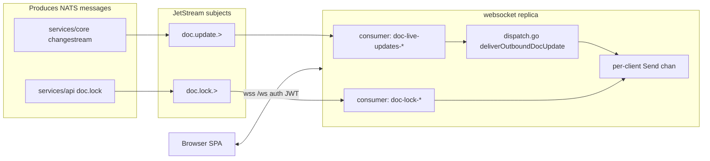
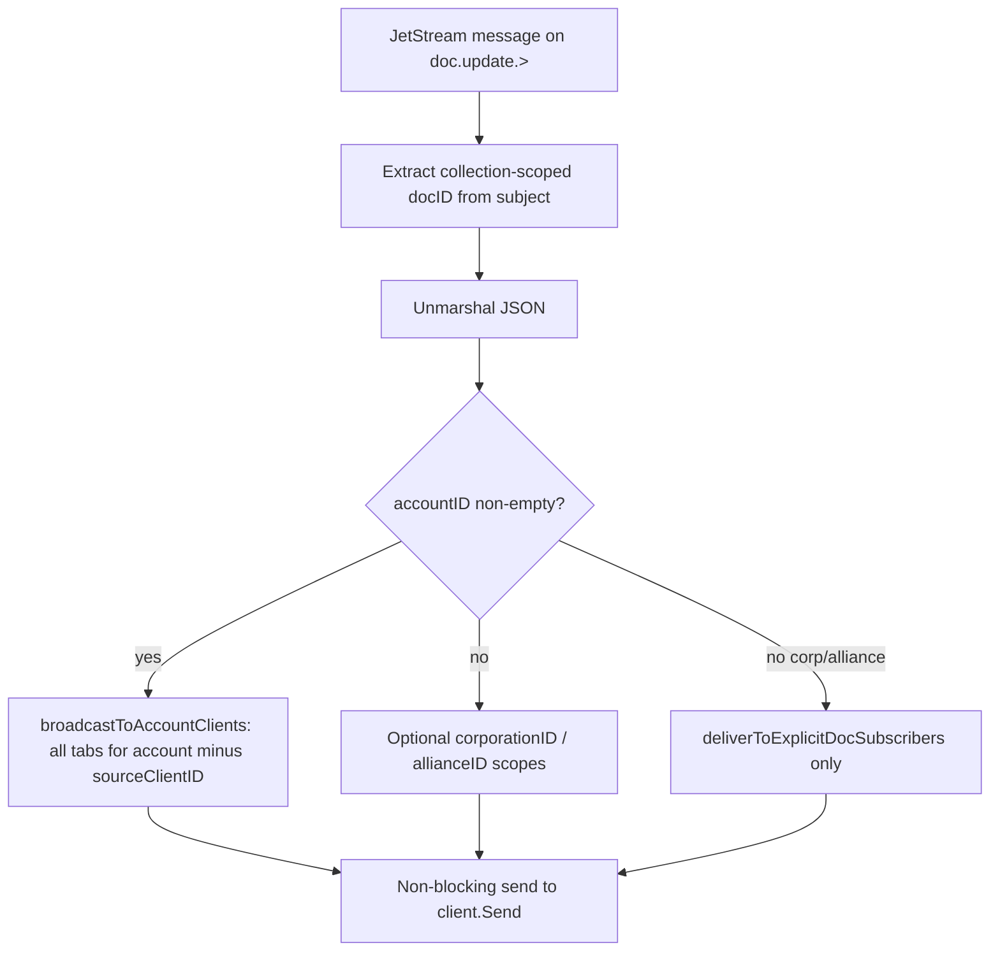

# WebSocket realtime — implementation reference

Single place for **what shipped in the repo** (paths, contracts, env, behavior). The Cursor plan remains the narrative design doc; this file tracks **code reality**. **Org routing, `scopes`, JWT ceilings, and `upgrade_scopes`:** see [ROUTING-AND-SCOPES.md](./ROUTING-AND-SCOPES.md).

## Keeping this document accurate (project rule)

**Whenever migration-related behavior or contracts change**, update this file and the sibling docs in **the same PR** (or the very next commit). See [README.md — Documentation maintenance (required)](./README.md#documentation-maintenance-required) for the full table (`IMPLEMENTATION.md`, `INTERACTIONS.md`, `PLAN-TODO-TRACKER.md`, plan snapshot).

**Recorded request:** Maintainers asked that every modification to this feature be reflected in this documentation and that this expectation itself be written into the docs (see [INTERACTIONS.md](./INTERACTIONS.md) dated entry).

## Architecture

| Component | Role |
|-----------|------|
| **`services/core`** | Mongo change stream → **JetStream** `doc.update.{collection}.{docID}` with `ChangeStreamMessage` JSON (`accountID`, optional `corporationID` / `allianceID`, optional `scopes`, `sourceClientID`, …). Optional fan-in `doc.update.account_sync.{accountID}` for singleton refetch signaling. See [`changestream/watcher.go`](../../../services/core/changestream/watcher.go). |
| **`services/websocket`** | HTTP `/ws`: JWT on **upgrade only**. Each replica runs a **JetStream** pull consumer with a **unique durable** on **`doc.update.>`** (`doc-live-updates-<suffix>`) so **every** pod receives every change (no shared durable load-balancing). Outbound routing: [`dispatch.go`](../../../services/websocket/server/dispatch.go) **`deliverOutboundDocUpdate`** — **`accountID`** first (account broadcast minus echo); else **`corporationID`** / **`allianceID`** using reverse indexes **`corpToClients`** / **`allianceToClients`** (filled after **`upgrade_scopes`**); optional **`scopes`** narrows recipients; else explicit `subscribe` doc IDs. Details: [ROUTING-AND-SCOPES.md](./ROUTING-AND-SCOPES.md). **`doc.lock.{accountID}`** is consumed via **JetStream** (`nats_doc_lock.go`). **HTTP stack:** `RequestStartTimeConstructor` → `RequestLoggingConstructor` (`request_id`, access log at **Debug**). **`otelhttp` is not used on `/ws`:** `gorilla/websocket` upgrade requires `http.Hijacker` on `ResponseWriter`. |
| **`services/api`** | Issues internal JWT. |
| **SPA** | Module singleton WebSocket (`frontend/src/Realtime/realtimeClient.js`); gated hook `useAccountWebSocket`; **`applyRemoteMessage`** (monotonic `realtimeSync` + account-scoped merge + token/character/system-index reconcile in one coordinated flow); `wsClientIdentity` for `X-WS-Client-ID` on private API calls. **Baseline `subscribe` after connect is a no-op**—JWT + `userConnections` imply the full account stream. |

## WebSocket service — full map and flows

This section is the **full map** of `services/websocket`: process bootstrap, goroutines, NATS edges, and how messages move. Paths are relative to the repo root.

### Process bootstrap

| Step | Location | What happens |
|------|----------|----------------|
| Entry | [`services/websocket/main.go`](../../../services/websocket/main.go) | `telemetry.Init`, **`shared.ConnectServices`** (**Mongo**, **NATS JetStream**, **Redis** — Redis used for session handoff + shared patterns), goroutine **`StartWSServer`**. |
| HTTP | [`main.go`](../../../services/websocket/main.go) `StartWSServer` | **`http.ServeMux`** mounts **`/ws`** and **`/ws/`**. Handler chain: **`RequestStartTimeConstructor`** → **`RequestLoggingConstructor`** → **`HandleWS`**. **No `otelhttp`** on `/ws` (must preserve `http.Hijacker` for upgrade). |
| Server construction | [`server/server.go`](../../../services/websocket/server/server.go) `NewServer` | Builds in-memory maps (`Clients`, `userConnections`, `corpToClients`, `allianceToClients`, `explicitDocSubscribers`, incoming/sync queues, …), **`initMetrics`**, starts **incoming coordinator**, **sync coordinator** (pond pool), **two JetStream consumer loops** (`doc.update`, `doc.lock`), **cleanup** goroutine. |

### Goroutines and responsibilities (one replica)

| Piece | Started from | Role |
|-------|----------------|------|
| **Listener** | `main` | Accepts TCP; one goroutine per request until upgrade completes. |
| **Reader** | [`handler.go`](../../../services/websocket/server/handler.go) after upgrade | One **`reader(client)`** per connection: reads WebSocket frames, routes control JSON (`subscribe`, `unsubscribe`, `sync`, `session_resume`, **`upgrade_scopes`**, …), `ping`/`pong`. **Defer:** session handoff snapshot (explicit docs + org scopes), **unregister org pool indexes**, subscription cleanup, remove from `Clients` / `userConnections`, close **`Send`** chan. |
| **Writer** | `handler.go` | One **`writer(client)`** per connection: blocking send loop draining **`client.Send`** (bounded buffer); connection writes. |
| **Incoming coordinator** | [`coordinator.go`](../../../services/websocket/server/coordinator.go) | Watches signals and drives **per-`docID`** incoming work (queues + mutex serialization in processor path). |
| **Sync coordinator** | [`websocket/sync`](../../../services/websocket/sync/) | Processes **client `sync`** requests via **`SyncPool`** (pond) and per-client sync queues. |
| **JetStream: `doc.update.>`** | [`nats_subscriptions.go`](../../../services/websocket/server/nats_subscriptions.go) + [`outbound_doc_update.go`](../../../services/websocket/server/outbound_doc_update.go) | Pull loop → **sharded** enqueue (partition by account / corp / alliance / explicit doc) → shard worker **`deliverOutboundDocUpdate`** → **ack after** fan-out (per-shard cap; inline fallback + ack if that shard is full). |
| **JetStream: `doc.lock.>`** | [`nats_doc_lock.go`](../../../services/websocket/server/nats_doc_lock.go) | Pull loop → wrap as `{ type: "document_lock", payload }` → **`broadcastRawToAccount`**. |
| **Cleanup** | [`cleanup.go`](../../../services/websocket/server/cleanup.go) | Idle incoming-queue teardown. |

### External edges (this service only)



- **`doc.update.*`** payloads are **`ChangeStreamMessage`** JSON from core (see [`changestream/watcher.go`](../../../services/core/changestream/watcher.go)). Routing: **`accountID`** → account broadcast; else **`corporationID`** / **`allianceID`** → pooled org indexes + optional **`scopes`** filter ([`dispatch.go`](../../../services/websocket/server/dispatch.go), [`outgoinglogic/decode.go`](../../../services/websocket/server/outgoinglogic/decode.go)); else **explicit** `subscribe` doc IDs only. Contract: [ROUTING-AND-SCOPES.md](./ROUTING-AND-SCOPES.md).

### Inbound flow (browser → server → Mongo / ordering)

```mermaid
sequenceDiagram
  participant B as Browser
  participant R as reader.go
  participant P as processor.go
  participant M as Mongo
  participant SC as sync package

  B->>R: JSON / ping / binary
  alt subscribe / unsubscribe
    R->>P: handleSubscribeRequest + subscribe_auth.go
    P->>P: Update explicitDocIDs / explicitDocSubscribers
  else sync
    R->>SC: Enqueue sync queue; SyncPool worker
    SC->>M: Fetch / merge as implemented
  else session_resume
    R->>session_resume.go: Restore explicit subs + org scopes; resume_ack
  else upgrade_scopes
    R->>scope_upgrade.go: JWT ceiling ∩ request; org indexes; scopes_ack
  else document mutations / bulk
    R->>P: Per-docID mutex path / bulk_processor
    P->>M: Writes / deletes
  end
```

- **Authorization** for explicit document IDs: [`subscribe_auth.go`](../../../services/websocket/server/subscribe_auth.go) **`docSubscribeAuthorized`** (JWT singletons vs Mongo `_meta.accountID` for jobs/groups/etc.).
- **Ordering:** inbound document work is serialized **per `docID`** (mutex / queue pattern in [`processor.go`](../../../services/websocket/server/processor.go)); **sync** uses the **pond** pool from [`server.go`](../../../services/websocket/server/server.go).

### Outbound flow (NATS → browsers)



- **No** per-document **outbound** queue: JetStream handler calls dispatch → **`select` on `client.Send`**; full buffer → drop + log ([`dispatch.go`](../../../services/websocket/server/dispatch.go)).
- **`SyncInProgress`:** if true, broadcast skips that client (avoid overlapping push during sync).

### In-memory registry (per replica)

| Structure | Purpose |
|-----------|---------|
| **`Clients[clientID]`** | Live socket + **`Send`** chan + **`explicitDocIDs`** + **`AccountID`** + **`SessionID`**. |
| **`userConnections[accountID]`** | Set of **`clientID`** for multi-tab fan-out and connection limits. |
| **`sessionConnections[sessionID]`** | One active **`clientID`** per auth session (duplicate session clients are evicted, warning logged + metric incremented). |
| **`explicitDocSubscribers[docID]`** | Reverse index for optional browser **`subscribe`** (escape hatch when payload has no **`accountID`**). |
| **Session handoff** | In-memory map + **Redis** `ws:session_handoff:v1:{account}:{oldClientID}` — see [Session resume](#session-resume-jwt-rotation). |

### Source file index (websocket package)

| Area | Files |
|------|--------|
| Upgrade + lifecycle | [`handler.go`](../../../services/websocket/server/handler.go), [`reader.go`](../../../services/websocket/server/reader.go), [`writer.go`](../../../services/websocket/server/writer.go) |
| NATS ingress | [`nats_subscriptions.go`](../../../services/websocket/server/nats_subscriptions.go), [`nats_doc_lock.go`](../../../services/websocket/server/nats_doc_lock.go), [`jetstream_consumer_id.go`](../../../services/websocket/server/jetstream_consumer_id.go) |
| Fan-out | [`dispatch.go`](../../../services/websocket/server/dispatch.go) |
| Subscriptions + ACL | [`subscription.go`](../../../services/websocket/server/subscription.go), [`subscribe_auth.go`](../../../services/websocket/server/subscribe_auth.go) |
| Ordered inbound work | [`processor.go`](../../../services/websocket/server/processor.go), [`coordinator.go`](../../../services/websocket/server/coordinator.go), [`bulk_processor.go`](../../../services/websocket/server/bulk_processor.go), [`queue.go`](../../../services/websocket/server/queue.go) |
| Resume | [`session_resume.go`](../../../services/websocket/server/session_resume.go), [`reader.go`](../../../services/websocket/server/reader.go) defer handoff |
| Metrics | [`metrics.go`](../../../services/websocket/server/metrics.go) |
| Client-initiated resync | [`websocket/sync/`](../../../services/websocket/sync/) |

### Multi-replica rule (critical)

Each pod must use a **different** JetStream durable suffix so **every** replica receives **every** `doc.update` message ([`jetstream_consumer_id.go`](../../../services/websocket/server/jetstream_consumer_id.go)). Otherwise only one consumer group member would see each message. See also **Operations checklist** below.

## Backend

### Shared internal JWT

| Item | Location |
|------|----------|
| RS256 sign/verify, key cache, JWKS helpers | [`services/shared/core/internaljwt/`](../../../services/shared/core/internaljwt/) |
| API session + refresh-token helpers (non-JWT core) | [`services/api/helper/auth/`](../../../services/api/helper/auth/) |
| WebSocket upgrade validation | [`services/websocket/server/handler.go`](../../../services/websocket/server/handler.go) → `internaljwt.ValidateInternalJWT` |

**Behavior:** Every WebSocket connection validates the token at **Upgrade** only. There is no in-band token refresh on an open socket; the client must reconnect with a new subprotocol when the JWT rotates.

### NATS: JetStream live delivery (websocket, multi-replica)

**Why separate durables per replica:** A **single** shared JetStream durable load-balances deliveries across subscribers. To give **every** websocket pod a copy of each `doc.update` message, each instance uses its own durable name suffix from [`jetstream_consumer_id.go`](../../../services/websocket/server/jetstream_consumer_id.go) (`doc-live-updates-<suffix>`), aligned with **`ws_instance_id`** in metrics.

| Stream / filter | Producer | Websocket consumer | Handler |
|-----------------|----------|-------------------|---------|
| **`doc.update.>`** (doc-update stream) | Core changestream [`PublishMessage`](../../../services/core/changestream/watcher.go) | [`subscribeToDocUpdates`](../../../services/websocket/server/nats_subscriptions.go) → **`deliverOutboundDocUpdate`** | Account broadcast (minus `sourceClientID`), optional corp/alliance placeholders, else explicit subscribers only. |

**Legacy core subjects:** Shared constants still define **`ws.doc.fanout`** / **`ws.doc.subscribe.fanout`** prefixes ([`constants.go`](../../../services/shared/core/nats/constants.go)); the websocket service **does not** subscribe to them. Historical docs referred to core fan-out; **current** live path is JetStream as above.

### JetStream elsewhere (workers, scheduler, persistence)

| Env | Purpose |
|-----|---------|
| `OTEL_SERVICE_INSTANCE_ID` | Optional override for **both** OpenTelemetry `service.instance.id` (Prometheus **`exported_instance`** / **`instance`**) and JetStream durable / metric replica suffix (`jetstreamConsumerSuffix`). |
| `WS_CONSUMER_NAME` | Explicit suffix override when `OTEL_SERVICE_INSTANCE_ID` is unset. |
| `DOCKER_CONTAINER_NAME` | Optional; set to the Docker/container **name** when your orchestrator provides it so Grafana/Prometheus labels match `docker ps`. |
| `CONTAINER_NAME` | Same intent as `DOCKER_CONTAINER_NAME` on some platforms. |
| *(otherwise)* | **`HOSTNAME`** (usually unique per container), then **`os.Hostname()`**, then **`local`**. |

**Websocket JetStream durables:** **`doc-live-updates-<suffix>`** (`doc.update.>`), **`doc-lock-<suffix>`** (`doc.lock.>`) — see [`jetstream_consumer_id.go`](../../../services/websocket/server/jetstream_consumer_id.go).

**Still JetStream-backed:** worker task stream, scheduler stream, all **`PublishMessage`** paths, changestream publish to `doc.update.*`, and **`doc.lock`** publishes.

**Stream subject reconciliation:** [`EnsureStreams`](../../../services/shared/core/nats/jetstream.go) aligns each ensured stream’s **`Subjects`** with the slice in code (same as creating a new stream). That **adds** missing patterns and **removes** obsolete ones (for example `doc.subscribe.>` after it was dropped from [`DocUpdateStreamSubjects`](../../../services/shared/core/nats/constants.go)). If **`UpdateStream`** fails—sometimes because a **leftover durable consumer** still targets a removed subject—check server logs (`failed to reconcile JetStream stream subjects`), delete the stale consumer on that stream, and retry on the next process start.

### Incoming / outgoing work

**Outbound NATS → browsers** does **not** use per-document outgoing queues: JetStream handlers call **`deliverOutboundDocUpdate`** → direct send to `client.Send` (with backpressure drop logging on full buffer).

**Inbound** client → Mongo (sync and subscribe/unsubscribe commands) still uses the coordinator + **per-`docID` mutex** in [`processor.go`](../../../services/websocket/server/processor.go). **Sync** still uses a `pond` pool ([`server.go`](../../../services/websocket/server/server.go)).

### Subscription registry

| Path | Behavior |
|------|----------|
| **JWT upgrade** | Connection is registered under **`userConnections[accountID]`**; [`handler.go`](../../../services/websocket/server/handler.go) stores JWT **corp/alliance ceilings** on the client and sends **`{ type: "connected", clientID, subscription: { account: true, corporation: false, alliance: false } }`**. Org pools stay empty until **`upgrade_scopes`**. |
| Browser JSON **`subscribe`** / **`unsubscribe`** | Optional **explicit** doc IDs only ([`subscribe_auth.go`](../../../services/websocket/server/subscribe_auth.go)); updates **`explicitDocIDs`** + inverse index **`explicitDocSubscribers`** ([`subscription.go`](../../../services/websocket/server/subscription.go)). Used when payloads lack **`accountID`** or for tooling—**not** required for normal account documents. |
| Browser JSON **`session_resume`** | After JWT re-handshake, restores **explicit** subscriptions from handoff via **`ApplySessionResume`** ([`session_resume.go`](../../../services/websocket/server/session_resume.go)); **`resume_ack`** may set **`skipBaselineSync: true`** whenever handoff matched (account stream needs no per-doc replay). Handoff snapshot stores **`explicitDocIDs`** only ([`reader.go`](../../../services/websocket/server/reader.go) defer). |

### OpenTelemetry metrics (websocket)

Meter name: **`eve-industry-planner/websocket`** (initialized in websocket `main.go` via `telemetry.Init(...DefaultConfig("websocket"))`).

| Metric | Type | Labels / Notes |
|---|---|---|
| `ws.upgrade.requests_total` | Counter | Upgrade request count (`/ws`). |
| `ws.upgrade.successes_total` | Counter | Successful websocket upgrades. |
| `ws.upgrade.errors_total` | Counter | `reason` labels (e.g. `missing_token`, `invalid_token`, `expired_token`, `upgrade_failed`). |
| `ws.upgrade.duration_milliseconds` | Histogram | Upgrade latency for success + error paths. |
| `ws.auth.expired_token_rejects_total` | Counter | Explicit expired-JWT upgrade rejects. |
| `ws.connections.opened_total` / `ws.connections.closed_total` | Counter | `account_id`-labeled connection lifecycle events. |
| `ws.document_updates.sent_total` | Counter | `account_id`, `doc_id`; increments by recipient count when broadcasts are delivered. |
| `ws.connected_clients` / `ws.connected_accounts` | Observable gauge | Current totals from in-memory websocket state; **`ws_instance_id`** label matches JetStream replica suffix (`WS_CONSUMER_NAME` → `DOCKER_CONTAINER_NAME` / `CONTAINER_NAME` → `HOSTNAME` → hostname) for **per-replica** breakdown in Prometheus/Grafana. |
| `ws.account_connected_clients` | Observable gauge | `account_id`, **`ws_instance_id`** → current client count per account **on that replica**. |
| `ws.client_subscribed_documents` | Observable gauge | **Explicit** subscribe count per connection (`explicitDocIDs`); **`client_id`**, `account_id`, **`ws_instance_id`**. |
| `ws.document_subscribers` | Observable gauge | Inverse index for **explicit** subscriptions only (`explicitDocSubscribers`); **`doc_id`**, **`ws_instance_id`**. |

Dashboard: `observability/grafana/provisioning/dashboards/definitions/websocket-otel-metrics.json` (Grafana title: **WebSocket · OTel metrics**, uid `websocket-otel-metrics`), including **Connected clients by websocket instance** (`ws_connected_clients` by `ws_instance_id`).

### Subscribe authorization (`docID` = `{collection}.{mongoId}`)

Enforced in **`(*Server).docSubscribeAuthorized`** ([`subscribe_auth.go`](../../../services/websocket/server/subscribe_auth.go)) from **`reader.go`** and **`processor.go`** (subscribe and unsubscribe).

| Collections | Rule |
|---------------|------|
| `users`, `application_settings` | **JWT proof:** the segment after the first `.` must equal **`account_id`** from the validated upgrade JWT (singleton docs keyed by account). |
| `jobs`, `user_job_documents`, `archivedJobs`, `groups`, `build_stats` | **Mongo:** document must exist with `_id` and **`_meta.accountID`** matching the JWT account (via `DocumentExistsByID`, 3s timeout). |
| **Any other collection** | **Denied** (fail closed). |

If Mongo is unavailable, Mongo-backed subscriptions are denied. **Adding a new realtime collection:** extend the `switch` in `subscribe_auth.go` with the correct ownership rule.

### Tests

| File | `go test` path |
|------|----------------|
| [`subscribe_auth_test.go`](../../../services/websocket/server/subscribe_auth_test.go) | `./websocket/server/...` |

## Frontend

| File | Purpose |
|------|---------|
| [`frontend/src/Functions/Auth/appJwt.js`](../../../frontend/src/Functions/Auth/appJwt.js) | **App-internal JWT** helpers: `decodeAppJwt`, `getAppJwtExpiryUnix`, `isAppJwtExpired` (60s skew), `getEffectiveAppAccessExpiryUnix` (prefers API `accessTokenEXP`, else JWT `exp`). Used by `realtimeClient`, `useAccountWebSocket`, `tokenActions`. |
| [`frontend/src/Realtime/realtimeClient.js`](../../../frontend/src/Realtime/realtimeClient.js) | Same-origin `/ws`, subprotocol `auth.<base64url(JWT)>`, **no baseline `subscribe`** (account implied by JWT), ping/pong, reconnect backoff (cap **20s**), optional `subscribeDocIDs` / `unsubscribeDocIDs` for explicit docs. **Does not** open or schedule reconnect when the JWT is **already expired** (`isAppJwtExpired`). After **reopen** following expiry halt or **token rotation**, runs baseline HTTP resync **unless** **`session_resume` / `resume_ack`** skipped it (see **Session resume** below). Exports **`stashRealtimeSessionResumeHint`** for the hook. |
| [`frontend/src/Realtime/resyncRealtimeDocumentsFromServer.js`](../../../frontend/src/Realtime/resyncRealtimeDocumentsFromServer.js) | Parallel **GET** [`/api/v1/user/main`](../../../services/api/apiServer.go) + [`/api/v1/user/application-settings`](../../../services/api/apiServer.go); merges into Zustand + advances `realtimeSync` cursors from `_meta.lastModified` (same contract as login / WS apply). |
| [`frontend/src/Realtime/useAccountWebSocket.js`](../../../frontend/src/Realtime/useAccountWebSocket.js) | Connect when `isLoggedIn && accessToken && accountID`; disconnect otherwise; **`stashRealtimeSessionResumeHint()`** in effect cleanup before **`disconnectRealtime()`**; **timer ~90s before `accessTokenEXP`** to reconnect with a fresh token before expiry. |
| [`frontend/src/Realtime/applyRemoteMessage.js`](../../../frontend/src/Realtime/applyRemoteMessage.js) | Routes `ChangeStreamMessage`-shaped JSON for **`users`**, **`application_settings`**, and **`user_job_groups`** (`USER_JOB_GROUPS_COLLECTION`). Delegates to [`Realtime/handlers/`](../../../frontend/src/Realtime/handlers/). See **SPA: `applyRemoteMessage`** below. |
| [`frontend/src/Realtime/wsClientIdentity.js`](../../../frontend/src/Realtime/wsClientIdentity.js) | In-memory WS `clientID` from `{ type: "connected" }`; still used for transport/session-resume hints and socket-level diagnostics. Lock ownership no longer depends on WS client id. |
| [`frontend/src/Zustand/realtimeSyncSlice.js`](../../../frontend/src/Zustand/realtimeSyncSlice.js) | Per-doc cursors; seeded on login in [`tokenActions.js`](../../../frontend/src/Zustand/account/tokenActions.js). |
| [`frontend/src/App.jsx`](../../../frontend/src/App.jsx) | Mounts `useAccountWebSocket()`. |
| [`frontend/src/routes/signout.jsx`](../../../frontend/src/routes/signout.jsx) | Calls `disconnectRealtime()` on sign-out. |

### SPA: `applyRemoteMessage` (`users`, `application_settings`, `user_job_groups`, `user_job_documents`)

The **router** is [`frontend/src/Realtime/applyRemoteMessage.js`](../../../frontend/src/Realtime/applyRemoteMessage.js); per-collection logic lives under [`frontend/src/Realtime/handlers/`](../../../frontend/src/Realtime/handlers/) (`usersDocument.js`, `applicationSettingsDocument.js`, **`userJobGroupsDocument.js`**, shared `accountReconcile.js`). Job documents use [`inboundJobDocumentsCoalesce.js`](../../../frontend/src/Functions/Debounce/inboundJobDocumentsCoalesce.js) (coalesced upserts/deletes into `jobData.jobArray`). **One coordinated pipeline** — no separate side-effect registration module.

**`account_sync`:** backend fan-in subject `doc.update.account_sync.{accountId}` triggers debounced HTTP refetch of singletons (`scheduleDebouncedAccountDocumentsSync`), not a direct document upsert.

1. **Stale guard:** `realtimeSync` per-doc cursor vs `_meta.lastModified`. Compare with **strict `<`** (`remoteMs < prevCursor`): events with **equal** `lastModified` to the cursor are **not** dropped (avoids missing updates when timestamps tie).
2. **`users.<accountId>` upsert**
   - **Snapshot** normalized `linkedCharacterRefreshTokens` from Zustand *before* `applyUserDocumentFromRemote` (that action updates linked job/order/transaction sets from the document, not refresh-token state on the account slice).
   - **Apply:** `account.actions.applyUserDocumentFromRemote(document)`; advance cursor.
   - **Async reconcile** (serialized queue so overlapping WS events do not race):
     - **Cloud off (`userCloudAccounts === false`):** mirror Accounts page — `updateLocalRefreshTokens(characters)` and clear `linkedCharacterRefreshTokens` if any remain in the store.
     - **Cloud on:** if the incoming document **includes** a `refreshTokens` / `refresh_tokens` **array**, compare to the snapshot; call `setLinkedCharacterRefreshTokens` only when content differs (omitted field does **not** clear store tokens). Build the effective token map from **`account.linkedCharacterRefreshTokens` after that optional update**.
     - **Characters:** remove additional (non-main) characters whose hash is absent from the effective map; `removeCharacterFromCorporations` + `removeLinkedCharacterRefreshToken` as on the Accounts page; `buildAccountDataFromRefreshToken` + `addCharacter` for new hashes.
     - **Existing `Character` models:** when the effective cloud `rToken` for a hash differs from `character.esiRefreshToken`, update the in-memory instance and `updateCharacters([...])` so ESI refresh uses the server-pushed token.
3. **`application_settings.<accountId>` upsert**
   - **Snapshot** `userCloudAccounts` before merge.
   - **Apply:** `mergeApplicationSettingsState` via `setState`; advance cursor.
   - **Async reconcile:** if cloud mode **toggled**, run the same cloud vs local branch as above (using current store tokens when enabling cloud). **Debounced** `getSystemIndexDataFromUserStructures` → `worldData.actions.addSystemIndex` when structures may have changed (coalesces bursts).
4. **`user_job_groups`:** Upserts/deletes update the in-memory [`Group`](../../../frontend/src/Classes/group.js) graph + Zustand (`handlers/userJobGroupsDocument.js`) with the same cursor rules.

5. **`user_job_documents`:** Same stale guard as above; debounced merge updates [`Job`](../../../frontend/src/Classes/job.js) rows in `jobArray`. Cursor key `user_job_documents.{jobID}`.

6. **Deletes:** `application_settings` reset store; `users` delete logs a session warning (same as prior behavior).

**HTTP baseline resync** on reconnect / token rotation remains [`resyncRealtimeDocumentsFromServer.js`](../../../frontend/src/Realtime/resyncRealtimeDocumentsFromServer.js) (parallel GETs); it is separate from per-message `applyRemoteMessage`.

### Job groups / planner (related SPA touchpoints)

| Area | Notes |
|------|------|
| Persist + ordering | [`newGroupPage.jsx`](../../../frontend/src/Components/Groups/New%20Group/newGroupPage.jsx): flush pending group save before job-documents batch (`saveJobsViaApi`). |
| Planner moves | [`moveItemsOnPlanner.js`](../../../frontend/src/Functions/JobPlanner/moveItemsOnPlanner.js): after moves, queues group persistence when jobs carry `includedInGroup` + `groupID`. |
| API | [`groups.js`](../../../frontend/src/Functions/Endpoints/Pirivate/groups.js), [`persistJobGroupsToApi.js`](../../../frontend/src/Functions/Groups/persistJobGroupsToApi.js). |

### Document locks

Redis + API + WebSocket + SPA: account-scoped **collaborative edit** locks for Mongo documents (e.g. **`user_job_documents`**, **`user_job_groups`**) live in **Redis**; the API publishes change notifications on **`doc.lock.{accountID}`**; the websocket service consumes them via JetStream ([`nats_doc_lock.go`](../../../services/websocket/server/nats_doc_lock.go)) and sends **`{ type: "document_lock", … }`** to browsers. The SPA turns that into a window event **`eip-document-lock`** ([`realtimeClient.js`](../../../frontend/src/Realtime/realtimeClient.js)).

| Layer | Role |
|-------|------|
| **API** | [`services/api/v1endpoints/documentlocks/`](../../../services/api/v1endpoints/documentlocks/) — POST **`acquire`**, **`extend`**, **`release`**, **`request`**, **`claim-handoff`**, **`waitlist-pulse`**; GET **`status?collection=&docID=`**. Identity is derived from JWT claim **`session_id`** (`holderSessionID`, `requesterSessionID`, `probeTargetSessionID`). Publishes lock messages for websocket (see `helper/doclock/publish.go`). |
| **JWT claim source** | Internal JWT now carries **`session_id`**; login/login-refresh mint it, standard refresh preserves it, and refresh backfills it when missing on legacy refresh-token records. |
| **SPA state** | [`documentLockSlice.js`](../../../frontend/src/Zustand/documentLockSlice.js) — per-scope `lockHeld`, `readOnly`, TTL/expiry, handoff fields; patch via **`patchDocumentLockForScope`**. Collection names in [`documentLockCollections.js`](../../../frontend/src/Functions/DocumentLock/documentLockCollections.js). |
| **`useDocumentLock`** | Used on **edit-job** for **`USER_JOBS_COLLECTION`** and (when job is in a group) **`USER_JOB_GROUPS_COLLECTION`**; acquire, periodic sync (**~45s**), extend (**~5 min** while holder), listens to **`eip-document-lock`**. Registers header UI via [`useRegisterHeaderDocumentLockUI`](../../../frontend/src/Hooks/useRegisterHeaderDocumentLockUI.js) — **job** scope ranks above **group** for the primary header icon ([`documentLockHeaderSelectors.js`](../../../frontend/src/Functions/DocumentLock/documentLockHeaderSelectors.js)). |
| **Group route** | [`groupFrame.jsx`](../../../frontend/src/Components/Groups/groupFrame.jsx) — **`groupReadOnly`** from **`selectDocumentLockReadOnly(s, USER_JOB_GROUPS_COLLECTION, groupID)`** for side menu + view selector. |
| **Job planner** | [`useJobPlannerGroupLockSync.js`](../../../frontend/src/Hooks/useJobPlannerGroupLockSync.js) — **`GET status`** once per visible **`groupID`** when the planner group set changes; **`eip-document-lock`** keeps cards updated without polling. Cards: [`ClassicGroupJobCard.jsx`](../../../frontend/src/Components/Job%20Planner/Planner%20Components/Classic/ClassicGroupJobCard.jsx), [`CompactGroupJobCard.jsx`](../../../frontend/src/Components/Job%20Planner/Planner%20Components/Compact/CompactGroupJobCard.jsx) (read-only chip + disabled delete; bottom type strip unchanged). |
| **Identity** | Frontend sends **`X-Session-ID`** on private API calls for observability/debug; backend lock ownership uses validated JWT `session_id` as source of truth. |

**HTTP quick-reference (document locks)**

| Method | Path | Notes |
|--------|------|-------|
| POST | `/api/v1/document-locks/acquire` | Body `collection`, `docID`; ownership from Bearer JWT `session_id`. |
| POST | `/api/v1/document-locks/extend` | Renew segment. |
| POST | `/api/v1/document-locks/release` | |
| GET | `/api/v1/document-locks/status` | Query **`collection`**, **`docID`**. |
| POST | `/api/v1/document-locks/request` | Queue / access request. |
| POST | `/api/v1/document-locks/claim-handoff` | Handoff probe ACK. |
| POST | `/api/v1/document-locks/waitlist-pulse` | Waitlist presence. |

**Browser events**

| Event | Source | Consumers |
|-------|--------|-----------|
| **`eip-document-lock`** | `realtimeClient` after WS `document_lock` | `useDocumentLock`, `useJobPlannerGroupLockSync`, alerts |

### Session resume (JWT rotation)

Browsers cannot refresh the JWT on an **open** WebSocket; the client must **close and open a new** `/ws` with subprotocol `auth.<base64url(JWT)>`. To avoid unnecessary **baseline HTTP GETs** when the same tab reconnects with a fresh token, the stack supports an optional **session handoff**.

| Layer | Behavior |
|-------|----------|
| **Client** | [`useAccountWebSocket.js`](../../../frontend/src/Realtime/useAccountWebSocket.js) cleanup calls **`stashRealtimeSessionResumeHint()`** then **`disconnectRealtime()`**. Stash reads `useUsersStore.getState().account` so **logout** (already `isLoggedIn: false`) does **not** record a hint. [`realtimeClient.js`](../../../frontend/src/Realtime/realtimeClient.js) consumes a one-shot hint (`accountId` + prior server **`clientID`**) on the next connect, sends **`{ type: "session_resume", previousClientID }`** after `open`, and awaits **`{ type: "resume_ack", skipBaselineSync, restoredDocIDs? }`** (race timeout ~400ms). If **`skipBaselineSync`** is true, it skips **`syncAccountDocumentsFromServer()`** for that open. **Baseline websocket `subscribe` is empty** regardless—account-scoped delivery does not require replaying doc IDs. |
| **Server** | On disconnect, **`snapshotSessionHandoff(client)`** captures **`explicitDocIDs`** and **active `Client.Scopes` corporation/alliance ids** ([`reader.go`](../../../services/websocket/server/reader.go) defer). [`session_resume.go`](../../../services/websocket/server/session_resume.go): **`popSessionHandoff`** tries **Redis `GETDEL` first**, then **in-memory** map; **`ApplySessionResume`** replays **`handleSubscribeRequest`** for each stored explicit doc ID (same auth as normal subscribe), then **re-applies org scopes** intersected with the **new** JWT ceiling and re-registers **`corpToClients` / `allianceToClients`** (may emit **`scopes_ack`**). **`skipBaselineSync`** is **`true`** whenever handoff matched—**including** when there were **zero** explicit docs (JWT rotation alone). **`restoredDocIDs`** is included in **`resume_ack`** only when non-empty. **`queueResumeAck`** sends **`resume_ack`**. |
| **TTL** | **`sessionHandoffTTL`** on server equals **`WS_RECONNECT_MAX_MS` + `WS_SESSION_HANDOFF_SLACK_MS`** (**25s** by default): Redis (`SET` / key TTL) and in-memory `Expires`. Matches client exports so handoff survives **one** capped reconnect delay (**20s** max). Sources: [`realtime_timing.go`](../../../services/websocket/server/realtime_timing.go), [`realtimeClient.js`](../../../frontend/src/Realtime/realtimeClient.js) (`WS_SESSION_HANDOFF_MS`). If the client never reconnects, Redis keys expire automatically; memory entries prune on lookup. |
| **Redis** | Key: **`ws:session_handoff:v1:{accountID}:{previousClientID}`**. Value: JSON **`{ "account_id", "docs": [...] }`** (explicit subscribe set; may be **empty**). Websocket service already connects via **`shared.ConnectServices(..., ServiceRedis)`**; handoff uses **`s.ServiceClients.Redis`**. If Redis is unavailable, logs warn and **memory-only** handoff still applies on the **same replica**. |

### Deployment (Docker stack / Traefik / load balancing)

| Topic | Detail |
|-------|--------|
| **Compose** | [`docker-compose.yml`](../../../docker-compose.yml) **`websocket.deploy.replicas: 2`** behind Traefik on **`PathPrefix(`/ws`)`**. |
| **Sticky sessions (Traefik)** | Service **`ws`**: `sticky.cookie=true`, name **`eip_ws_affinity`**, **`httpOnly=true`**. **Default Traefik `MaxAge` is 0** (documented as affinity cookie **not** given a finite lifetime by Traefik unless you set `sticky.cookie.maxAge`). Optional: add **`traefik.http.services.ws.loadbalancer.sticky.cookie.maxAge=<seconds>`** if you want periodic reshuffling; not required for correctness because Redis handoff exists. |
| **Load balancing** | Traefik assigns backends with its default strategy (effectively **round-robin** among healthy tasks for **new** clients). Stickiness then pins **that browser** to the same task for subsequent `/ws` connections. Balancing is **not** “least active WebSocket connections per replica.” |
| **API** | **`/api`** is **not** given sticky cookies in compose; REST is stateless JWT-per-request. |
| **Why both sticky + Redis** | **Sticky** reduces cross-replica hops for the same browser. **Redis handoff** restores subscription routing when routing **does** change (deploy, sticky miss, new device). |

## Operations checklist

1. **Multiple websocket replicas:** each pod must use a **different** JetStream durable suffix (**`doc-live-updates-*`**, **`doc-lock-*`**) via distinct **`HOSTNAME`** / container name / **`OTEL_SERVICE_INSTANCE_ID`**. That guarantees every replica pulls **all** `doc.update.*` messages. Prefer **`DOCKER_CONTAINER_NAME`** / **`CONTAINER_NAME`** when available so Grafana **`ws_instance_id`** matches `docker ps`. Compose does **not** inject container names per replica automatically unless you set them.
2. **Traefik sticky + Redis:** VPS stack uses **sticky cookie `eip_ws_affinity`** on service **`ws`** plus **Redis session handoff** keys (`ws:session_handoff:v1:…`). After changing labels or Redis, redeploy Traefik / websocket as needed.
3. **Stale JetStream consumers:** older deployments may have obsolete consumer names from prior designs; **`doc-live-updates-<suffix>`** and **`doc-lock-<suffix>`** are the active websocket durables today.
4. **Plan snapshot:** `./scripts/sync-websocket-migration-plan.sh` after editing the Cursor plan file.
5. **Log correlation:** API and WS access logs include `request_id` (from `X-Request-ID` or generated UUID) plus OpenTelemetry trace fields when a span is present (`LOG_LEVEL=debug` for per-request “started/completed” lines).

## Verification (manual)

- Logged out: no `/ws` connection attempts.
- Two tabs: change settings or user doc; both UIs update.
- Two replicas: both instances run **JetStream** consumers on **`doc.update.>`** with **different** durable suffixes and push to **their** connected clients (every pod sees every message).
- **Expired JWT in store:** no reconnect backoff loop; after refresh/login supplies a new token, `/ws` opens and baseline GETs refresh `users` / `application_settings` + cursors when the token string changed or the client had halted for expiry (unless **`resume_ack`** skipped baseline after a successful **`session_resume`**).
- **JWT refresh (same tab):** observe `session_resume` → `resume_ack` and optional skip of duplicate baseline GETs when handoff hits (Redis or same replica memory).
- **Traefik:** after first `/ws`, browser stores **`eip_ws_affinity`**; subsequent connects prefer the same replica when healthy.
- **Document lock / JWT refresh:** edit a job with an acquired lock; wait for access-token rotation (~pre-expiry reconnect). Header stays **locked/editor** via stable JWT **`session_id`** ownership (no client-id rebind path).

## Related scripts

| Script | Purpose |
|--------|---------|
| [`scripts/sync-websocket-migration-plan.sh`](../../../scripts/sync-websocket-migration-plan.sh) | Refresh `PLAN-SNAPSHOT.md` from the canonical Cursor plan. |
