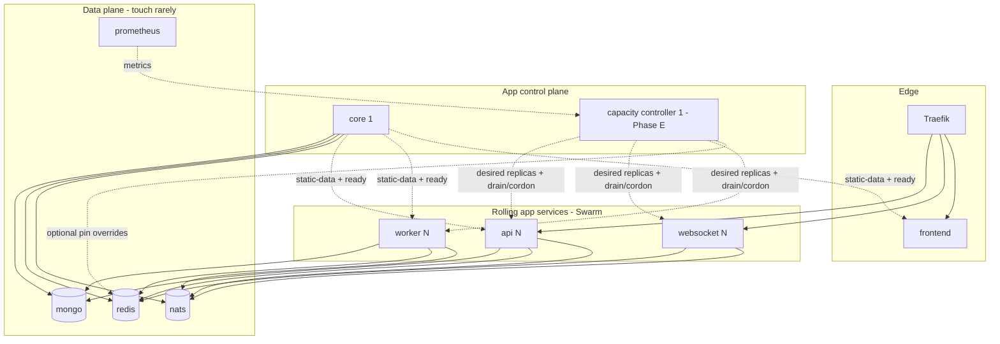

# Docker Swarm migration — roadmap & backlog

> **Handoff status (2026-07-19):** This file is the **source of truth** for the Swarm migration. Planning is mature enough to **start implementing** Phase 0/A; prefer growing follow-up design notes over expanding this roadmap further. **No Swarm cutover code/stack has been implemented yet**. A new session should read this document top-to-bottom (especially [Start here](#start-here-for-a-new-session), [Decisions log](#decisions-log), [Phases](#phases), [Backlog](#backlog)) and continue from Phase 0 / pickup order item 1. Do not rediscover architecture from chat history.

Tracks moving production from **all-reconcile Docker Compose** to **single-host Swarm** so elastic services can roll without taking the stack down, and JetStream / telemetry replica IDs stay stable across recreates.

Later, Swarm’s fixed replica counts are driven by a **capacity controller** (not a naive CPU HPA). Swarm does not autoscale by itself. Prep for the controller is **woven into earlier items** so Phase E is mostly policy + Docker/Traefik ops, not inventing identity or metrics from scratch.

**Scope (intentional):** **one host forever** for this product (current design; multi-node HA / multi-manager are out of scope). Multi-node overlay, Mongo multi-host, K8s, replacing NATS stay out of scope.

**Non-goals for v1:** forcing core to multi-active before changestream/scheduler are lease-safe; letting every replica call the Docker API to scale itself; auto-scaling the data plane; polishing data-plane live swaps before a basic Swarm cutover works; **Redis placement lookup on every WebSocket connect**; treating Phase E as a naive CPU “autoscaler” instead of a **capacity controller**.

**Dev vs prod (same product):** `make dev` **builds and runs** the app locally (images from Dockerfiles). **Prod** runs the **same service set / same built images** with the live `.env` and published tags — not a different architecture. Staging ≃ local/dev shape; Swarm is how prod (and eventually the same shape) is orchestrated after hard cutover.

---

## Start here for a new session

1. **Goal of next implementation slice:** Phase 0 → Phase A **hard cutover** to a **minimal** Swarm path for elastic services (`api` / `websocket` / `worker` + Traefik swarm provider). Defer fancy affinity, **capacity controller**, #20/#21 until cutover works.
2. **Pickup order:** [Recommended pickup order](#recommended-pickup-order) — start with **#1, #2, #5, #24 (minimal), #4 (basic)**.
3. **WS placement (locked preference):** Traefik (already the LB) does **consistent hash / tenant-keyed routing** on an affinity cookie whose **value** is `alliance:` / `corporation:` / `account:`. **Do not** design a Redis query on every `/ws` connect for placement. Redis pins are **optional later** for overflow / evacuate / move (#21). Session auth may already hit Redis; placement must not add a second round-trip.
4. **Auth** rolls **in parallel** — cutover may use **account-key** affinity until corp/alliance claims exist.
5. **Related roadmaps:** [document-lock](../document-lock/ROADMAP.md) (multi-tenant #30–#37, especially #32), [auth](../auth/ROADMAP.md), [DEPLOYMENT.md](../../DEPLOYMENT.md), current [docker-compose.yml](../../docker-compose.yml).
6. **Code anchors already in tree:** `services/shared/core/instanceid`, `services/core/singleton` + `redis/lease`, websocket JetStream durables (`doc-live-updates-*`, `InactiveThreshold`, consumer reconcile), Traefik sticky labels in compose (to be replaced for `/ws`).
7. **Testing:** grow [Testing & simulation](#testing--simulation) / **#25–#29** as you implement; weave tests into PRs for #4/#8/#18/#21/etc.

Companion context:

- Current prod path: `docker-compose.yml` + `make up` (`DEPLOYMENT.md`)
- Replica identity: `services/shared/core/instanceid` → JetStream durables / OTLP `service.instance.id`
- Core singleton jobs (already lease-gated): `services/core/singleton`
- Core **not** yet multi-safe: scheduler (`gocron`), Mongo changestream watcher
- **Multi-tenant product:** [document-lock ROADMAP § Strategic direction](../document-lock/ROADMAP.md#strategic-direction--multi-tenant-locks-account--corporation--alliance)
- Public deploy: operators edit **`.env`**; Swarm must pick up env changes (#24)

> Per item: **status** · **size** (S/M/L) · **where** · **why** · **how** · optional **acceptance**.  
> Add **new** open items at the bottom **without renumbering** existing ids.  
> All backlog items are **open / not started** unless marked otherwise.

---

## How to use this document

| Section | Purpose |
|---------|---------|
| [Start here](#start-here-for-a-new-session) | Handoff entry for a new agent/session |
| [Current state](#current-state) | What Compose does today and the pains |
| [Target shape](#target-shape-single-host) | What “done” looks like on one machine |
| [WS placement model](#ws-placement-model-traefik-first) | How connections reach the right websocket (no Redis-per-connect) |
| [Multi-tenant fit](#multi-tenant-fit-account--corp--alliance) | How Swarm/scale/placement anticipates product direction |
| [Changelog delivery](#changelog-delivery-core--jetstream--ws) | How Mongo changes reach containers (today vs #20) |
| [Principles](#principles) | Guardrails while migrating |
| [Phases](#phases) | Ordered delivery |
| [Capacity controller build-up](#capacity-controller-build-up-woven) | How earlier work feeds Phase E |
| [Testing & simulation](#testing--simulation) | How we prove cutover, affinity, scale, and management |
| [Backlog](#backlog) | Numbered work items **#1–#30** |
| [Impact map](#impact-map) | What improves vs what breaks |
| [Pickup order](#recommended-pickup-order) | Suggested sequencing |
| [Follow-ups](#follow-ups-detail-later) | Design notes still to write |
| [Decisions log](#decisions-log) | Locked decisions from planning |

---

## Current state

| Layer | Today | Pain |
|-------|--------|------|
| Deploy | `make up` → `docker compose up -d` over the whole project | Feels like all-down / all-up; hard to ship one image safely |
| api / websocket / worker | `deploy.replicas` in Compose (partial semantics) | Recreates mint new hostnames → JetStream durable churn |
| websocket identity | `OTEL_SERVICE_INSTANCE_ID` → … → `HOSTNAME` (`instanceid.Replica`) | Unstable names; orphan durables need `InactiveThreshold` + reconcile |
| core | Single container (`container_name: core`), `core-ready` file healthcheck | Other services `depends_on: service_healthy`; swap = gap |
| Edge | Traefik `providers.docker` + **per-browser sticky cookie** for `/ws` | Swarm provider cutover; sticky does **not** co-locate corp/alliance users — replace with **tenant-aware placement** (#4) |
| Observability | Alloy Docker discovery + `compose_service` labels | Swarm tasks use different labels |
| Dev | `docker-compose.dev.yml` + local builds (`make dev`) | Same app as prod; keep contracts aligned after cutover |

Elastic / dynamic process set (by design): **api**, **websocket**, **worker**.  
Control plane: **core** — singleton today; swap-safe first, multi-active only after leasing the remaining process-wide work.

---

## Target shape (single host)



| Service | Replicas | Update order (target) | Identity |
|---------|----------|----------------------|----------|
| api | ≥1 (later capacity-controlled) | `start-first` | `api-{{.Task.Slot}}` → `OTEL_SERVICE_INSTANCE_ID` |
| websocket | ≥2 (capacity-controlled + drain) | `start-first` | `websocket-{{.Task.Slot}}` |
| worker | ≥1 (first capacity-control target) | `start-first` | `worker-{{.Task.Slot}}` (tune Asynq concurrency if N>1) |
| core | 1 | `stop-first` until Phase C | fixed `core` (or slot `1`) |
| capacity-controller | 0 until Phase E; then 1 | `start-first` (lease-gated; same spirit as core Phase C) | singleton slot; owns desired shape (replicas, drain, optional pins) — Swarm executes |
| frontend | 1–2 | `start-first` | optional |
| mongo / redis / nats / exporters | 1 | rare / manual | keep stable DNS names |

**Hybrid allowed:** data plane + early core stay on Compose; elastic trio on `docker stack deploy` attached to an **external** `eip` network.

---

## WS placement model (Traefik first)

Traefik **already** load-balances `/ws`. A second generic LB does not group orgs by itself. Opaque sticky cookies group **browsers**, not **corps**.

### Default (preferred — no Redis placement on connect)

1. At login / session create (or from claims the SPA already has), set a cookie whose **value** is the primary affinity key: `alliance:{id}` → else `corporation:{id}` → else `account:{id}`.
2. Traefik uses **consistent hash** (or equivalent tenant-keyed routing) on that cookie value → `websocket-N`.
3. WebSocket upgrade still validates session (existing Redis auth path is fine). **Do not** add a separate “ask Redis which slot” on every connect.
4. Optional: derive the affinity key from the session document already loaded for auth (piggyback) — still not a placement-table lookup.

### Optional later (overflow / ops / capacity controller)

`preferred_slot = redis_pin[tenant] ?? hash(tenant)`

- Redis pin only when the **capacity controller** (#18) or ops (#21) need soft overflow, evacuate, or “prefer new empty slot for new tenants.”
- Most connects never touch a pin key — Traefik hash remains default.
- Hosted-tenant / interest for #20 updates on connect/disconnect/move — **not** on every changelog.
- Separation of concerns: **Swarm** schedules containers; **Traefik** routes; **capacity controller** decides desired cluster shape (replica counts, cordon/drain, reserve capacity, optional pins). Analogous to a lightweight app-specific control plane (not Kubernetes).

### Not the design

- Per-browser Traefik sticky as the long-term model.
- Placement API that Redis-GETs on every `/ws`.
- Live TCP teleport of sockets between containers (reconnect + existing `ws:session_handoff` instead).

---

## Changelog delivery (core → JetStream → WS)

**Today:** core changestream publishes once to `doc.update.{collection}.{docID}` (JetStream). Each websocket replica has its own durable on `doc.update.>` so **every** replica receives **every** message, then filters locally to connected clients.

**With affinity alone:** co-location improves in-process density; the bus firehose remains until #20.

**Target (#20):** tenant (or shard) in subject; each slot keeps **one durable** with a **mutable filter set** for hosted tenants; core still publishes once — **no Redis on the changelog hot path**. Interest registry in Redis is for connect/move/ops. Dead slots: Redis TTL + JetStream `InactiveThreshold` + reconcile (same spirit as today’s orphan durable cleanup). On filter change after a move, define stream `MaxAge` and new-only vs backlog policy so reconnects don’t dump history or skip events.

**Core hot-swap:** core is the publisher leader (Phase B stop-first gap; Phase C lease-gate scheduler + changestream for start-first). Websocket consumers do not move with core.

---

## Multi-tenant fit (account | corp | alliance)

Product direction (locks, docs, WS fan-out) is **one planner** that serves **personal**, **corporation**, and **alliance** scopes together — not three separate apps. Infra choices here must not paint us into an account-only corner.

| Concern | Implication for Swarm / Traefik / capacity controller |
|---------|------------------------------------------|
| Tenants chatty on the same docs/locks | Prefer **placing clients that share a corp/alliance on the same WS replica within reason** so in-process fan-out hits more of that org’s tabs |
| **Today’s JetStream WS path** | Each replica uses its own durable on `doc.update.>` / `doc.lock.>` so **every** replica receives **every** message, then discards if no local listeners — correct when sticky scatters users; becomes a **worthless bottleneck** once affinity groups orgs |
| Selective fan-out (follow-on) | Know **which replicas host which tenants** and deliver only there (plus overflow/miss path) — see **#20**; pairs with affinity (#4) and tenant subjects (document-lock **#32**) |
| Personal + corp + alliance open at once | A session may need **multiple tenant subscriptions**; placement key is a **primary affinity** (e.g. largest/most-active org for that session), not “only one tenant forever”; interest registry must track **all** tenants with live sockets on that replica |
| Cookie sticky (`eip_ws_affinity`) | Pins a **browser**, not an **org** — random relative to corp mates. **Do not treat sticky as the long-term model**; replace at Traefik cutover (#4) |
| Scale signals | Global client/queue depth first; later add **hot-tenant** pressure (clients or backlog attributed to `corporation:*` / `alliance:*`) in #8 / #19 / metrics so one large alliance cannot silently soak a replica without scale-up |
| Workers | Today personal/Asynq queues; leave policy room for **per-tenant or per-queue-family** triggers when corp/alliance job pipelines exist (#7 / #19) |
| Drain / scale-down | Must consider **tenant concentration** — do not shrink away the only replica hosting a hot alliance without drain (#8); interest map must drop that replica’s tenants on drain |
| **Move / rebalance tenants** | Hash placement is stable until N changes; **override pins** + reconnect for evacuate/move (#21). Prefer reconnect over live teleport |

**Affinity key (target):** `alliance:{id}` → else `corporation:{id}` → else `account:{id}` (same encoding as lock tenants). **Default routing = Traefik hash of that key.** Soft overflow / evacuate uses optional Redis pins later — not a per-connect placement service.

**Rebalance model (target):** capacity controller / ops change optional pin (or wait for hash ring after scale), signal clients to reconnect, Traefik hashes (or honours pin). Session handoff/resume already exists. Scale-in always **drains** first.

**Why selective fan-out matters with affinity:** Co-location alone does not cut NATS/CPU if every `websocket-N` still pulls `doc.update.>`. #20 narrows delivery; see [Changelog delivery](#changelog-delivery-core--jetstream--ws).

Cross-links: document-lock **#32** (WS fan-out by tenant), **#30** (tenant string encoding). Placement can ship with **account-key affinity** before corp collections exist, then widen the key as membership claims land in session/auth — without going back to per-browser sticky.

---

## Principles

1. **Single host is the product** — design for one machine; no multi-node volume/network designs.
2. **Stable slot IDs** for JetStream durables / `ws_instance_id` (and sane scale-up naming).
3. **Never run two core leaders** until scheduler + changestream are lease-gated.
4. **Same app, two run modes** — `make dev` builds/runs locally; prod runs the same images with live env. After cutover, keep topology/env contracts aligned so staging isn’t a different animal.
5. **Product safety over clever rollouts** — prefer a short core gap (`stop-first`) over duplicate changestream publishes until Phase C.
6. **Deep-dive before coding each phase** — detailed designs land in follow-ups / ADRs as items are picked up.
7. **Centralise capacity decisions** — a singleton **capacity controller** (or operator) owns desired replica counts, drain/cordon, reserve capacity, and optional placement overrides. App replicas must not call the Docker API to scale themselves.
8. **Lay capacity-controller groundwork early** — metrics, Traefik, drain, YAML policy feed Phase E (see [Capacity controller build-up](#capacity-controller-build-up-woven)).
9. **Operator-owned policy file** — ceilings, targets, reserve %, cooldowns in mounted YAML (#19), including **host resource headroom**.
10. **Design for multi-tenant from day one** — tenant-shaped placement/scale keys; auth claims roll in parallel.
11. **Org-aware WS placement over sticky** — Traefik **hashes** primary tenant key on `/ws` (#4). **No Redis placement GET on every connect.** Redis pins only for later overflow/move (#21).
12. **Selective WS bus delivery follows affinity** — #20; no Redis on changelog hot path; one durable per slot + mutable filters.
13. **Tenant placement is movable** — #21 evacuate/move when hash alone isn’t enough; lock UX during moves with doc-lock corp/alliance work.
14. **Hard cutover, then deepen** — minimal Swarm first; then ordered rolls, affinity depth, capacity controller.
15. **Public `.env` is the config surface** — documented Swarm refresh (#24).
16. **This roadmap is the handoff** — implement from here; don’t re-derive from chat.
17. **Test as we build** — every major capability gets automated coverage and a **simulation/harness** path (affinity, connections, scale, evacuate/move, core failover). Prefer dry-run / fake Docker / load generators over “try it in prod.” Weave tests into item acceptance; grow the suite under **#25–#29**.

---

## Phases

### Phase 0 — Prep (still Compose in prod)

Prepare files/network/identity for a **hard cutover** to a **basic** Swarm stack (elastic services + Traefik swarm provider). Defer ordered multi-service roll sophistication, data-plane live swaps, and full corp affinity until after cutover is boring.

- Pin / document replica env vars.
- Inventory bind mounts → configs/volumes plan (#3).
- External attachable `eip` (#1).
- Minimal stack file sketch (#5); Traefik swarm path (#4) — account-key affinity OK for v1 cutover if corp claims not ready.
- Document `.env` → Swarm env story (#24) at least for “recreate services after env edit.”

### Phase A — Hard cutover: basic Swarm for elastic path

**Hard cutover** to Swarm for **api / websocket / worker** (+ Traefik as needed). Core + mongo/redis/nats may stay Compose briefly or move only as far as required for one working prod path — prefer **simplest** setup that runs.

- Slot-stable identity (#2).
- `start-first` rolls for elastic services.
- Traefik swarm + **hash on affinity cookie** (#4) — account-key OK; no Redis-per-connect placement.
- Manual scale documented (#6); capacity envelope drafted (#7 / #19).

**Exit criteria:** prod is on the basic Swarm path; `make up`-style whole-compose bounce is no longer the release mechanism for elastic services; known rollback = previous images / re-stack with prior tag.

**Then build outward:** ordered version rolls (#23), env refresh (#24), core Phase B/C, affinity depth, #20/#21, **capacity controller**.

### Phase B — Core as Swarm singleton (swap-safe, brief gap OK)

Goal: **replace core without bouncing the whole stack**, not zero-gap yet.

- `replicas: 1`, `order: stop-first` (SIGTERM old → drain → start new).
- Graceful shutdown already wired via signal context + cleanup fns: stop scheduler, changestream, singleton jobs, then exit.
- Replace Compose `depends_on: core healthy` with Redis/HTTP **ready** (#10); api/worker retry until ready.
- Document ops: no `docker exec` by fixed name (#14).
- **Accept** a short window with no changestream / no cron (depends on SDE/startup). Fine for many deploys; not HA “on the fly.”

**Exit criteria:** `docker service update` core alone; dependents survive the gap; gap duration measured and documented.

### Phase C — Core hot-swap / active-passive (true on-the-fly)

Goal: **new core becomes leader before (or as) old releases**, so changelog + schedule ownership moves without a long dark period.

| Workload | Today | Needed for hot-swap |
|----------|--------|---------------------|
| `singleton/*` (doclock expiry, auth maintenance) | Already Redis lease-elected | Ready — standby can wait on lease |
| Scheduler (`gocron`) | Starts on every process | **#11** — only leader registers/runs |
| Changestream watcher | Starts on every process | **#12** — only leader watches; resume token/handoff |
| SDE / indexes / ready | Runs at startup | Idempotent; **leader ready** (#10), not “any process touched a file” |

Then Swarm: `order: start-first`, optionally `replicas: 2` (leader + warm standby). New task acquires leases → becomes leader → old loses leases / SIGTERM → drains. JetStream **consumers** stay on websocket slots; only the **publisher** (core) moves.

**Exit criteria:** core image roll with takeover SLA; no dual changestream storm; no double cron.

### Phase D — Remainder (optional)

- frontend on Swarm.
- Alloy label mapping for swarm tasks (`compose_service` compatibility or new `swarm_service` label).
- Optionally fold Traefik / exporters / data plane into the same stack once ops are comfortable.
- **Capacity-controller prep:** ensure Prometheus series the future controller will query (Asynq queues, `ws.connected_clients` per slot, optional API latency/CPU, host headroom) are stable and dashboarded under Swarm labels (#15, #7, #8).

### Phase E — Capacity controller (optional)

Swarm does **not** autoscale and does not understand org co-location. After elastic services are stable, add a **dedicated singleton Swarm service** for the **capacity controller** (#18) driven by YAML (#19) — **its own container**, not a sidecar of core/api/worker.

**Roll / swap:** same class of problem as core. From day one use **lease-gated hot-swap** (core Phase C pattern): `replicas: 1` (or 2 with warm standby), `order: start-first`, Redis lease so only one controller mutates Docker; new task acquires lease → becomes active → old loses lease / SIGTERM → exits. Brief dual-process overlap is fine; **dual armed mutators are not**. A stop-first gap is acceptable only as an emergency fallback, not the design target.

It is **not** a simple CPU watcher. It manages **cluster shape**:

| Decision | Examples |
|----------|----------|
| Replica counts | worker / websocket / api min–max from queue depth, client load, host headroom |
| Spare capacity | e.g. keep ~20% WS headroom (`reserve_capacity`) before average utilisation forces scale-up |
| Soft vs hard limits | `target_clients` vs `hard_limit` per WS slot |
| Scale-up | raise desired replicas; wait healthy; optionally prefer **new** slot for new tenants (pin / cordon policy) |
| Scale-down | **never** instant kill — cordon → drain (#21) → when empty `service scale` down |
| Migrate / evacuate | which tenant leaves which slot under imbalance or deploys |
| Kill switches | per-service `enabled: false` in YAML |

**Division of labour**

- **Swarm** — schedules/runs the desired task count  
- **Traefik** — routes `/ws` (hash on affinity cookie by default)  
- **Capacity controller** — decides what the cluster *should* look like  

Similar spirit to K8s splitting scheduler vs HPA vs cluster-autoscaler, without adopting Kubernetes.

**Exit criteria:** capacity-controller service rolls via Swarm hot-swap with single lease holder; worker and WS desired state converge under policy without hand-scaling; scale-down always drains; dry-run (#27) proven before armed Docker mutations; operators edit YAML not code.

---

## Capacity controller build-up (woven)

Do not wait for Phase E to invent signals. Each earlier item owns a slice:

| When doing… | Also leave behind… | Feeds |
|-------------|-------------------|--------|
| **#2** slot identity | Continuous `ws_instance_id` / OTLP instance series as replica count changes | WS utilisation math |
| **#4** Traefik swarm + **tenant affinity** | Placement by primary tenant key; overflow when soft-full; no per-browser sticky as end state | WS scale-up + co-located orgs; **prerequisite for #20** |
| **#5** stack file | Mount point for policy YAML; optional label mirrors | #18 / #19 |
| **#6** roll playbook | Manual `service scale`; note affinity impact on reconnect | Operator + controller parity |
| **#7** worker capacity | ESI envelope; draft `worker:` YAML; **placeholder** triggers for future corp/alliance queue families | #19 worker section |
| **#8** WS reconnect / drain | Soft caps; cordon; hosted-tenant set; reconnect — precursor to moves | #19 WS; feeds #20 / #21 |
| **#15** Alloy/Prom labels | Series for N tasks; room for tenant-labelled WS gauges when product emits them | #18 inputs |
| **#17** Makefile/docs | `make scale-*`; YAML edit/reload | Ops path |
| **#11–#13** core leases | Same lease-election pattern reused by capacity controller (#18) | #18 hot-swap |
| **#19** policy YAML | Schema: mins/maxes, targets, reserve %, drain, host ceilings | #18 source of truth |
| **#30** cluster abstraction | Observe/Apply API hiding Docker; fake impl for #27 | #18 packages |
| **#20** selective fan-out | Interest map + tenant-scoped delivery | Honest per-slot load |
| **#21** drain / evacuate / move | Ops the controller invokes on scale-in / rebalance | Management under affinity |
| **#25–#29** testing harness | Sims for connections, dry-run capacity decisions, management drills | Confidence for #18 / #21 |

Phase E (#18) should **evaluate cluster health periodically** from metrics + policy (#19), then call Swarm/Traefik-facing ops (scale, cordon, drain, optional pins) — not react to a single CPU sample. Prefer **dry-run** (#27) before armed mutations.

---

## Testing & simulation

Swarm, affinity, and capacity control are easy to get subtly wrong. Build a **layered suite** as features land — not a single big-bang QA project at the end.

### Layers

| Layer | What | Examples |
|-------|------|----------|
| **Unit** | Pure logic | Affinity key selection; hash → slot; capacity-controller policy decisions from fake cluster state; lease acquire/release; filter-set reconcile; YAML schema validate |
| **Integration** | Real Redis/NATS/Mongo in CI (or testcontainers) | Session handoff; JetStream durable create + InactiveThreshold; hosted-tenant interest TTL; core lease failover for #11/#12 |
| **Contract / component** | HTTP/WS against running services (`make dev` or compose profile) | Traefik routes `/ws`; two clients same affinity key → same backend (or same sticky target in test double); ordered roll script dry-run |
| **Simulation / load** | Generators + harnesses | N concurrent WS clients with corp/account keys; queue depth fake for Asynq; capacity dry-run printing `would scale websocket 2→3` then `drain WS-3`; evacuate/move without prod Docker socket |
| **Chaos / failover drills** | Scripted fault injection | Kill websocket slot; kill core leader; assert recover within SLA; orphan durable cleanup |

### What must be simulatable (management surface)

Operators and CI should be able to exercise without hoping traffic appears:

1. **Connections** — spawn many WS clients with chosen affinity keys; assert co-location / reconnect / handoff.
2. **Capacity control** — feed synthetic per-slot metrics into the policy engine; assert full decisions (scale, drain, reserve headroom, optional pins); **dry-run mode** that never calls Docker until explicitly armed (#27).
3. **Manual scale** — Makefile/`service scale` paths covered by integration or documented script tests.
4. **Evacuate / move / cordon (#21)** — script or API to move a fake tenant between slots; assert reconnect + interest map.
5. **Core leadership** — two core processes in test; kill leader; assert single changestream/scheduler.
6. **`.env` refresh (#24)** — scripted recreate path in CI smoke where feasible.
7. **Selective fan-out (#20)** — publish tenant-keyed messages; assert non-hosting slot pull count ≈ 0.

### Woven into other items

When implementing #4, #6–#8, #11–#13, #18–#21, #23: add/extend tests in the same PR when practical. Track harness foundations under **#25–#29** so work isn’t orphaned.

### Dev mirror

`make dev` should be able to run (or invoke) the same harnesses against local stacks so prod Swarm behaviour isn’t only testable on the live box.

---

## Backlog

### Prep & platform

#### #1 — External attachable `eip` network
- **status:** open
- **size:** S
- **where:** `docker-compose.yml` networks; deploy docs / Makefile notes
- **why:** Hybrid Compose data plane + Swarm app services need shared DNS
- **how:** Define external network; document create-once bootstrap; point both runtimes at it
- **acceptance:** `api` (stack) resolves `mongo` / `redis` / `nats` (compose) by name

#### #2 — Replica identity contract (prod)
- **status:** open
- **size:** S
- **where:** `instanceid.Replica`, websocket JetStream durables, deploy templates
- **why:** Unstable HOSTNAME/container IDs thrash durables and Grafana series; capacity control also needs continuous per-slot series
- **how:** Standardise on Swarm `{{.Task.Slot}}` (and Compose-era overrides for transitional hybrid); document env priority already implemented; verify metrics stay on `websocket-1`…`N` when scaling up/down manually
- **acceptance:** After recreate **or** `service scale`, durables/metrics reuse `doc-live-updates-websocket-<slot>` (etc.) for each live slot
- **capacity-controller build-up:** required input for per-slot WS utilisation averages without orphan label explosion

#### #3 — Secrets / configs instead of fragile bind mounts
- **status:** open
- **size:** M
- **where:** `adminSDK*.json`, key material mounts, observability file mounts used by stack services
- **why:** Swarm stacks handle bind mounts poorly; deploys become host-path-dependent
- **how:** Docker configs/secrets or named volumes populated by bootstrap scripts
- **acceptance:** Elastic services deploy without `./file` host binds for secrets

#### #4 — Traefik swarm provider cutover + tenant-aware WS placement
- **status:** open
- **size:** L
- **where:** Traefik command/labels; `/ws` LB; affinity cookie set at login/session; auth claims when available
- **why:** Stack tasks need swarm provider; opaque sticky groups browsers not orgs
- **how:**
  1. Enable `providers.swarm`; network constraint; TLS; keep `/api` + frontend.
  2. **Default placement:** consistent hash (or tenant-keyed routing) on cookie **value** = affinity key (`alliance:` / `corporation:` / `account:`). Set cookie at login/session create — **not** via Redis placement lookup on each `/ws`.
  3. Remove opaque sticky as steady-state design (emergency fallback only during cutover if needed).
  4. Account-key OK until corp/alliance claims exist (auth parallel).
  5. Redis session handoff / SPA resume when reconnect moves slots.
  6. Track local hosted-tenant set for future #20 (in-memory; Redis interest optional later).
  7. **Defer** Redis pins / overflow / placement API until #21 — not part of minimal cutover.
- **acceptance:** Two clients with the same affinity key land on the same WS replica via Traefik hash; `/ws` connect path has no extra Redis placement GET; Swarm routing works; **#26** (or interim test) can demonstrate co-location
- **capacity-controller build-up:** scale-up adds hash ring members; scale-down needs drain (#8) / later #21

### Elastic services (Phase A)

#### #5 — Stack file for api / websocket / worker
- **status:** open
- **size:** M
- **where:** new `docker-stack.yml` (or split compose override used only with `stack deploy`)
- **why:** Need Swarm-honoured `deploy.update_config` and slot templates
- **how:** Extract elastic services; pin images via `APP_VERSION`; wire volumes (`api_data`, `static_data_files`, `worker_data`) on single node; reserve a named volume or bind for capacity policy YAML later (`/config/capacity.yaml`); optional deploy labels may **mirror** YAML min/max for humans/`docker service inspect`, but YAML is authoritative for the controller
- **acceptance:** `docker stack deploy` runs trio beside existing data plane
- **capacity-controller build-up:** config mount path + optional label mirrors for #18 / #19

#### #6 — Rolling update playbook (api / ws / worker)
- **status:** open
- **size:** S
- **where:** `DEPLOYMENT.md` or `docs/swarm/DEPLOY.md`
- **why:** Replace tribal `compose up` with service-scoped rolls
- **how:** Document `service update --image`, rollback, healthcheck expectations, WS reconnect behaviour; add **manual** `docker service scale` examples for worker and websocket within #7/#8 envelopes
- **acceptance:** Operator can roll one service without touching mongo/redis/nats; can manually scale worker/ws safely
- **capacity-controller build-up:** controller later automates the same scale/drain path operators already practice

#### #7 — Worker replica vs Asynq concurrency policy
- **status:** open
- **size:** S
- **where:** worker Asynq server config; stack `replicas`; asynqmon / Prometheus panels; draft #19
- **why:** Each process already uses a large concurrency pool; N replicas can overwhelm Redis/ESI; this envelope is the capacity controller’s ceiling; corp/alliance workloads will add more queue families later
- **how:** Decide default `replicas` and per-process concurrency product; document ESI-safe envelope; draft `worker:` in #19 with today’s queue thresholds **and** commented placeholders for future per-tenant / per-queue-family triggers (e.g. corp export queues) so schema does not have to break later
- **acceptance:** Written min/max replicas and concurrency; Grafana/asynqmon healthy under chosen N; YAML draft includes extensibility notes for multi-tenant queues
- **capacity-controller build-up:** **primary** worker section for #19 → #18

#### #8 — Websocket rollout, affinity reconnect, and drain
- **status:** open
- **size:** M
- **where:** tenant-affinity placement (#4); Redis `ws:session_handoff:v1`; SPA reconnect/resume; WS gauges; later per-tenant hotspot metrics
- **why:** Replica rolls and scale-down still drop sockets; org co-location makes “which replica we drain” product-sensitive (do not evaporate the alliance’s home replica carelessly)
- **how:** Test mid-edit deploy + affinity reconnect; soft per-replica caps; drain/cordon checklist that considers **tenant concentration**; keep an accurate **in-memory (and optionally Redis) set of tenants with local sockets** updated on connect/disconnect; support a **slot cordon** flag (refuse new upgrades for this slot; optional “please reconnect” to local clients) as a thin precursor to full tenant move (#21); draft `websocket:` in #19 (`target_clients`, `hard_limit`, `reserve_capacity`, `drain_timeout`); plan metrics: per-slot `ws.connected_clients` now, optional per-tenant hotspot gauges later
- **acceptance:** Controlled roll does not strand sessions; affinity-stable reconnects within reason; drain/cordon checklist + YAML draft exist; sticky-cookie assumptions removed from runbooks; hosted-tenant set is correct enough to drive interest registry (#20) and rebalance (#21)
- **capacity-controller build-up:** WS section for #19 → #18; hosted-tenant set feeds #20/#21; no automatic scale-down until drain + affinity rules are real

### Core (Phase B / C) — switching core on the fly

Core is the **control plane** (changestream → JetStream, scheduler → tasks, singleton jobs). It is not scaled like websocket. “Switch on the fly” means **safe ownership transfer**, not N active cores.

#### #9 — Core Swarm singleton (`stop-first`, Phase B)
- **status:** open
- **size:** M
- **where:** stack deploy for `core`; graceful SIGTERM path in `main` / cleanup fns
- **why:** Ship core image bumps without whole Compose reconcile; first step toward replaceable core
- **how:** `replicas: 1`, `order: stop-first`, stop_grace_period long enough for drain (scheduler stop + changestream close + singleton stop). Healthcheck on ready (#10). Measure gap (last changelog publish → first publish after swap).
- **acceptance:** Core rolls alone; dependents survive; gap documented; no orphan “half started” core

#### #10 — Ready signal without Compose `depends_on`
- **status:** open
- **size:** M
- **where:** `startup.WriteCoreReadyMarker`; prefer Redis `core:ready` / `core:leader` + generation; api/worker/frontend tolerate wait
- **why:** Swarm lacks Compose health depends_on; file marker on a volume is brittle across tasks
- **how:** Phase B: “process finished bootstrap.” Phase C: “**this process holds leadership** and changestream+scheduler are running.” Consumers poll/retry; optional wait in deploy scripts.
- **acceptance:** api/worker start order-independent; become ready when core is; Phase C ready flips with leadership

#### #11 — Lease-gate scheduler (leader only)
- **status:** open
- **size:** L
- **where:** `services/core/scheduler`; reuse `singleton` / `redis/lease`
- **why:** Two cores would double-fire gocron / duplicate schedule publishes
- **how:** Only lease holder constructs gocron + JetStream scheduler consumer work; on lease loss cancel jobs promptly; follower loops trying to acquire. Same lease family style as `lease:doclock:…`.
- **acceptance:** Two core processes live; exactly one emits scheduled publishes; kill leader → standby takes over within lease TTL

#### #12 — Lease-gate changestream watcher
- **status:** open
- **size:** L
- **where:** `services/core/changestream`
- **why:** Two watchers duplicate `doc.update` / related publishes — breaks WS correctness and doubles bus load
- **how:** Leader-only `Watch`; persist/resume token (Mongo resume or equivalent) so takeover doesn’t require full replay storm; on lease loss close change streams before release; follower idle. Coordinate with tenant-subject publishing when #20/doc-lock #32 land (publisher is still single-leader).
- **acceptance:** Kill leader → standby resumes without sustained duplicate storm; failover within documented SLA; metrics for “changestream leader” instance id

#### #13 — Core `start-first` / warm standby (Phase C hot-swap)
- **status:** open · blocked on #11 #12 (+ #10 leader-ready)
- **size:** M
- **where:** core `deploy.update_config`
- **why:** Remove intentional dark window for live fan-out and schedules
- **how:** After leases land: `order: start-first`; optionally `replicas: 2` (standby already connected to mongo/nats/redis, waiting on leases). New task acquires → old loses lease / SIGTERM. Prefer **explicit lease release on shutdown** (shorten takeover vs waiting full TTL). Do not run two leaders.
- **acceptance:** Core image roll with changelog pause bounded by handoff SLA (not full cold start); no dual watchers; rollback works if new task never becomes ready/leader

#### #14 — Core CLI / one-shot job ops under Swarm
- **status:** open
- **size:** S
- **where:** `core/main.go` command mode; deploy docs
- **why:** `docker exec` + `container_name: core` breaks
- **how:** Document `docker run --rm --network eip …` one-shots or `docker exec` via task id helpers
- **acceptance:** Common migrations/tasks runnable without Compose container names

### Observability & edge (Phase D-ish)

#### #15 — Alloy / Loki label compatibility for Swarm tasks
- **status:** open
- **size:** M
- **where:** `observability/alloy/config.alloy`; Prometheus/Grafana as needed
- **why:** Today maps `com.docker.compose.service` → `compose_service`; swarm tasks omit that; capacity controller and humans both need trustworthy series
- **how:** Map swarm service name into `compose_service` (compat) and/or add `swarm_service`; update Grafana variables; verify **asynqmon** + OTLP WS/API gauges remain queryable after hybrid/Swarm cutover
- **acceptance:** Per-service log filters work for stack tasks; capacity-relevant PromQL (per-slot clients, queues, host headroom) can be written against live data
- **capacity-controller build-up:** metric pipeline readiness for #18

#### #16 — Frontend on Swarm (optional)
- **status:** open
- **size:** S
- **where:** frontend service in stack
- **why:** Same rolling-deploy story as api
- **how:** `start-first`, Traefik labels under swarm provider
- **acceptance:** Frontend rolls without bounce of data plane

#### #17 — Makefile / DEPLOYMENT.md dual-path
- **status:** open
- **size:** M
- **where:** `Makefile`, `DEPLOYMENT.md`, optional `docs/swarm/DEPLOY.md`
- **why:** Operators need clear Compose-dev vs Swarm-prod commands
- **how:** Targets for stack deploy/update/rollback; `make dev` builds/runs the same app locally; prod uses published tags + live `.env`; add thin `scale-worker` / `scale-websocket` helpers; YAML edit/reload docs when #19 lands; `.env` refresh points at #24
- **acceptance:** Docs describe dev vs prod without contradictory “always compose up for releases”; manual scale and env-refresh helpers exist
- **capacity-controller build-up:** same scale entrypoint the controller will eventually call; config edit path for operators

### Capacity controller (Phase E)

#### #18 — Capacity controller (singleton Swarm service)
- **status:** open · blocked on Phase A practicals (#2, #4–#8), trustworthy metrics (#7, #15), and policy schema (#19); WS scale-down blocked on #8 drain / #21 evacuate
- **size:** L
- **where:** **dedicated** app image/service (`capacity-controller`); Docker API access (socket or equivalent); Prometheus query client; mounted YAML from #19; Redis lease + optional pin overrides
- **why:** Swarm only holds a desired replica count. Something still must decide **cluster shape**: how many worker/WS/api replicas, when to drain/remove a slot, how much spare capacity to keep, and (later) which replica should receive a new or migrated tenant. That is richer than watching CPU. Own container keeps Docker privileges and scale loops out of core/api/worker, and lets Swarm replace it like other singletons.
- **how:** Dedicated **capacity controller** service only (no app replica calls Docker to scale itself). **Swap model (locked):** lease-gated **hot-swap from day one** — same spirit as core Phase C (`start-first`, single leader via Redis lease; optional warm standby). New task acquires lease before arming mutations; old task releases lease on SIGTERM. Cooldown/hysteresis state may live in Redis so a roll does not forget recent scale decisions.

  **Internal shape (same binary, three packages — not three services):**

  ```text
  capacity-controller/
    policy/     // "what should happen?" — pure Evaluate(state, yaml) → desired
    cluster/    // "what exists?" — read observations + Apply mutations via #30
    executor/   // "make reality match desired" — ordered scale/drain/pin ops
  ```

  **Reconciliation loop (golden rule):** `Observe → Evaluate → Apply → Wait`. Policy evaluation is **deterministic and side-effect free**; Docker (and later drain/pin side effects) live only behind the cluster/executor boundary (#30). That keeps #18 coherent as one product owner without one undifferentiated blob.

  Periodically evaluate the cluster against YAML (#19), not a single metric sample. Responsibilities:
  1. **Desired replica counts** — worker / websocket / api within min–max from queue depth, client load, host headroom.
  2. **Reserve / spare capacity** — e.g. keep `reserve_capacity` headroom before average WS utilisation forces scale-up.
  3. **Scale-up sequence** — raise desired replicas → wait healthy → optionally prefer the new slot for **new** tenants (soft pin / cordon policy).
  4. **Scale-down sequence** — cordon → drain/evacuate (#21) → when empty `docker service scale` down (never instant kill of a hot slot).
  5. **Optional placement overrides** — Redis pins for overflow / migrate / “put new tenants on empty slot”; default stays Traefik hash (#4).
  6. **Kill switches & lease** — per-service `enabled: false`; only the lease holder mutates Docker; hot-reload config.
  
  Signals: Asynq queue depth/age; per-slot WS clients / hot-tenant; optional API latency/CPU; **host CPU/mem headroom** (node-exporter) so scale-up pauses when the single box is saturated — not urgent early, required before aggressive control. Introduce order: **worker → websocket (up first, down only with drain) → api**.

  Illustrative loop: two WS slots at ~90% of `target_clients` → decide scale to 3 → wait WS-3 healthy → place new tenants on WS-3; later average ~30% → drain WS-3 → when empty scale to 2.
- **acceptance:** Controller is its own Swarm service and rolls via `service update` without bouncing the stack; hot-swap transfers lease with no dual Docker mutators; packages keep policy pure (fixture-tested) and Docker confined to cluster/executor; worker and WS desired state converge under YAML without hand-scaling; operators can disable/clamp via YAML; scale-up respects host ceilings when configured; WS scale-down always drains; no replica stampede; **#27 dry-run** + **#30** fake cluster proven before arming Docker mutations in any environment

#### #19 — Capacity policy config (YAML, operator-owned)
- **status:** open · can start as soon as #7/#8 numbers exist (before #18)
- **size:** S
- **where:** e.g. `observability/capacity/capacity.example.yaml` + deployed `/config/capacity.yaml` (named volume or host bind on the single manager)
- **why:** Ceilings, targets, reserve %, drain timeouts, and kill-switches must be tunable without rebuilding the controller; multi-tenant product will need more knobs than “global clients > N”
- **how:** Define schema (versioned). Mount into the capacity controller only. Example shape (illustrative — numbers TBD from #7/#8):

  ```yaml
  version: 1
  defaults:
    cooldown: 2m
    scale_up_stabilization: 1m
    scale_down_stabilization: 5m
  # Default placement remains Traefik hash on affinity cookie (#4).
  # Controller may set optional Redis pins for overflow / migrate / new-on-empty-slot.
  affinity:
    primary_key_order: [alliance, corporation, account]
  services:
    worker:
      enabled: true
      min: 2
      max: 20
      notes: "respect Asynq concurrency envelope in worker image (#7)"
      scale_up:
        queue_depth: 500
        cooldown: 30s
      scale_down:
        queue_depth: 50
        cooldown: 5m
      # future: corporation/alliance queue families — same shape, different queue name
      # scale_up:
      #   queue: corp_documents
      #   queue_depth: 300
    websocket:
      enabled: false   # enable after drain + affinity (#4/#8/#21)
      min: 2
      max: 12
      target_clients: 1500   # soft per-replica target
      hard_limit: 2000      # refuse / overflow before exceeding
      reserve_capacity: 0.20  # keep ~20% spare across the fleet
      drain_timeout: 10m
      # future: react when one tenant concentrates on a replica
      # hot_tenant_clients_scale_up_above: 1500
      place_new_tenants_on:
        preference: newest_healthy_slot   # after scale-up; else hash
    # Host headroom — not urgent early, but controller must not ignore the box (#18)
    # host:
    #   max_cpu_percent: 85
    #   max_mem_percent: 85
    #   pause_scale_up_if_exceeded: true
    api:
      enabled: false
      min: 1
      max: 4
  ```

  Seed from #7/#8; keep example committed; validate on load; fail closed. Extend fields when multi-tenant queues/metrics appear — prefer additive YAML keys over code-only constants.
- **acceptance:** Example YAML in-repo with multi-tenant / reserve / drain fields; production mount documented; #18 dry-run prints effective policy; changing max/enabled/reserve does not require a new image
- **capacity-controller build-up:** write sections while doing #7/#8/#4; #18 consumes the file

### Multi-tenant realtime efficiency (after affinity)

#### #20 — Selective JetStream / WS fan-out (interest-based)
- **status:** open · blocked on usable affinity (#4) + hosted-tenant tracking (#8); strongly paired with document-lock **#32** (tenant subjects / WS subscribe set)
- **size:** L
- **where:** websocket JetStream consumers (`doc.update.>`, `doc.lock.>` today); Redis interest registry (connect/move path only); changestream / lock publishers; tenant (or shard) in subject
- **why:** Today each replica’s durable filters `doc.update.>` / `doc.lock.>` so **every container receives every message**, then `deliverOutbound*` no-ops when no local clients — fine when sticky scatters users; once orgs are co-located, this is pure firehose cost on replicas that will never deliver
- **how (direction — prefer no Redis on changelog hot path):**
  1. **Interest registry in Redis** — updated on connect/disconnect/move/heartbeat only. **Not** queried per changelog. Used for placement (#4/#21), ops visibility, and reconciling what a slot *should* be subscribed to.
  2. **Preferred delivery: dynamic subscribe on the WS side** — core still publishes **once** to a tenant-keyed (or shard-keyed) subject. Each slot consumes only what it hosts. Avoid publish-time Redis lookup.
  3. **Keep consumer cardinality small (cleanup hygiene):**
     - **Do not** mint one long-lived JetStream durable per `(slot, tenant)` — that is what gets messy (orphans × tenants × deploys).
     - **Prefer one durable per slot** (same naming generation as today: `doc-live-updates-websocket-N`) whose **filter set** is updated as tenants join/leave that slot (JetStream `FilterSubjects` / consumer update, or equivalent). Dead **slot** → one durable to reap, not thousands.
     - **Alternative if filter churn hurts:** coarse **shards** (`doc.update.shard.{0..K}.>`), slot subscribes to a few shard subjects; tenants map to shards via hash — fewer subscribe mutations, slightly less precise than per-tenant.
     - **Ephemeral / pull consumers tied to process lifetime** where JS allows — vanish when the task dies; less durable garbage.
  4. **Dead subscriber cleanup (layered, reuse what you already have):**
     - Redis interest keys: **TTL + heartbeat**; failed slot disappears from the map without a delete message.
     - JetStream: set **`InactiveThreshold`** on fan-out durables (already used for today’s per-replica durables) so abandoned pull consumers self-delete.
     - Startup / periodic **reconcile** (same idea as `DocUpdateFanoutKeepPolicy` / stream consumer reconcile): allowlist current slot durable(s); delete orphans from old slots or old naming generations.
     - On shutdown / cordon / evacuate (#21): explicitly remove interest + shrink filters before exit when possible; TTL/InactiveThreshold cover crashes.
  5. **Safety:** short grace or dual-interest while #21 moves; optional low-rate catch-all only for miss windows — not a permanent second firehose.
  6. **JetStream retention / replay:** selective filters change which messages a slot *pulls*, not what the stream *stores*. After a move/filter widen, a slot might see a backlog (or nothing if messages already aged out). Define stream `MaxAge` / limits and whether new filters start at “new only” vs resume — so #21 reconnect doesn’t dump hours of history or silently miss. Detail in the #20 design note.
  7. **Metrics:** messages pulled vs delivered per slot; filter/interest size; orphan durables deleted; miss/retry counts.
  8. **Not** required for Phase A hard cutover.
- **acceptance:** Hot corp load test: non-hosting slots pull ~zero for that tenant; kill a slot → interest/durable cleanup clean; documented backlog vs new-only policy on filter change
- **capacity-controller build-up:** hot-tenant metrics honest; #18 / #8 / #21 know where tenants live without a Redis GET on every Mongo change

#### #21 — Tenant rebalance / evacuate / move (WS placement control plane)
- **status:** open · blocked on Traefik hash affinity (#4) + hosted-tenant tracking (#8); stronger with #20
- **size:** M
- **where:** optional Redis placement **override** pins; WS control/close codes; SPA reconnect; ops / capacity-controller hooks
- **why:** Pure Traefik hash co-locates orgs but cannot soft-overflow or empty a slot for scale-in without killing connections cold
- **how (direction — prefer reconnect over live TCP migrate):**
  1. **Default remains hash** (#4). Pins are **overrides**: `slot = pin[tenant] ?? hash(tenant)`.
  2. **Operations:** evacuate slot / move tenant / rebalance — write pins, cordon, signal reconnect; clients land via Traefik using pin or updated key.
  3. **Not** a Redis GET on every normal connect — only when a pin exists or during move workflows.
  4. **Safety** + doc-lock coordination as already noted; dual-interest grace for #20.
  5. Not required for hard cutover.
- **acceptance:** Evacuate/move works without Redis-on-every-connect for the default population; scale-in playbook can evacuate before `service scale` down
- **capacity-controller build-up:** #18 WS scale-down should call evacuate when pins/hash would leave a hot slot dying cold

### Release / ops (after basic cutover)

#### #22 — Data-plane container updates (mongo / redis / nats) — later
- **status:** open · **low priority** — after elastic Swarm cutover is routine
- **size:** M
- **where:** mongo / redis / nats; named volumes; deploy docs
- **why:** One DB per deployment stays; bumping the DB **container** without taking the whole app down would help
- **how:** Volume-preserving **stop-first** replace; brief gap OK (same spirit as core Phase B). No data-plane capacity control. Explicit “touch rarely.” **Not** a Phase A blocker.
- **acceptance:** Playbook to bump mongo/redis/nats image without full-stack down; data intact

#### #23 — Ordered multi-service version rollout
- **status:** open · after basic cutover (#5/#6); pairs with #16 frontend
- **size:** M
- **where:** `APP_VERSION` / GHCR; Makefile or deploy script; release notes template
- **why:** Today every service jumps together; releases need a **defined swap order** so mixed-version windows stay safe (API/WS/worker/core/frontend)
- **how:** Default order in docs/scripts; release notes can override; health-gate between steps; covers SPA↔API skew. `make dev` builds those versions locally; prod pulls the same tags with live `.env`.
- **acceptance:** Ordered release without bouncing data plane; incompatible order called out in release template

#### #24 — `.env` changes → Swarm service refresh (public deploy)
- **status:** open · needed around cutover; polish after
- **size:** M
- **where:** `.env` / `env.example`; stack env wiring; `DEPLOYMENT.md` / Makefile
- **why:** Public tool — operators edit `.env`. Swarm tasks do not auto-reload env; need a clear recreate/update path
- **how:** Document/script: edit `.env` → which services to recreate/update and how; keep `.env` as the human surface; align with #3
- **acceptance:** Following the doc, a user changes a documented var and running Swarm tasks use the new value

### Testing & simulation harnesses

#### #25 — Swarm test suite foundation
- **status:** open · start alongside Phase 0/A (do not defer entirely)
- **size:** M
- **where:** e.g. `services/...` Go tests + `scripts/swarm/` or `tests/swarm/`; CI job; `make` targets (`make test-swarm`, `make sim-ws`, …)
- **why:** Need one place for unit/integration + entrypoints to sims so features don’t ship untestable
- **how:** Package layout; shared fixtures (fake metrics, mini Redis/NATS where needed); document how to run against `make dev`; CI runs unit + cheap integration on PR
- **acceptance:** `make test` (or documented target) runs the foundation green in CI; README section in this roadmap or `docs/swarm/TESTING.md` pointer linked from Start here

#### #26 — WebSocket connection / affinity simulator
- **status:** open · pairs with #4 / #8
- **size:** M
- **where:** load/sim tool (Go or existing stack) that opens many `/ws` with chosen affinity cookies; asserts backend co-location and reconnect/handoff
- **why:** Cannot validate Traefik hash or drain behaviour with a handful of manual browsers
- **how:** Configurable N clients, affinity key distribution (same corp vs many accounts), reconnect storms, optional mid-test kill of a slot; report which backend each client landed on (via debug header, metrics, or server-side counter)
- **acceptance:** Script can prove “N clients with key K → same slot”; reconnect after kill recovers; runnable via make against local stack

#### #27 — Capacity controller dry-run / simulation
- **status:** open · pairs with #18 / #19 / #30; **required before arming real Docker mutations** (`service scale`, drain, optional pins)
- **size:** M
- **where:** `policy.Evaluate` unit tests + capacity-controller flags (`--dry-run`); fake `#30` cluster impl that records Apply calls
- **why:** Must simulate full **cluster-shape** decisions (queue spikes, client floods, reserve headroom, drain-then-scale-down, host ceiling) without mutating prod Swarm
- **how:** Golden fixtures for pure `Evaluate` (e.g. “two slots @90% → scale to 3”; “three slots @30% → drain newest → scale to 2”); dry-run wires Observe → Evaluate → Apply against a recording cluster; never opens Docker socket unless `EIP_CAPACITY_ARMED=1`
- **acceptance:** Full policy suite without Docker; documented sims of worker scale-up/down, WS reserve/scale/drain cycle, and host-ceiling pause

#### #28 — Core leadership / failover tests
- **status:** open · pairs with #11 / #12 / #13
- **size:** M
- **where:** Go tests + optional two-process harness
- **why:** Dual changestream/scheduler is catastrophic; must prove single-leader and takeover SLA
- **how:** Lease unit tests; integration with Redis; scripted “start two cores, kill leader, assert one publisher”; changelog gap metric assertion where feasible
- **acceptance:** Automated test fails if two leaders publish; takeover within documented bound

#### #29 — Management ops simulator (evacuate / move / cordon / ordered roll)
- **status:** open · pairs with #21 / #23 / #6
- **size:** M
- **where:** `scripts/swarm/` or service admin endpoints gated for non-prod
- **why:** Ops paths must be rehearsable without waiting for a real hot alliance incident
- **how:** CLI or make targets that: cordon a slot, move a synthetic tenant, run ordered-roll dry-run, assert interest/map/client counts; use sim clients from #26 where needed
- **acceptance:** Documented drill: evacuate slot → clients (#26) land elsewhere; ordered-roll dry-run prints step list without applying; CI can run a subset without live Swarm

#### #30 — Cluster state abstraction (capacity controller)
- **status:** open · start with or just before #18 / #27; do **not** let Docker SDK types leak into `policy/`
- **size:** S
- **where:** `capacity-controller/cluster` (interface + Swarm impl + fake/recording impl)
- **why:** Before the Docker API leaks everywhere. Policy must not import Swarm client types; dry-run (#27) and future API/orchestrator churn stay confined. Not a bet on leaving Swarm — a seam for testability and executor hygiene.
- **how:** Define a small interface, e.g. observe workers/websockets/api (replica counts, slot IDs, client counts, health), plus Apply ops (`Scale`, `Cordon`, `Drain`, optional pin helpers). First impl talks to Docker Swarm (+ Prom/Redis reads as needed for Observe). Fake impl feeds fixtures and records mutations. Keep the surface minimal; grow only when #18/#21 need new ops.
- **acceptance:** `policy` package has **zero** Docker imports; #27 runs Evaluate + Apply against fake cluster; Swarm impl is the only production adapter

---

## Impact map

| Area | Swarm effect |
|------|----------------|
| JetStream WS durables / `ws_instance_id` | **Better** with slot IDs (#2); stays coherent under scale |
| Live doc/lock during **ws/api** roll | **Better**; brief reconnect (#8) |
| Live doc/lock during **core** roll | **Worse** gap until #11–#13 |
| Document locks / Redis sessions | Neutral → better with more API replicas; tenant locks ([doc-lock #30+](../document-lock/ROADMAP.md)) need tenant-aware WS fan-out |
| Corp/alliance co-located WS | **Target** via affinity placement (#4); replaces sticky |
| Full JetStream firehose to every WS replica | **Today’s design**; acceptable pre-affinity; **retire toward #20** once orgs are grouped |
| Asynq / ESI workers | Better throughput; overscale risk (#7); later capacity-controlled (#18); schema room for org queues (#19) |
| Websocket capacity | Affinity + manual/capacity control; drain must respect hot tenants (#8 → #18); **moves** via #21 |
| Tenant pins stuck on one slot | Fixed by **#21** rebalance/evacuate; needed for scale-in |
| Alloy/`compose_service` logs | Breaks until #15 |
| `docker exec core` / fixed names | Worse until #14 |
| Traefik `/ws` routing | Swarm provider + **tenant affinity**, not opaque sticky |
| `make dev` vs prod | Same app/images; dev builds locally, prod uses live `.env` + tags |
| Mongo/Redis/NATS data | One DB; touch rarely; optional later volume-preserving swaps (#22) |
| Version bumps | Ordered multi-service rolls (#23), not all-jump |
| Public `.env` edits | Documented Swarm refresh path (#24) |
| Testing / sims | Required track **#25–#30**; dry-run capacity controller (#27) + cluster seam (#30) before real scale/drain |

---

## Recommended pickup order

1. **#1, #2, #5, #24 (minimal), #4 (basic), start #25** — cutover skeleton + test foundation
2. **#6, #8, #7, draft #19, #26** — playbooks + WS sim for affinity/reconnect
3. **#3, #17, #23** — secrets, Makefile, ordered rolls (+ #29 dry-run for rolls)
4. **#9, #10, #14** — core singleton
5. **#15** when logs/metrics go dark
6. **#11 → #12 → #13** + **#28** — core hot-swap with failover tests
7. **#16** frontend if needed
8. **#19 → #30 → #27 → #18** — policy schema + cluster seam + **dry-run** before armed capacity controller
9. **#20 / #21** + extend #26/#29 — selective fan-out + management drills
10. **#22** data-plane updates — last

---

## Follow-ups (detail later)

1. **Traefik cutover + WS affinity** — hash on affinity cookie; no Redis-per-connect; auth parallel.
2. **Stack / hard cutover** — minimal stack; same images; live env.
3. **Core readiness (#10)**.
4. **Scheduler lease (#11)**.
5. **Changestream lease / resume (#12)**.
6. **Observability labels (#15)**.
7. **Worker + host capacity (#7/#19)**.
8. **Operator runbooks** — cutover, ordered rolls (#23), `.env` (#24), evacuate (#21).
9. **Capacity controller (#18/#19/#30)** — `policy`/`cluster`/`executor`; Observe→Evaluate→Apply→Wait; **dry-run first (#27)**.
10. **Multi-tenant infra sync** — locks + auth + placement.
11. **Selective WS fan-out (#20)** — filters; retention policy.
12. **Tenant move / rebalance (#21)**.
13. **Core hot-swap (#9/#13)**.
14. **Data-plane update (#22)** — later.
15. **Testing architecture (#25–#29)** — CI layout; WS load tool; capacity dry-run; chaos drills; make targets; what runs in PR vs nightly.

---

## Decisions log

Locked from planning (2026-07-19). Keep unless deliberately revisited:

| # | Decision |
|---|----------|
| 1 | **Single host** is the permanent product topology. |
| 2 | One DB per deploy remains; **data-plane container swaps** are a **later** nicety (#22), not Phase A. |
| 3 | **Host resources** factor into capacity policy YAML when control is real — not urgent now. |
| 4–6 | **Ordered image/version rolls** (#23) replace all-services-jump; covers FE/API skew. |
| 5 | Public operators keep **`.env`**; Swarm needs an explicit refresh path (#24). |
| 7 | **Auth rollout runs alongside** Swarm; affinity widens as claims exist. |
| 8 | Lock behaviour during tenant moves factored with **doc-lock corp/alliance** work. |
| 9 | JetStream retention/replay under #20 (filters ≠ storage; define MaxAge / new-only). |
| 10 | **Hard cutover** to a **basic** Swarm setup first; deepen afterward. |
| 11 | `make dev` = build/run local same app; prod = same images + live env. |
| 12 | Multi-node / K8s / multi-DB / replacing NATS remain **out of scope**. |
| 13 | **WS placement default = Traefik hash on affinity cookie value** — **no Redis placement GET on every `/ws` connect**. Redis pins only for later overflow/evacuate/move (#21). Opaque sticky is not the end state. Extra generic LB without a tenant key does not solve org grouping. |
| 14 | **Changelog hot path:** no Redis; selective fan-out via JetStream filters (#20), one durable per slot. |
| 15 | **Implementation not started** — planning mature enough to **stop expanding this roadmap** and implement Phase 0/A; grow follow-up design notes as work proceeds. |
| 16 | **Full testing + simulation track** (#25–#29): unit/integration, WS connection/affinity load sim, capacity-controller **dry-run** before armed Docker mutations, core failover tests, management ops drills. Weave into feature PRs; harnesses runnable via `make` / `make dev` where possible. |
| 17 | **Name it a capacity controller, not an “autoscaler.”** It owns replica counts, spare capacity, drain/remove, migrate targets, and optional pins — Swarm schedules; Traefik routes; the controller decides cluster shape (lightweight app control plane, not Kubernetes). |
| 18 | **Capacity controller is its own singleton Swarm container** (not inlined into core). Swap it like core: **lease-gated hot-swap from day one** (`start-first`; only lease holder mutates Docker). Stop-first gap is emergency-only, not the design target. |
| 19 | **Controller architecture:** reconciliation loop **Observe → Evaluate → Apply → Wait**. Policy evaluation is deterministic and side-effect free. Mutations confined to cluster/executor behind **#30**. Same binary, packages `policy` / `cluster` / `executor` — not three services. |

When an item above is explored, link the resulting note from the related backlog id and keep this roadmap as the index.
)