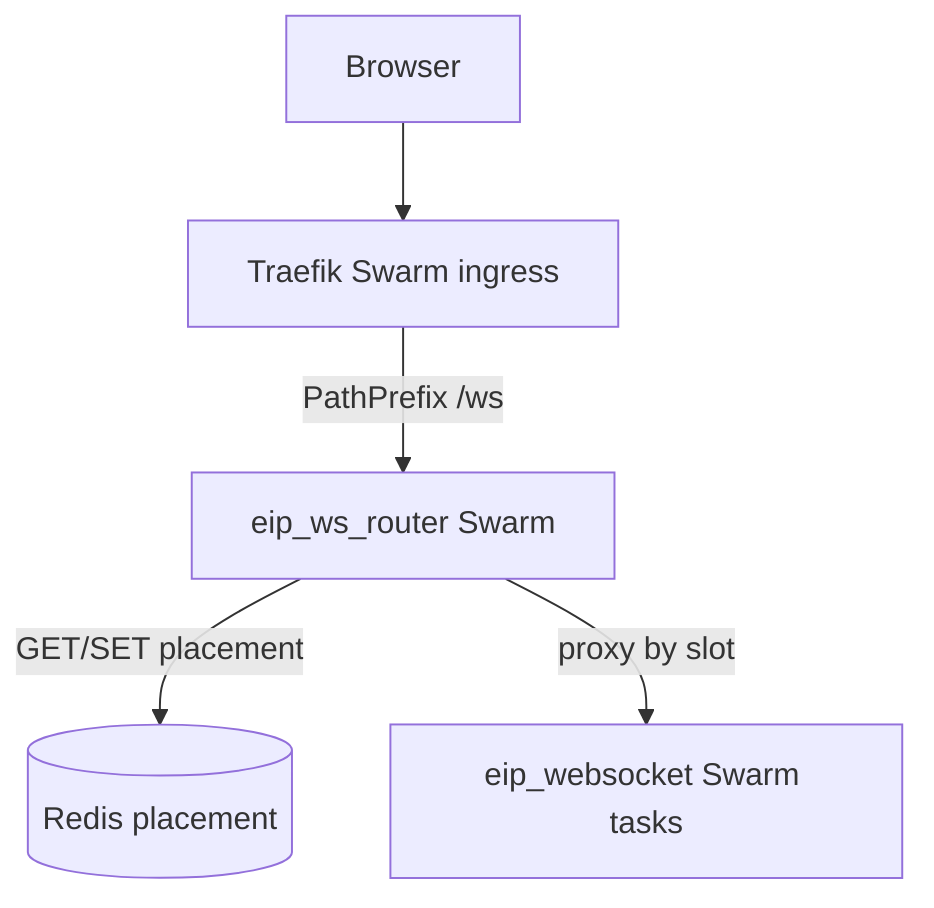

# WS placement router (`eip_ws_router`)

> Part of [ROADMAP.md](./ROADMAP.md) backlog **#4** / **#21**. **Placement implemented** on the
> hybrid stack; **#4 acceptance done**. **#21 minimum:** Redis cordon/pin/evacuate overlays
> honored on place (Make ops script **removed** — #18 owns the armed path). Traefik stays
> TLS/ingress only; this service owns tenant → websocket **slot** placement.

## Locked model

| Piece | Role |
|-------|------|
| **Traefik** (Swarm `eip_traefik`) | TLS + ingress publish + path `/ws` → `eip_ws_router` (swarm provider) |
| **ws-router** (Swarm) | Redis-first placement; reverse-proxy upgrade to `websocket-N:4001` |
| **Redis** (Compose) | Placement authority: `tenant → slot id` (aligned with `websocket-{{.Task.Slot}}`) |
| **Cookie `eip_tenant_affinity`** | Hint / key only (`alliance:` → `corporation:` → `account:`). Real session auth stays on the websocket process |
| **Sticky `eip_ws_affinity`** | **Fallback** when affinity cookie missing or Redis unavailable — not the steady-state org model |

**Withdrawn:** “no Redis placement GET on every `/ws` connect.” Traefik v3 cannot hash cookie
values (sticky + IP `hrw` only), so Redis + a thin router is the placement path.

**Not Redis on the changelog hot path** (#20) — that rule is unchanged. Placement is connect-time only.

## Why Swarm (not Compose) for the router

Compose recreate of a singleton proxy would drop every live `/ws` tunnel. The router uses the
same deploy class as elastic services:

- `deploy.update_config.order: start-first`
- Slot identity `ws-router-{{.Task.Slot}}` (telemetry)
- **Replicas: 1** (v1) — `start-first` rolls so a replacement starts before the old task stops (handover). Scale to 2 later if dual-router readiness is needed; shared Redis still means same placement map.
- Discovered by Traefik `providers.swarm`



## Placement algorithm (v1)

```text
key = cookie eip_tenant_affinity
ttl = configurable (e.g. 24h–7d); refresh on each successful place
if key empty:
  sticky_fallback(browser)
else:
  slot = Redis GET placement[key]
  if slot missing or slot not in ready_tasks:
    slot = pick_slot(ready_tasks)
    Redis SET placement[key] = slot EX ttl
  else:
    Redis EXPIRE placement[key] ttl
  proxy → taskIP(slot):4001
```

Store **slot id** (`websocket-1`, …), not raw IPs. Discover backends via **`ws-docker-proxy`**
(tecnativa socket proxy: GET `/services` + `/tasks` only, `POST=0`) — the router does **not**
mount the raw Docker socket (`:ro` on a sock mount is not API read-only).

**Dead / missing slot on connect:** instant **reassign** (no background reconcile loop in v1).
That keeps the balancer correct when a task dies.

**App-train (#23) - prefer newest bake:** among eligible (non-cordoned / non-full) slots, placement
and reassignment prefer backends whose process `APP_VERSION` is the highest semver. Sticky homes
on an older bake are reassigned onto NEW so reconnects do not hop OLD columns during dual-warm.
Affinity key / pin / cordon / full still apply. OLD SPA clients may land on NEW slots (FE still
snackbars refresh for new assets; reconnect is not blocked). Exact client `?app_version=` match
filtering was removed.

## #21 ops overlays (cordon / pin / evacuate)

Same Redis map as placement. Prefixes (fixed in `shared/wsplacement`):

| Key | Meaning |
|-----|---------|
| `eip:ws:place:v1:{affinity}` | Tenant → slot (steady-state; TTL refreshed on hit) |
| `eip:ws:pin:v1:{affinity}` | Ops pin — preferred slot when that slot is eligible |
| `eip:ws:cordon:v1:{slot}` | Slot refuses **new** placements; reconnects reassign away |
| `eip:ws:full:v1:{slot}` | Best-effort “at client_cutoff” hint (TTL refreshed by websocket). Skip for new placements |

**Router behaviour:** drops cordoned **and full** slots from the eligible set when
placing/reassigning (if every slot is skipped, falls back to all ready so `/ws` is not
black-holed — process `client_cutoff` refuse still caps the replica). Affinity home and
ops pin do **not** stick onto a full/cordoned slot; reconnects reassign onto an eligible
slot. Sticky fallback also uses the eligible set.

**Evacuate:** rewrite placement keys off the source slot + cordon source + **PUBLISH**
`eip:ws:drain:v1` with the slot id. Matching websocket replica force-closes local sockets
(`please_reconnect` + close 1001); SPA reconnects; router places on an eligible slot.
Session handoff Redis keys cover ~25s.

> Redis pub/sub wake-up is a **temporary** bridge. Placement / cordon **state** stays in Redis.
> Planned: NATS drain notify + capacity-controller ops under #18 — see [WEBSOCKET.md](./WEBSOCKET.md).
> The Make `ws-placement-ops` escape was **removed** (not ported to `eip`).

Scale-in playbook: **[WEBSOCKET.md](./WEBSOCKET.md)** — never cold-kill a hot alliance slot.
Sticky is fallback only. Armed evacuate/cordon = **#18**.

## Health + metrics

Orchestration probes listen on **`:19100`** (not on the `:8080` traffic mux):

| Path | Purpose | Ready criteria |
|------|---------|----------------|
| `GET :19100/healthy` (and `/health`) | Liveness | Process up |
| `GET :19100/ready` | Readiness | Redis OK + ≥1 **probe-ready** websocket backend |
| `GET :8080/metrics` | Lean Prometheus | Always on traffic port; no OTLP; no per-tenant series |

Swarm healthcheck and Traefik LB healthcheck → router `:19100/ready`. That check means **both**:
router Redis is up **and** at least one websocket task answered `GET http://{task-ip}:19100/ready`
(200). Docker “running” alone is not enough — cold/stuck WS slots are dropped from the eligible
set on each backend poll. Redis down / no probe-ready backends → router `/ready` 503; `/healthy` still 200.

**Lean router series (examples):** upgrades, placement hit/miss/reassign/pin/cordon_skip/
full_skip/sticky_fallback/redis_error, active proxies, backend slot count, proxy errors.

**Balance / occupancy** lives on **websocket slots** (in-memory client / corp / alliance maps →
per-slot gauges). No Redis SCAN, no placement-scout service, no core job. Wire gauges under
**#8** / **#15**. Observability addon (#34) only charts when Prom + addon are up.

## CORS

Browser `/ws` upgrades use the Traefik CORS middleware on **`ws-router`** (labels live with the
`/ws` path rules — no longer on the websocket service).

## Recovery

Re-run the same bring-up (`make up` / `make dev` / `stack-deploy`). No Compose-elastic fallback.

## Bring-up

Included with hybrid `make up` / `make dev` / `stack-deploy`. Binary:
`services/ws-router` + `ws-docker-proxy`. Router calls `DOCKER_HOST=tcp://ws-docker-proxy:2375`
(allowlisted GET `/services` + `/tasks` only), then HTTP-probes each task’s `:19100/ready`.
The router container does **not** mount `/var/run/docker.sock`. Its proxy lives on overlay
**`eip-docker-ws`** (router joins `eip` + `eip-docker-ws`). Traefik uses a **separate**
proxy + overlay (`eip-docker-traefik`); #18 gets a third (`eip-docker-capacity`) — never
share docker nets or allowlists across trust boundaries.

## #4 acceptance

Landed: same `eip_tenant_affinity` cookie → same Redis placement slot (`eip:ws:place:v1:…`).
The Make smoke script was removed with other Make escapes.

## Sequencing

1. **Done:** router + Traefik `/ws` cutover + Redis placement (this doc / stack).
2. **Done:** #4 acceptance — same affinity key → same websocket slot.
3. **Done (minimum):** #21 cordon / pin / evacuate Redis overlays (runtime); Make ops CLI removed.
4. **Done (force-close):** drain PUBLISH → websocket force-closes locals ([WEBSOCKET.md](./WEBSOCKET.md)).
5. Soft caps / hosted-tenant gauges still open (#8); capacity-controller ops (#18).

## Related

- [WEBSOCKET.md](./WEBSOCKET.md) — drain checklist / force-close (#8)
- [TRAEFIK.md](./TRAEFIK.md) — ingress; `/ws` → router
- [STACK.md](./STACK.md) — stack services
- [IDENTITY.md](./IDENTITY.md) — `websocket-N` / `ws-router-N` slots
- [ROADMAP.md](./ROADMAP.md) — **#4**, **#8**, **#21**
