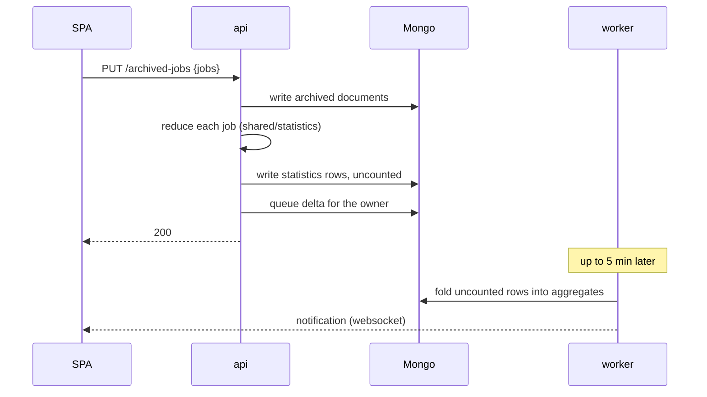

# Archive and statistics API

Reading the archive, and the figures derived from it. An archived job leaves the planner and becomes
two things: a stored document that can be read back or restored, and a row of figures that folds into
per-item totals. This topic covers the routes over both.

The system spans:

- **`services/api/v1endpoints/archivedjobs`** — archive, list, read, restore, file by hand.
- **`services/api/v1endpoints/statistics`** — the three views over the aggregates.
- **`services/api/helper`** — the query parsing both surfaces share, so a window means the same thing
  on either.
- **`services/shared/statistics`** — the reduction. The API writes a row with it; the worker folds
  that row.
- **`services/shared/models`** — `Group`'s `RebuildFrom` / `AddJobs`, the backend half of group
  derivation.

Read alongside: the worker statistics topic (how figures are produced, queued and reconciled) and
[shared/mongo.md](../shared/mongo.md) (owner block, index rules).

## Vocabulary

| Term | Meaning |
|------|---------|
| **Owner handle** | `kind:id` in a request path — `account:{id}` today. The client-safe form: for org kinds the id is a ref, never a raw EVE id. |
| **Archive** | The set of archived jobs for one owner. A job belongs to exactly one. |
| **Row** | One archived job's figures, in `statistics_rows`. Written by the archive request, folded by the worker. |
| **Group** | What a user put together. Derived from the jobs naming it, never stored as a membership list. |
| **Related set** | What parent/child links make. Computed by walking the archive, not by a stored field. |
| **Pending** | A row whose figures have not reached the aggregates yet. Resolves in seconds. |
| **Stale** | A row whose job the reduction can no longer read. Does not resolve on its own, so it outranks pending on a row that is both. |
| **Filing** | Assigning a job's figures to months by hand, when the dates the sources carry are wrong or absent. |

## Routes

| Method | Path | Serves |
|--------|------|--------|
| `PUT` | `/api/v1/archived-jobs` | archive a batch of jobs |
| `GET` | `/api/v1/archived-jobs` | a paged, filtered list of summaries |
| `GET` | `/api/v1/archived-jobs/{jobID}` | one full archived document |
| `POST` | `/api/v1/archived-jobs/{jobID}/restore` | restore one job |
| `POST` | `/api/v1/archived-jobs/groups/{groupID}/restore` | restore a group, rebuilt from its jobs |
| `POST` | `/api/v1/archived-jobs/related/{jobID}/restore` | restore a set walked over the archive |
| `PATCH` | `/api/v1/archived-jobs/{jobID}/filing` | file one job's figures by hand |
| `PATCH` | `/api/v1/archived-jobs/groups/{groupID}/filing` | the same, for a group |
| `PATCH` | `/api/v1/archived-jobs/related/{jobID}/filing` | the same, for a related set |
| `GET` | `/api/v1/statistics/{owner}/timeline` | monthly figures |
| `GET` | `/api/v1/statistics/{owner}/timeline/items` | the same, per item |
| `GET` | `/api/v1/statistics/{owner}/totals` | lifetime totals; `?summary=1` folds the archive into one row |

Filing is held to `PATCH` deliberately: it changes part of a stored document rather than replacing it.

## The owner in the path

```text
GET /api/v1/statistics/account:abc123/timeline
                       └─ owner handle ─┘
```

| Stage | Answers |
|-------|---------|
| Router parses the handle | **404** if it cannot be read at all |
| Handler compares it with the session | **403** for an owner the session does not hold |
| Auth middleware, before either | **401** for no session |

A kind that is routable but not served — `corporation:`, `planner:` — is refused at the handler rather
than falling through to the caller's own account. That is what stops a caller reading someone else's
figures by editing one path segment.

The check lives in the handler, not the router, because it compares against the session the auth
middleware resolved: rejecting earlier would answer 403 where these routes answer 401.

**An account may read only itself.** That comparison becomes a grant lookup when shared planners land,
and nothing else about the shape changes — the route already carries a full owner.

## End-to-end flows

### Archiving



The row is written by the archive request rather than by the fold. A fold's work list is the uncounted
rows, so the job that queued it would be the one job it could not see.

### Restore

One server-side operation, in an order that matters:

1. Decrypt the stored identity.
2. Resolve ESI links against what the account already holds.
3. Write the job documents back to the planner.
4. Re-link free ESI ids on the account.
5. Return the jobs to their groups.
6. Delete the archived documents.
7. Queue the fold that takes the figures back out.

Deleting the archived document before the job is written back would lose it on a failure between the
two; queueing the fold before the delete would fold a job still in the archive.

**The ESI re-link is written server-side.** The `accounts` document is realtime synced, so a server
write reaches the client's store before it would next save — which is what lets restore stay atomic
rather than splitting the job write and the re-link across two processes.

**Conflicts are reported, not fatal.** An ESI id another job now holds is stripped from the restored
job and named in the response. Refusing the whole restore would strand the job in the archive over a
link the user may not care about.

**A group another session holds refuses the restore.** The group's lock stands for its archived members:
a restore writes the group, so it needs the same lock an edit would.

### Three ways to restore

| Route | Restores | Because |
|-------|----------|---------|
| `{jobID}/restore` | one job | it rejoins the group it was archived from |
| `groups/{groupID}/restore` | every job naming that group | a group is what the user put together |
| `related/{jobID}/restore` | the set reachable by parent/child links | a build chain is only useful whole |

Each job rejoins the group it was archived from, merging into it when that group is still on the
planner and rebuilding it from every job that names it when it is not.

## Groups are rebuilt from their jobs, not stored

A group is derived from the jobs that name it, so restoring one needs no stored copy — the jobs are the
membership. Derivation has one owner on each side:

| Side | Owner |
|------|-------|
| Backend | `models.Group`'s `RebuildFrom` and `AddJobs` |
| SPA | `createGroup` and `addJobsToGroup` |

A nine-case corpus at `testing/fixtures/group-derivation` defines the rules, and a harness on each side
reads it. **The corpus is the rule**: a change to what a group derives goes there first, and both sides
follow. It found three divergences when it was written — name truncation, blank output names, and id
ordering.

While a job is archived the group keeps it in `archivedJobIDs` and drops its contribution from the
derived sets until it comes back. Archiving a whole group deletes it.

## What a list row carries

A summary is assembled from two collections — the archived job for its identity and dates, the
statistics row for its figures:

| Field | From |
|-------|------|
| `jobID`, `name`, `itemID`, `jobType` | the archived job |
| `groupID` | the archived job; the group it belonged to |
| `parentJobs`, `childJobs` | the archived job; what makes its related set |
| `archivedAt` | `_meta.archivedAt` |
| figures | the statistics row |
| `figuresPending` / `figuresStale` | the row's `contributedAt` and `skippedAt` |

Rows report **both** the group and the related set, because they answer different questions: a group is
what a user assembled, a related set is what the build chain makes. A row can be in one, both, or
neither.

**Filters narrow a window; they do not define one.** A filter on item or group narrows what the window
returns rather than replacing the window, so paging stays stable as filters change.

Query parsing lives in `api/helper` and is shared with the statistics views, so `limit`, ordering and
the window mean the same thing on both surfaces and a caller learns one set of rules.

## What a period cost

A month carries the six components of a period's cost and its extras by category.

**The Market segment is decided on evidence.** A job that left no sale behind is Stock; broker fees
count as market activity. There is no stored flag, because nothing attributes a stack in a hangar to
the job that built it — a flag would present a guess as a record.

**Kept as stock is a quantity, not a classification**: `quantityProduced − quantitySold`, floored at
zero because a month can settle a sale against an earlier month's build. Chain output is excluded unless
an item view asks for the chain.

The two questions stay separate: the segment breakdown answers "how many builds never sold at all",
which a job selling most of a run does not, and the quantity answers "how much was kept".

## What a client is told about freshness

Every statistics response reports the owner's recalculation state, so a page can say figures are moving
rather than presenting stale numbers as current:

| State | Means |
|-------|-------|
| recalculating | work is queued or running for this owner |
| failed | the work exhausted its retries; `lastError` says why |

Read from the owner's queue entry. The worker writes it; the API only reports it.

## Where every file lives

| Path | Holds |
|------|-------|
| `api/v1endpoints/archivedjobs/router.go` | route shapes, and the method each is held to |
| `api/v1endpoints/archivedjobs/putHandler.go` | archiving, and writing the row |
| `api/v1endpoints/archivedjobs/getList.go`, `archivelist.go`, `listparams.go` | the list, its row shape, its parameters |
| `api/v1endpoints/archivedjobs/getJob.go` | one full document |
| `api/v1endpoints/archivedjobs/restore.go`, `restoreHandlers.go` | the restore sequence |
| `api/v1endpoints/archivedjobs/grouprebuild.go`, `relatedsets.go` | the two set-shaped restores |
| `api/v1endpoints/archivedjobs/esilinks.go` | resolving and reporting ESI conflicts |
| `api/v1endpoints/archivedjobs/filing.go` | filing figures by hand |
| `api/v1endpoints/archivedjobs/scope.go` | addressing an archive by owner |
| `api/v1endpoints/statistics/owner.go` | parsing the handle, and the 403 |
| `api/v1endpoints/statistics/getTimeline.go`, `getTimelineItems.go`, `getTotals.go` | the three views |
| `api/v1endpoints/statistics/recalculation.go` | the freshness state on every response |
| `api/helper/queryparams.go` | the window and paging rules both surfaces share |

## Topic-only detail

How figures are produced, queued, folded and reconciled → the worker statistics topic. Owner block,
index rules and collection naming → [shared/mongo.md](../shared/mongo.md). The pages that
read these routes → [frontend/](../../frontend/contents.md).
