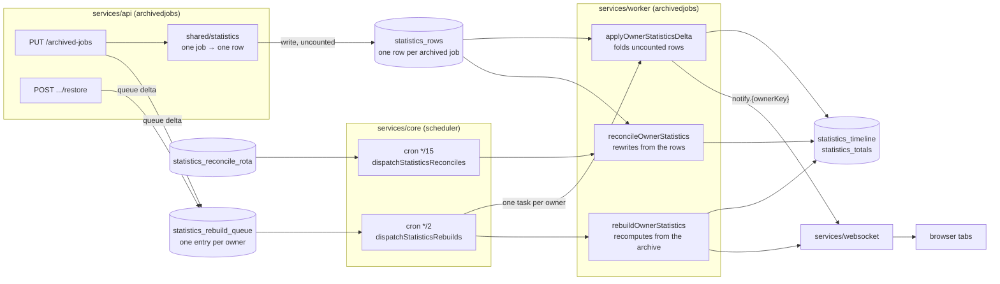

# Archived job statistics

**Draft, not live SoT.** Promoted into `technical-documentation/backend/worker/statistics.md` when
[archived-jobs-stats](../plan.md) closes, with a row added to
[backend/worker/contents.md](../../../backend/worker/contents.md). Written in the live voice — current
behaviour only — so promotion is a move rather than a rewrite. Provenance:
[overlay.md](../overlay.md) §§ Stage B, Stage J.

---

How an archived job becomes figures a user can read: the reduction that turns one job into a row, the
two paths that fold rows into aggregates, and the rota that corrects them.

The system spans three services and the SPA:

- **`services/shared/statistics`** — the reduction. One archived job in, one statistics row out. Pure,
  and shared so the API and the worker cannot disagree about what a job cost.
- **`services/api/v1endpoints/archivedjobs`** — writes the row in the archive request itself, then
  queues the fold. Restore queues the fold that takes it back.
- **`services/worker/tasks/archivedjobs`** — the folds, the rebuilds, the reconcile rota, and the
  notification.
- **`services/core/scheduler`** — two crons that dispatch, nothing more.
- **`frontend/src`** — reads the figures over HTTP and the notification over the websocket.

Read alongside: the archive API topic (routes, what a period cost), and
[shared/mongo.md](../../../backend/shared/mongo.md) (owner block, index rules).

## Vocabulary

| Term | Meaning |
|------|---------|
| **Owner** | `{kind, id}` — who a document belongs to. Every collection here keys on it; nothing branches on the kind. |
| **Row** | One archived job reduced to its figures, in `statistics_rows`. `_id` is `{ownerKey}\|{jobID}`. |
| **Aggregates** | The two derived collections a row folds into: `statistics_timeline` (per item, per month) and `statistics_totals` (per item, lifetime). |
| **Fold** | Adding a row's figures to the aggregates, or subtracting them. The unit of a delta. |
| **`contributedAt`** | The stamp saying a row's figures are already in the aggregates. Its absence is what makes a row a fold's work. |
| **Revoked** | A row whose job has been restored. Kept, not deleted, so a fold can tell "removed" from "never seen". |
| **Claim** | A counter on the queue entry deciding who may write. A rebuild raises it; a fold that finds it moved stands down. |
| **Delta** | Work proportional to what changed. Queued by archive and restore. |
| **Rebuild** | Work proportional to the whole archive. Recomputes one owner from its archived jobs. |
| **Rota** | `statistics_reconcile_rota` — when each owner was last reconciled, oldest first. |
| **Skipped** | A row whose job the reduction can no longer read. Stamped `skippedAt` with a reason; keeps its figures, because dropping them would take real history out of the totals. |

## What holds the figures

| Collection | Holds | Key |
|------------|-------|-----|
| `statistics_rows` | one archived job reduced to its figures | `{ownerKey}\|{jobID}` |
| `statistics_timeline` | monthly figures per item | owner-led |
| `statistics_totals` | lifetime totals per item | owner-led |
| `statistics_rebuild_queue` | outstanding work, one entry per owner | owner key as `_id` |
| `statistics_reconcile_rota` | when each owner was last reconciled | owner key as `_id` |

Rows are the source; the other two are derived from them and can be rebuilt at any time. That is why a
reconcile can rewrite aggregates without reading a single job.

## High-level architecture



**One sentence:** the API writes a row when a job is archived and queues the owner, two crons read the
queue and the rota to dispatch one task per owner, the worker folds those rows into the aggregates —
or recomputes them outright — and tells the owner's tabs the figures moved.

Everything between the API and the worker is a **collection**, not a call. Nothing here talks to
anything else directly: the queue is the handover, which is what lets a failed fold be retried and a
busy owner be folded once rather than per job.

Two writes are left off to keep the flow one-directional. A rebuild also **writes** `statistics_rows`,
reducing each archived job afresh, and a reconcile **stamps** the rota with the turn it just took.

## The two paths

| | Delta | Rebuild |
|---|-------|---------|
| Costs | the rows that changed | the whole archive |
| Queued by | archive, restore | a reconcile finding drift, an operator, a release |
| Task | `applyOwnerStatisticsDelta` | `rebuildOwnerStatistics` |
| Priority / timeout | `Priority3` / 5 min | `Priority5` / 15 min |
| Reads | `statistics_rows` | `archived_jobs` |

The delta outranks the rebuild deliberately: a user waits on the figures they just archived, and nobody
waits on a bulk recompute.

**Archiving costs the same whether the archive holds ten jobs or ten thousand.** That is the property
the delta exists for, and the reason the row is written by the archive request rather than by the work
that follows it — a fold whose work list is rows cannot see the job that queued it.

## Task and subject map

| Task | Subject | Priority | Timeout | Does |
|------|---------|----------|---------|------|
| `applyOwnerStatisticsDelta` | `task.scheduled.applyOwnerStatisticsDelta` | 3 | 5 min | folds one owner's uncounted rows |
| `rebuildOwnerStatistics` | `task.scheduled.rebuildOwnerStatistics` | 5 | 15 min | recomputes one owner from its archived jobs |
| `reconcileOwnerStatistics` | `task.scheduled.reconcileOwnerStatistics` | 5 | 15 min | rewrites one owner's aggregates from its rows |
| `dispatchStatisticsRebuilds` | `task.scheduled.dispatchStatisticsRebuilds` | 4 | 15 min | reads the queue, publishes one task per eligible owner |
| `dispatchStatisticsReconciles` | `task.scheduled.dispatchStatisticsReconciles` | 5 | 5 min | publishes a reconcile for every owner whose turn has come |

The two dispatchers only dispatch, so their timeout covers a queue read and a fan-out rather than any
owner's work. Dispatching one task per owner is what lets a long queue make progress across ticks
instead of one worker holding it.

## End-to-end flows

### Archiving a job

1. `PUT /api/v1/archived-jobs` writes the archived document.
2. The same request reduces the job through `shared/statistics` and writes its row, uncounted — no
   `contributedAt`.
3. It queues `delta` for the owner.
4. Up to five minutes later (`rebuildDebounce`) the drain dispatches `applyOwnerStatisticsDelta`.
5. The fold reads every uncounted row, adds their figures to the aggregates, and stamps each
   `contributedAt`.
6. The owner is notified.

### Restoring a job

The mirror, in reverse order: the fold subtracts the row's figures and the row is **revoked** rather
than deleted. A bucket that reaches zero on a *count* is removed; one that reaches zero on a *total* is
kept, because a real month with no net value is not the same as a month that never happened.

### A rebuild

1. Read every archived job for the owner.
2. Reduce each to a row and write it, stamped as already counted — a fold arriving behind must not add
   them twice.
3. Write the aggregates from those rows.
4. Prune buckets and totals the new keep-list does not name.

A rebuild that cannot finish in one pass still makes progress: the queue entry survives, and the next
dispatch picks it up.

### Reconciliation

Every owner comes round on a 24-hour `reconcileWindow`, oldest stamp first. It rewrites the aggregates
from the rows beneath them, reports what disagreed, and stamps the rota. **Drift is reported, not acted
on** — a correction that hides its own cause makes the next one harder to find.

Float comparison uses a tolerance: two figures that differ in the last bits of a float are equal, or
every reconcile would report drift that is not there.

## Ordering: the claim

Two writers can want the same owner — a fold and a rebuild queued moments apart. The claim decides:

```text
rebuild starts  → BumpOwnerClaim raises the claim
fold finishes   → claim it captured ≠ current claim → stand down, write nothing
```

A rebuild always wins, because it computed from the whole archive and the delta computed from part of
it. The fold's work is not lost: its rows stay uncounted, and the rebuild stamps them as counted when it
writes them.

## Failure

A failed delta fails its task and is retried. Once retries are exhausted the failure is recorded on the
queue entry and the task stops rather than looping:

| Field | Holds |
|-------|-------|
| `failures` | how many times this owner's work has failed |
| `lastError` | the reason, verbatim |
| `lastFailedAt` | when |

That entry is what the API reads to tell a user their figures are stale. Failure is handled by the task
rather than by the request, which keeps a broken statistics write from failing an archive that actually
succeeded.

A job the reduction cannot read is **skipped**, not dropped: the row keeps its figures and gains
`skippedAt` with a reason, the archive list reports `figuresStale`, and the stamp clears the moment the
job can be read again.

## What the client is told

| | |
|---|---|
| Subject | `notify.{ownerKey}` — `account:{id}` today |
| Subtype | `archiveStatsProcessed` |
| Body | `{ownerKind, accountID, processedAt}` |

Published after a fold or a rebuild writes. Only an owner kind that has clients is worth a message.

Every statistics response also reports whether a recalculation is outstanding or has failed, so the SPA
can show that figures are moving rather than presenting stale numbers as current.

Archiving still invalidates its own caches at the call site. The notification tells *other* sessions; it
does not replace the invalidation the acting session already does.

## Constants

| Constant | Value | Where | Why |
|----------|-------|-------|-----|
| `rebuildDebounce` | 5 min | `worker/tasks/archivedjobs/dispatch_rebuilds.go` | Bounds the longest an owner waits, rather than sliding with each re-queue |
| `reconcileWindow` | 24 h | `worker/tasks/archivedjobs/reconcile_owner_task.go` | How often an owner's turn comes round |
| `cron.dispatchStatisticsRebuilds` | `*/2 * * * *` | `core/scheduler/jobs.go` | |
| `cron.dispatchStatisticsReconciles` | `*/15 * * * *` | `core/scheduler/jobs.go` | |

**A drain firing inside the debounce reports `eligible: 0` against a full queue.** That is the debounce
working, not a stall. `eip cli dispatchStatisticsRebuilds` ignores it, because an operator running it by
hand means now.

## Operator surface

| Need | Command |
|------|---------|
| Dispatch queued work now | `eip cli dispatchStatisticsRebuilds` |
| Reconcile now | `eip cli dispatchStatisticsReconciles` |
| Queue every owner | `eip cli -- prepareRelease` (its last step) |

## Where every file lives

| Path | Holds |
|------|-------|
| `shared/statistics/archived_job_row.go` | the reduction: one job → one row |
| `shared/statistics/job_figures.go` | what a job cost, and how each figure is derived |
| `shared/mongo/rebuild_queue.go` | the queue, the claim, the failure fields |
| `shared/mongo/reconcile_rota.go` | `StatisticsOwners`, the rota, who is due |
| `shared/mongo/apply_row_delta.go` | the fold's writes, and the prune |
| `worker/tasks/archivedjobs/apply_delta_task.go` | the delta task |
| `worker/tasks/archivedjobs/rebuild_statistics.go` | the rebuild |
| `worker/tasks/archivedjobs/reconcile_statistics.go` | the reconcile |
| `worker/tasks/archivedjobs/dispatch_rebuilds.go` | the drain and its debounce |
| `worker/tasks/archivedjobs/failure.go` | recording a failure on the queue entry |
| `worker/tasks/archivedjobs/notify.go` | the notification |
| `core/scheduler/jobs.go` | the two crons |

## Topic-only detail

Owner block, index rules and collection naming → [shared/mongo.md](../../../backend/shared/mongo.md).
Routes, what a list row carries, restore's order → the archive API topic. The pages that read the
figures → [frontend/](../../../frontend/contents.md).
