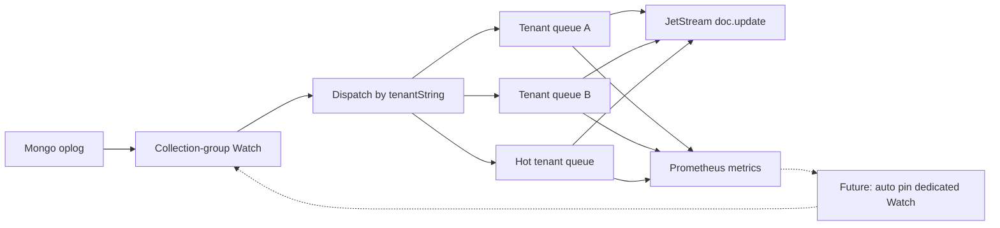

# Changestream tenant scale — plan

**Status:** Phase 1 (docs) — open; no product work yet  
**Code today:** [`services/core/changestream`](../../../services/core/changestream/)  
**Live SoT (until promote):** [core.md](../../backend/core/core.md) § Changestream → JetStream

**Rules:** Read and following [`../documentation-rules.md`](../documentation-rules.md)
and [`../technical-rules.md`](../technical-rules.md) (migration-plans).
Phase 1 (project folders/docs) before any product work.
For Go surfaces in scope only: `go fix -diff` before planned work; again on edited packages (not unrelated code).
Live SoT will not be edited until this project is complete and promotion is approved.

## Problem

Today the primary-only watcher partitions by **collection group** (`account` / `planner` / `archive_and_stats` / `blueprints`) — one Mongo `database.Watch` + serial `Next → publish` loop per group. That isolates *domains*, not *tenants*.

Product direction adds **separate corporation and alliance collections** (users-like + planner-like per tenant type, plus more). Selective JetStream fan-out (#20) already protects **websocket pull**. The remaining cliff is **core publish**: one hot alliance can saturate a group’s cursor while other tenants wait on the same serial loop.

## Goals

1. **Isolate busy tenants in the publish path** so one whale does not stall unrelated tenants on the same collection group.
2. **Ship metrics** that make lag and hot tenants visible (group + `tenantString`).
3. **Leave the door open** for future **auto-detect → dedicated Mongo Watches** without a second redesign.
4. Keep **single-primary** changestream ownership (`lease:core:primary`) until a later, explicit multi-publisher design.

## Non-goals (this project)

- Multi-active core changestream / hash-sharded publishers across processes (rejected until deliberately revisited — see swarm-stack decision **#32**).
- One Mongo collection per busy alliance.
- Changing `doc.update.{tenantString}.{collection}.{docID}` subject shape (#20 locked).
- WS placement / capacity-controller replica scale (separate roadmaps).

## Current baseline (do not regress)

| Piece | Live rule |
|-------|-----------|
| Leadership | Only primary runs changestream |
| Partition today | `CollectionGroups()` — parallel Watch per group |
| Resume | Redis `eip:core:handoff:v1:cs:resume:{groupID}` + `StartAfter` |
| Publish | Sync JetStream `PublishMessage` on the watch loop |
| Downstream | Tenant-keyed subjects; WS filters by hosted tenants |

## Target shape (phased)

### Phase A-0 — Baseline correctness (prerequisite to A)

The shared Mongo client sets a client-wide CSOT (`SetTimeout`), which applies to every
operation including `changeStream.Next`. A change stream is a long-lived awaitable cursor
with no obligation to return promptly, so on an idle database the budget drains, the driver
declines to send `getMore` with a zero server-side timeout, and the cursor dies. Each group
loop then rebuilds and replays its resume token on a fixed cycle, always with zero events
processed.

Two consequences for this plan. Lag and hot-tenant signals gathered under a forced rebuild
cycle would measure the defect rather than tenant behaviour, so Phase A cannot produce a
trustworthy baseline until this is fixed. And every rebuild replays `StartAfter`, which is
the window where events can be missed or duplicated — the property Phase B's done-when
depends on.

The driver offers no exported way to clear a client-level timeout for a single operation:
`csot.WithTimeout` is internal, and a context deadline pre-empts the client timeout rather
than removing it. Per-call deadlines were considered and rejected — they only move the
ceiling, and an expiry still destroys the cursor.

The watcher therefore gets its own Mongo client built without a client-wide timeout, added
as an additive constructor in `services/shared/mongo` alongside the existing one.
`MaxAwaitTime` (30s) bounds how long the server holds each `getMore` before returning an
empty batch, so expiry is a normal empty return that leaves the cursor valid. Existing
callers keep the timeout unchanged: it is correct for ordinary request/response work in api,
worker, websocket, ws-router, and capacity-controller, which are unaffected because core
owns the only production `Watch` in `services/`. Cost is one extra connection pool, sized
small.

`MaxAwaitTime` also becomes the interval at which an idle group loop regains control, which
is the seam Phase B needs to drain per-tenant queues when no events are arriving.

**Done when:** an idle stream survives well past the old ceiling without rebuilding; events
after an idle gap still arrive and advance the resume token; lose-primary cancellation stays
prompt.

### Phase A — Metrics (prerequisite)

Instrument the existing loops **before** changing scheduling. Contract → [metrics.md](./metrics.md).

**Done when:** group + tenant publisher metrics scrape cleanly; dashboards/alerts can name a hot `tenantString` and a lagging `group_id`.

### Phase B — Per-tenant publish streams (processing split)

Keep one Mongo Watch per **collection group**. After `Next` + decode + tenant resolve, enqueue to a **per-`tenantString` worker** (bounded queue). Preserve order **per tenant** (and prefer per-doc within tenant). Sync JetStream publish moves onto those workers so NATS latency on alliance A does not block account B on the same group cursor.

**Done when:** a synthetic hot tenant’s publish backlog does not stall other tenants’ publish latency on the same group; resume still advances safely (at-least-once OK); primary lose cancels queues.

### Phase C — Collection registry for corp / alliance

When corp/alliance collections land, register them as **tenant-type × domain** groups (e.g. `corporation_planner`, `alliance_planner`) in `CollectionGroups()` — capacity knob by family, not one mega-`planner`. Still one primary; still Phase B queues inside each group.

**Done when:** new collections have an explicit group home in the registry; docs/overlay list the map.

### Phase D — Auto-detect hooks (open for later; not required to close B/C)

Design seams only in B/C so a later controller can promote a whale without rewriting the publisher:

- Stable metric names/labels for “tenant dominating group”
- Interface / config seam for **pinned hot tenants** (dedicated Watch + exclude from default `$match`)
- Hysteresis policy documented — → [auto-detect.md](./auto-detect.md)

**Implementing** dynamic Watch split/merge is **out of scope until** Phase B metrics prove a single Watch + queues are insufficient. Phase D docs stay ahead of code.

## Ordering vs other work

| Related | Relationship |
|---------|----------------|
| Swarm #12 changestream lease | Remains the leadership gate |
| Swarm #20 selective fan-out | Consumer path; this plan is publisher path |
| Corp/alliance product collections | Drive Phase C timing; do not wait on Phase D |
| Capacity controller #18 | May **consume** publisher hot-tenant metrics later; does not own Mongo Watches |

## Go touch surface (when product work starts)

Run `go fix -diff` only on packages in scope before edits; re-run on edited packages after.

- `services/core/changestream/`
- Likely `services/core/metrics/` (or existing metrics wiring under core)
- Tests under `services/core/changestream/`

## Promote (when go-ahead)

Fold landed behaviour into [backend/core/core.md](../../backend/core/core.md) (changestream section: groups, per-tenant queues, metrics). Leave history here.

## Status checklist

- [x] Phase 1 — project folder + plan + metrics/auto-detect scaffolds + section `contents.md` link
- [x] Phase A-0 — changestream idle-timeout baseline correctness (landed; live-tested, not promoted)
- [ ] Phase A — metrics landed
- [ ] Phase B — per-tenant publish queues landed
- [ ] Phase C — corp/alliance collection groups registered (when collections exist)
- [ ] Phase D — auto-detect / dedicated Watch (optional; only if needed)
- [ ] Promote to live SoT
