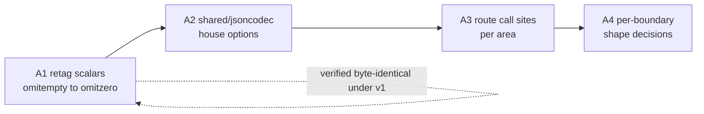

# Go 1.27 adoption — plan

**Status:** Track A has A1 and A2 landed, and A3's HTTP request and response paths routed — its other call sites are open. Track B is done. Track C is clear: `go fix -diff` reports nothing across `services/`, the last file having been rewritten by A3 rather than patched. Re-measured against the tree at this update, and the Redis seam Track B was waiting on is answered below.
**Code in scope:** [`services/`](../../../services/) (all areas), [`testing/`](../../../testing/), [`deployment-tool/`](../../../deployment-tool/)
**Live SoT (until promote):** [backend/core/core.md](../../backend/core/core.md), [backend/api/contents.md](../../backend/api/contents.md), [technical-rules.md](../../technical-rules.md) § Prefer modern Go

**Rules:** Read and following [`../documentation-rules.md`](../documentation-rules.md)
and [`../technical-rules.md`](../technical-rules.md) (migration-plans).
Phase 1 (project folders/docs) before any product work.
For Go surfaces in scope only: `go fix -diff` before planned work; again on edited packages (not unrelated code).
Live SoT will not be edited until this project is complete and promotion is approved.

## Prerequisite (landed before this project)

The language-version move is done and is **not** a track here:

| Piece | Now |
|-------|-----|
| `services/go.mod`, `deployment-tool/tools/go.mod` | `go 1.27.0` (`deployment-tool/go.mod` was already there) |
| Six `services/*/Dockerfile` + `deployment-tool/Dockerfile` (both stages) | `golang:1.27.0-alpine` |
| Toolchain directives | None added, in any module |
| Verification | `go build`, `go vet`, `go test` clean on both modules |

Two consequences that the tracks below depend on:

- **`encoding/json` is now the v2-backed implementation.** The `jsonv2` GOEXPERIMENT ships on by default in the 1.27 toolchain, so moving the builder images changed the engine under every existing `encoding/json` call. v1 *semantics* are preserved by the legacy-options path; the full module test suite passes unchanged. The only opt-out is build-time `GOEXPERIMENT=nojsonv2` — there is no runtime GODEBUG for it.
- **`encoding/json/v2` is now reachable.** `go vet` rejects the v2 API below language version 1.27 (`json.Marshal requires go1.27 or later`), so Track A was blocked until the bump and is not blocked now.

## Goals

1. Decide and execute a position on **`encoding/json/v2`** — gaining its read-side strictness without silently changing any wire contract.
2. Put the **time-driven wait loops** that currently cost wall clock (or have no coverage at all) on simulated time.
3. Clear the **`go fix` backlog** the new language version exposed, scoped per area rather than as one sweep.

## Non-goals (this project)

- Adopting v2's default semantics wholesale as a single change.
- Changing the JSON shape of any client-facing response as a side effect of an engine or API change; shape changes are a deliberate, separately-decided step (Track A, Phase A4).
- Migrating the `MarshalIndent` **operator output** (`core/commands/cli`, eight sites, and `cmd/mongo_parity_sample`) to v2 — human-read output gains nothing from either the strictness or the speed. This does **not** cover the other three `MarshalIndent` sites: `worker/tasks/sde/update/conversionStage.go` and the two in `shared/core/sde/store.go` write the static data table that every browser reads, which is the largest JSON payload the system produces and the one place the size argument is real. Those are in scope and deferred, not excluded — see § Which `omitempty` fields actually matter.
- Rewriting tests that need real infrastructure (miniredis, live Mongo) to run under simulated time without a seam; the seam is a named prerequisite, not an assumed one.

## Track A — `encoding/json/v2`

Measured behaviour differences, the retag rule, and the house-options set: [json-semantics.md](./json-semantics.md). Read that before starting any phase here.

Surface, re-counted at this update: 74 non-test files under `services/` still import `encoding/json` directly (148 counting tests); 169 `,omitempty` in `json` tags against 96 `omitzero`; six custom unmarshaler methods; one `RejectUnknownMembers` site, in `shared/jsoncodec`. A per-area split is deliberately not written down here — it moves with every slice and with ordinary work on other branches; `grep -rl '"encoding/json"' --include='*.go' services/<area>` answers it for the area you are opening. The `bson` half carries a further 90 `,omitempty`, which A1 does not touch. A2 has landed, so [`shared/jsoncodec`](../../../services/shared/jsoncodec/) is the house-options home; call sites still import the stdlib directly until A3 moves them. The surface grows with ordinary work, so recount for the area you open rather than working from these numbers.

The `,omitempty` tags that remain are on the strings, pointers, maps, slices and non-pointer `time.Time` A1 leaves alone: the tag already does what it says for those, and for slices and maps the two tags genuinely differ. They concentrate in `api/v1endpoints` (15 files) and `shared/models` (12 files).

### Phase A1 — Retag scalars, still on v1

`,omitempty` → `,omitzero` on the numeric and bool fields whose zero `omitempty` never omitted. `omitzero` behaves identically under both engines, so this is provable while still on the v1 API and removes the single largest source of v2 shape drift.

**Do not** retag slices, maps, or `time.Time` — the two tags genuinely differ there, and those types already agree between engines under `omitempty`.

**Change the `json` tag only.** The BSON driver does not read `omitzero`, and most fields carry both tags written as one pair — retagging the `bson` half drops the option and changes what the upsert writes. See [json-semantics.md](./json-semantics.md) § The retag rule.

`go fix` will not do this for you. It sees the rewrite — it logs `ignoring alternative fix "Replace
omitempty with omitzero (behavior change)"` — and declines, because the change alters behaviour and it
will not make that call. Track C therefore cannot land A1 by accident.

Done when: no numeric or bool field in `services/` carries `,omitempty` on its `json` tag except
the ones [`shared/jsoncodec/omitempty_sweep_test.go`](../../../services/shared/jsoncodec/omitempty_sweep_test.go)
names, each with the reason its zero cannot reach a document. That test is the check and the record;
§ Which `omitempty` fields actually matter is the survey behind it.

### Which `omitempty` fields actually matter

**The rule is what the document says, not whether a reader would break.** A field whose zero means
"this has not happened yet" or "this does not apply to this record" is omitted, because writing `0`
or `false` asserts something untrue about the record. Whether anything currently observes the
difference decides what to fix *first*, not what to fix.

That distinction was live for a while, because a narrower consequence-based test — retag only where a
reader distinguishes absent from zero — picks out a different and much smaller set. It is a good way
to order the work: the fields that idiom touches are the only ones that can produce a wrong answer
today. It is not the criterion. Applied as one it leaves most of the tree writing zeros that mean
nothing, and a reader cannot tell why the already-corrected fields do not match it.

Every one of these fields already carried `,omitempty`. Under v2 that tag omits an empty JSON value —
`null`, `""`, `{}`, `[]` — and does nothing whatever for a number or a bool. So the author had
already said "do not write this when it is empty" and the tag had never done it. The sweep makes each
tag do what it already said.

Swept by AST across `services/`, **97** numeric and bool fields carried `,omitempty`. (An earlier
count of 91 read the tags by grep: it took six string and slice fields in `api/v1endpoints/user` for
scalars, and was taken after the first twelve had already been retagged.) **89 were retagged**; the 8
below stay, and are the exemption list the test carries:

| Kept on `omitempty` | Fields | Why the zero cannot reach a document |
|---------------------|--------|--------------------------------------|
| `SchemaVersion` on `Job`, `Group`, `UserAccountDocument`, `ApplicationSettings`, `Planner`, `Membership`, `Settings` | 7 | The release step normalises a missing or `0` schemaVersion to `1`, and every planner construction sets `SchemaCurrent`. Omitting would also hide the one case worth seeing if that ever regressed |
| `MetaData.Revision` | 1 | Seeded at 1 by the write path |

**The idiom that makes a zero actively wrong** is worth naming separately, because it is where the
work had to be right rather than merely tidy: the SPA reads an id as `?? null` and then tests
`!== null` to mean "has one". Nullish coalescing does not catch `0`, so a written zero passes a guard
meant to reject it. That pattern is on the character, corporation and order ids.

The SDE conversion group (20 fields) is the only part of the sweep that changes a shape the browser
reads — it is the static data table, the largest payload the system produces. Its readers were traced
rather than sampled: the market tree walks stop on `parent_id` by truthiness, `has_types` is read
through `Boolean()`, `category_id` and `market_group_id` are already typed optional in the SPA's
JSDoc, and five fields have no reader at all. Two needed the closer look: `metaGroupID` feeds a `??`
chain, but resolves to a `Set.has()` that is false for both `0` and `null`; `maxProductionLimit`
feeds a division that already yields `Infinity` at `0`, so the zero does not occur there either. The
table is rebuilt wholesale on release rather than migrated, so there is no mixed-shape window.

### Phase A2 — `shared/jsoncodec`

One shared package owning the house options (`FormatNilSliceAsNull`, `FormatNilMapAsNull`, `EscapeForHTML`, `Deterministic`) plus thin `Marshal` / `Unmarshal` / encode / decode wrappers. `FormatNilSliceAsNull` is **transitional**: it holds output byte-identical while A3 moves call sites, and comes off for array-valued results at A4 — see § Decisions taken. This is the one-SoT home the codebase lacks; the options must not be re-declared per call site.

Done when: the package exists with tests proving byte-identical output to v1 for the representative documents, and its options are the only place the policy is written down.

### Phase A3 — Route call sites, area by area

`shared` → `core` → `worker` → `websocket` → `api`, finishing each area's cutover within its own slice. No forwarding wrappers left behind.

The helper layer is done — both halves of [`api/helper/json.go`](../../../services/api/helper/json.go) plus the response sites that hand-rolled around it. What remains is the direct call sites: the `json.Unmarshal` reads of Redis blobs, NATS envelopes, asynq payloads and websocket frames, and the `json.RawMessage` fields that want `jsontext.Value`.

Done when: no product file outside `shared/jsoncodec` imports `encoding/json` directly, except the `MarshalIndent` operator-output sites named under non-goals.

### Phase A4 — Per-boundary shape decisions

Only after A3. Take boundaries one at a time, internal first (Redis blobs, asynq / NATS payloads — both ends are ours), then websocket, then the client-facing API. Each is a deliberate wire decision, not a default.

What each boundary carries today is measurable rather than a matter of reading structs: the model
parity sweep decodes every stored document and reports what the model does not reproduce, and its
corpus drives the SPA-side check — [testing harness.md](../../testing/harness.md) § Model parity.
Run it before and after a boundary decision.

**Wire compatibility:** A1–A3 are **additive/neutral** by construction. A4 splits in two, and the halves do not carry the same risk.

For **array-valued API results** the SPA's settled expectation is already `[]`, and the endpoints hold it themselves by building with `make([]T, 0, n)` rather than by relying on the encoder. Dropping `FormatNilSliceAsNull` there only changes the cases where a nil slice currently leaks past that discipline — which are already answering `null` against the contract. That half is a **fix**, not a break.

The breaking half is the **internal Go-to-Go boundaries** — Redis blobs, NATS envelopes, asynq payloads — where a reader can test a slice against nil and see the difference. Those are the ones to take one at a time.

The read-side strictness is **breaking** for any producer sending duplicate keys or mismatched field case. No such in-tree producer was found; `eip cli` output and Firestore import data are external enough to need a check before A4 touches them. Mixed-version rolling deploys are low risk in the other direction — extra zero-valued fields are ignored by v1 readers.

## Track B — Simulated-time tests

Feasible with no seam, all in-process and channel-driven:

| Target | Today |
|--------|-------|
| [`core/servicemanager/managed_test.go`](../../../services/core/servicemanager/managed_test.go) | Two 2s `time.After` selects waiting on start/stop signals |
| [`core/scheduler/cancel_on_shutdown_test.go`](../../../services/core/scheduler/cancel_on_shutdown_test.go) | A 3s `wait.For` poll and 30s / 5s / 5s `time.After` selects around gocron shutdown |

Both are ceilings rather than sleeps, so the wall-clock cost is small when the code behaves; the gain is that a regression fails in simulated time instead of hanging out to a real deadline.

Blocked until a seam exists — these drive real leases through miniredis, which serves over loopback TCP and exposes no custom-listener API. Real network I/O never counts as durably blocked, so a bubble deadlocks rather than fails:

- [`core/primarycontroller/controller_test.go`](../../../services/core/primarycontroller/controller_test.go) (5.05s of the suite's wall clock)
- [`core/leadership/failover_test.go`](../../../services/core/leadership/failover_test.go)
- [`core/singleton/service_test.go`](../../../services/core/singleton/service_test.go)

The seam has a home: every Redis-backed test takes [`testing/redisfake`](../../../testing/redisfake/), which owns construction of the miniredis server and its client, and its package comment names itself as the one place to change. Making those tests bubble-safe means giving that constructor an in-memory transport rather than editing each test.

### The seam works, and its shape is measured

Built and run against miniredis v2.38.0 and go-redis v9.21.0: a `synctest` bubble drove real Redis
commands while fifteen seconds of simulated time passed in no wall clock at all, with TTLs correct
throughout. No fork and no upstream change — `Miniredis.Server()` is exported and `server.ServeConn`
takes a `net.Conn`, documented as "Nice with net.Pipe()". The client reaches it through
`redis.Options.Dialer`, so nothing touches a socket.

The arrangement is the whole finding. Three of the four fail:

| Arrangement | Result |
|-------------|--------|
| Server outside the bubble, dial inside | **fatal** — `sync: WaitGroup.Add called from inside and outside synctest bubble` |
| Server started inside the bubble | passes trivially, then **hangs** as soon as simulated time is involved: the TCP accept goroutine is never durably blocked, so the clock never advances |
| Everything outside, logic inside, default pool | **fatal** — simultaneous commands force a second dial *inside* the bubble, same WaitGroup crash |
| Everything outside, logic inside, `PoolSize: 1` | **passes**, including eight simultaneous commands |

So the constructor must establish server, client **and the first connection** before the bubble opens,
and pin the pool to one connection so no dial ever happens inside. That belongs in `redisfake` as a
second constructor beside `New`, not spelled per test.

`testing/httpfake` is the precedent for the shape — it serves over an in-memory pipe for the same
reason and its own test runs under `synctest.Test`.

**The wall clock is not the reason to do it.** Measured across `./core/...`: `primaryhandoff` 5.07s,
`primarycontroller` 5.03s, `changestream` 4.99s, `scheduler` 1.59s. `core/primaryhandoff` is a single
test — `TestResumeTokenTreatsAnUnreachableRedisAsAColdStart` at 4.97s — burning a real dial timeout
against a stopped miniredis, and it is the largest single item in the suite. The two targets the plan
leads with are ceilings that rarely fire, so they cost little today. `changestream` is different again:
its 5s is a literal sleep in a live-Mongo test, which this project's non-goals exclude.

Done: both unblocked targets run under `testing/synctest`, and `redisfake.NewForBubble` carries the three that needed the seam — see [overlay.md](./overlay.md) § Track B, including why pinning the pool to one connection did not survive a second bubble.

## Track C — `go fix` sweep

`go fix -diff ./...` at the new language version reports `errors.As` → `errors.AsType`, `interface{}` → `any`, `slices` / `maps` adoption, `strings.Cut`, `max()`, plus composite-literal folding, promoted fields in struct literals, and gofmt alignment. The `wg.Go` and `for range n` fixers no longer match anywhere in the tree.

By area, re-counted at this update — **nothing outstanding**. `api` was the last, and its one file was `api/helper/json.go`, whose `errors.As` lines A3 replaced with the v2 error types rather than patching in place. `capacity-controller`, `core`, `worker`, `websocket`, `ws-router` and the separate `testing/` and `deployment-tool/` modules are all clear.

The count is a snapshot, not an inventory: it falls on its own as areas are touched under the scoped `go fix` rule. Re-run the command for the area you are about to open rather than working from these numbers.

Land **per area, scoped to that area**, per [technical-rules.md](../../technical-rules.md) § Prefer modern Go — not as one sweeping commit, and not widened into packages a slice does not otherwise touch. Where an area is already being opened by Track A Phase A3, its `go fix` slice should land first so the JSON change reviews clean.

Every group has landed. The two that were held back were held because they were tag and error-handling
decisions rather than mechanical rewrites, and Track A took both: the wire tags at A1, and
`api/helper/json.go` at A3, whose `errors.As` lines were replaced by the v2 error types rather than
patched.

One caution outlives the sweep. **Composite-literal folding does not check whether the target field is
already set in the literal.** In `authenticate.go` it folded in a duplicate `RefreshToken` and the
package stopped compiling — recorded in [overlay.md](./overlay.md) § `api`. Any future area whose
`go fix` output includes that fixer needs a by-hand pass, not a blind sweep.

The two `deployment-tool/` files have landed — see [overlay.md](./overlay.md) § `deployment-tool`.
They turned out to be a **language** change, not the dependency change they were first read as: Go 1.27
permits a promoted field in a struct literal, so `Meta: swarmtypes.Meta{Version: …}` becomes a direct
`Version:`. Moby's `swarm.Service` still embeds `Meta` unchanged. Measured: the rewritten literal is
rejected at language version 1.26 with *"use of promoted field Meta.Version in struct literal requires
go1.27 or later"* and accepted at 1.27.

Done when: `go fix -diff` is empty for every area, or a remaining suggestion is recorded here with the reason it was waived.

## Decisions taken

**The migration is worth it for the read-side strictness, and for nothing else.** Duplicate object
names rejected, invalid UTF-8 rejected, case-sensitive field matching, and a real `ErrUnknownName`
sentinel in place of a string prefix check. Performance is explicitly not a reason: the measured gain
is ~13% on unmarshal and none on marshal, and it disappears entirely under `DefaultOptionsV1` — see
[json-semantics.md](./json-semantics.md), which also records the 92-reads-to-55-writes split that
leans the right way without carrying the argument.

What made the decision safe to take was measuring what the strictness would reject rather than
reasoning about it: across 1,076 named tags and 212 recorded payloads there is no case-only mismatch,
no duplicate name and no invalid UTF-8, with the detectors proved against deliberately bad input.

**The strictness is for producers whose schema we hold, and for nothing else.** That is the SPA and
our own services: an undeclared member there means a client is sending something we did not agree to,
and refusing it is the point. ESI and EVE SSO are the opposite case — CCP adds fields to responses
without asking, and a decoder that refused them would turn an ordinary upstream release into a failed
login. Sampling a live response does not settle this, because it only says what ESI sent today.

So third-party responses take the lenient `Decode`, never `UnmarshalRequest`. The two waiting call
sites are in [`shared/evesso/jwks.go`](../../../services/shared/evesso/jwks.go), which reads SSO
metadata and the JWKS; the ESI client's own decode path goes the same way.

The phases stay as A1 → A4 for the same reason they were written that way: A1 is provable while still
on v1, A2 has no call sites, A3 moves one area at a time, and only A4 changes a wire shape — by which
point § Decisions taken already says what an empty array looks like.

**A result that is a JSON array is emitted as `[]` when empty, never `null`.** This is v2's default, so
`FormatNilSliceAsNull` is **not** carried permanently for array-valued results — A2's house options
carry it only as long as A3 needs byte-identical output while call sites move. Nothing in the SPA
distinguished the two: its `Job` already builds `[]` where the API sends `null`, and no reader compares
a collection against `null`. The decision is about what the wire honestly says. It does not reach
scalars, objects, or genuinely nullable fields, where `null` stays meaningful.

**The Redis seam was built.** `redisfake.NewForBubble` establishes server, client and every connection
before the bubble opens. Pinning `PoolSize: 1`, which this decision first called for, turned out to
fail as soon as a second bubble ran in the same process — the shipped constructor warms a pool instead.
[overlay.md](./overlay.md) § Track B has the reason and the measured result. The justification was
deterministic failure rather than wall clock; it delivered both.
No fake lease behind `shared/redis`.

## Done-when (project)

All three tracks closed or explicitly declined, the Track A wire decisions recorded per boundary in [overlay.md](./overlay.md), and go-ahead given to promote the landed behaviour into live SoT.
