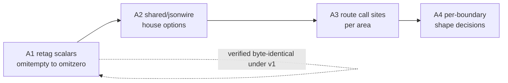

# Go 1.27 adoption — plan

**Status:** Track A at zero; Track B is done. Track C has landed everything that needs no decision: only 4 files remain, all waiting on Track A or its Phase A3. Re-measured against the tree at this update, and the Redis seam Track B was waiting on is answered below.
**Code in scope:** [`services/`](../../../services/) (all areas), [`testing/`](../../../testing/), [`deployment-tool/`](../../../deployment-tool/)
**Live SoT (until promote):** [backend/core/core.md](../../backend/core/core.md), [backend/api/contents.md](../../backend/api/contents.md), [technical-rules.md](../../technical-rules.md) § Prefer modern Go

**Rules:** Read and following [`../documentation-rules.md`](../documentation-rules.md)
and [`../technical-rules.md`](../technical-rules.md) (migration-plans).
Phase 1 (project folders/docs) before any product work.
For Go surfaces in scope only: `go fix -diff` before planned work; again on edited packages (not unrelated code).
Live SoT will not be edited until this project is complete and promotion is approved.

## Prerequisite (landed before this project)

The language-version move is done and is **not** a track here:

| Piece | Now |
|-------|-----|
| `services/go.mod`, `deployment-tool/tools/go.mod` | `go 1.27.0` (`deployment-tool/go.mod` was already there) |
| Six `services/*/Dockerfile` + `deployment-tool/Dockerfile` (both stages) | `golang:1.27.0-alpine` |
| Toolchain directives | None added, in any module |
| Verification | `go build`, `go vet`, `go test` clean on both modules |

Two consequences that the tracks below depend on:

- **`encoding/json` is now the v2-backed implementation.** The `jsonv2` GOEXPERIMENT ships on by default in the 1.27 toolchain, so moving the builder images changed the engine under every existing `encoding/json` call. v1 *semantics* are preserved by the legacy-options path; the full module test suite passes unchanged. The only opt-out is build-time `GOEXPERIMENT=nojsonv2` — there is no runtime GODEBUG for it.
- **`encoding/json/v2` is now reachable.** `go vet` rejects the v2 API below language version 1.27 (`json.Marshal requires go1.27 or later`), so Track A was blocked until the bump and is not blocked now.

## Goals

1. Decide and execute a position on **`encoding/json/v2`** — gaining its read-side strictness without silently changing any wire contract.
2. Put the **time-driven wait loops** that currently cost wall clock (or have no coverage at all) on simulated time.
3. Clear the **`go fix` backlog** the new language version exposed, scoped per area rather than as one sweep.

## Non-goals (this project)

- Adopting v2's default semantics wholesale as a single change.
- Changing the JSON shape of any client-facing response as a side effect of an engine or API change; shape changes are a deliberate, separately-decided step (Track A, Phase A4).
- Migrating `MarshalIndent` operator output (`eip cli` JSON) to v2 — human-read output gains nothing from either the strictness or the speed.
- Rewriting tests that need real infrastructure (miniredis, live Mongo) to run under simulated time without a seam; the seam is a named prerequisite, not an assumed one.

## Track A — `encoding/json/v2`

Measured behaviour differences, the retag rule, and the house-options set: [json-semantics.md](./json-semantics.md). Read that before starting any phase here.

Surface, re-counted at this update: 160 files under `services/` import `encoding/json` (48 shared, 32 websocket, 31 api, 24 core, 21 worker, 2 capacity-controller, 1 ws-router, 1 cmd); 269 `,omitempty` in `json` tags against 7 `omitzero`; six custom marshaler methods; one production `DisallowUnknownFields` site. The `bson` half carries a further 90 `,omitempty`, which A1 must not touch. There is **no** shared JSON helper today — every call site imports the stdlib directly. The surface grows with ordinary work, so recount for the area you open rather than working from these numbers.

By Go type, roughly two thirds of the `,omitempty` tags are on the scalars and pointers A1 can retag; the rest are on the maps, slices and non-pointer `time.Time` it must leave alone. They concentrate: `api/v1endpoints` (16 files) and `shared/models` (14 files) carry most of them.

### Phase A1 — Retag scalars, still on v1

`,omitempty` → `,omitzero` on **scalar** fields only (int / float / bool / string / pointer). `omitzero` behaves identically under both engines, so this is provable while still on the v1 API and removes the single largest source of v2 shape drift.

**Do not** retag slices, maps, or `time.Time` — the two tags genuinely differ there, and those types already agree between engines under `omitempty`.

**Change the `json` tag only.** The BSON driver does not read `omitzero`, and most fields carry both tags written as one pair — retagging the `bson` half drops the option and changes what the upsert writes. See [json-semantics.md](./json-semantics.md) § The retag rule.

`go fix` will not do this for you: it proposes no `omitzero` rewrite against the 326 `,omitempty` tags
in the tree, because the change alters behaviour and it declines to make that call. Track C therefore
cannot land A1 by accident.

Done when: every scalar `omitempty` in `shared/models` and the cross-process payload structs is retagged, and a byte-equality assertion over the representative documents passes unchanged.

### Phase A2 — `shared/jsonwire`

One shared package owning the house options (`FormatNilSliceAsNull`, `FormatNilMapAsNull`, `EscapeForHTML`, `Deterministic`) plus thin `Marshal` / `Unmarshal` / encode / decode wrappers. `FormatNilSliceAsNull` is **transitional**: it holds output byte-identical while A3 moves call sites, and comes off for array-valued results at A4 — see § Decisions taken. This is the one-SoT home the codebase lacks; the options must not be re-declared per call site.

Done when: the package exists with tests proving byte-identical output to v1 for the representative documents, and its options are the only place the policy is written down.

### Phase A3 — Route call sites, area by area

`shared` → `core` → `worker` → `websocket` → `api`, finishing each area's cutover within its own slice. No forwarding wrappers left behind.

Includes rewriting [`api/helper/json.go`](../../../services/api/helper/json.go) error handling: it currently matches `*json.SyntaxError` / `*json.UnmarshalTypeError` and string-prefixes `"json: unknown field "`. v2 replaces these with `*jsontext.SyntacticError`, `*json.SemanticError`, the `json.ErrUnknownName` sentinel, and a `jsontext.Pointer` field path — strictly better, and it deletes the stringly check.

Done when: no product file outside `shared/jsonwire` imports `encoding/json` directly, except the `MarshalIndent` operator-output sites named under non-goals.

### Phase A4 — Per-boundary shape decisions

Only after A3. Take boundaries one at a time, internal first (Redis blobs, asynq / NATS payloads — both ends are ours), then websocket, then the client-facing API. Each is a deliberate wire decision, not a default.

What each boundary carries today is measurable rather than a matter of reading structs: the model
parity sweep decodes every stored document and reports what the model does not reproduce, and its
corpus drives the SPA-side check — [testing harness.md](../../testing/harness.md) § Model parity.
Run it before and after a boundary decision.

**Wire compatibility:** A1–A3 are **additive/neutral** by construction. A4 is **breaking** per boundary for any consumer distinguishing `null` from `[]`, and the read-side strictness is **breaking** for any producer sending duplicate keys or mismatched field case. No such in-tree producer was found; `eip cli` output and Firestore import data are external enough to need a check before A4 touches them. Mixed-version rolling deploys are low risk in the other direction — extra zero-valued fields are ignored by v1 readers.

## Track B — Simulated-time tests

Feasible with no seam, all in-process and channel-driven:

| Target | Today |
|--------|-------|
| [`core/servicemanager/managed_test.go`](../../../services/core/servicemanager/managed_test.go) | Two 2s `time.After` selects waiting on start/stop signals |
| [`core/scheduler/cancel_on_shutdown_test.go`](../../../services/core/scheduler/cancel_on_shutdown_test.go) | A 3s `wait.For` poll and 30s / 5s / 5s `time.After` selects around gocron shutdown |

Both are ceilings rather than sleeps, so the wall-clock cost is small when the code behaves; the gain is that a regression fails in simulated time instead of hanging out to a real deadline.

Blocked until a seam exists — these drive real leases through miniredis, which serves over loopback TCP and exposes no custom-listener API. Real network I/O never counts as durably blocked, so a bubble deadlocks rather than fails:

- [`core/primarycontroller/controller_test.go`](../../../services/core/primarycontroller/controller_test.go) (5.05s of the suite's wall clock)
- [`core/leadership/failover_test.go`](../../../services/core/leadership/failover_test.go)
- [`core/singleton/service_test.go`](../../../services/core/singleton/service_test.go)

The seam has a home: every Redis-backed test takes [`testing/redisfake`](../../../testing/redisfake/), which owns construction of the miniredis server and its client, and its package comment names itself as the one place to change. Making those tests bubble-safe means giving that constructor an in-memory transport rather than editing each test.

### The seam works, and its shape is measured

Built and run against miniredis v2.38.0 and go-redis v9.21.0: a `synctest` bubble drove real Redis
commands while fifteen seconds of simulated time passed in no wall clock at all, with TTLs correct
throughout. No fork and no upstream change — `Miniredis.Server()` is exported and `server.ServeConn`
takes a `net.Conn`, documented as "Nice with net.Pipe()". The client reaches it through
`redis.Options.Dialer`, so nothing touches a socket.

The arrangement is the whole finding. Three of the four fail:

| Arrangement | Result |
|-------------|--------|
| Server outside the bubble, dial inside | **fatal** — `sync: WaitGroup.Add called from inside and outside synctest bubble` |
| Server started inside the bubble | passes trivially, then **hangs** as soon as simulated time is involved: the TCP accept goroutine is never durably blocked, so the clock never advances |
| Everything outside, logic inside, default pool | **fatal** — simultaneous commands force a second dial *inside* the bubble, same WaitGroup crash |
| Everything outside, logic inside, `PoolSize: 1` | **passes**, including eight simultaneous commands |

So the constructor must establish server, client **and the first connection** before the bubble opens,
and pin the pool to one connection so no dial ever happens inside. That belongs in `redisfake` as a
second constructor beside `New`, not spelled per test.

`testing/httpfake` is the precedent for the shape — it serves over an in-memory pipe for the same
reason and its own test runs under `synctest.Test`.

**The wall clock is not the reason to do it.** Measured across `./core/...`: `primaryhandoff` 5.07s,
`primarycontroller` 5.03s, `changestream` 4.99s, `scheduler` 1.59s. `core/primaryhandoff` is a single
test — `TestResumeTokenTreatsAnUnreachableRedisAsAColdStart` at 4.97s — burning a real dial timeout
against a stopped miniredis, and it is the largest single item in the suite. The two targets the plan
leads with are ceilings that rarely fire, so they cost little today. `changestream` is different again:
its 5s is a literal sleep in a live-Mongo test, which this project's non-goals exclude.

Done: both unblocked targets run under `testing/synctest`, and `redisfake.NewForBubble` carries the three that needed the seam — see [overlay.md](./overlay.md) § Track B, including why pinning the pool to one connection did not survive a second bubble.

## Track C — `go fix` sweep

`go fix -diff ./...` at the new language version reports `errors.As` → `errors.AsType`, `interface{}` → `any`, `slices` / `maps` adoption, `strings.Cut`, `max()`, plus composite-literal folding, promoted fields in struct literals, and gofmt alignment. The `wg.Go` and `for range n` fixers no longer match anywhere in the tree.

By area, re-counted at this update — **4 files**, all in `services/` (api 3, shared 1) and all waiting on a Track A decision. Every other area is clear: `capacity-controller`, `core`, `worker`, `websocket`, `ws-router`, and the separate `testing/` and `deployment-tool/` modules.

The count is a snapshot, not an inventory: it falls on its own as areas are touched under the scoped `go fix` rule. Re-run the command for the area you are about to open rather than working from these numbers.

Land **per area, scoped to that area**, per [technical-rules.md](../../technical-rules.md) § Prefer modern Go — not as one sweeping commit, and not widened into packages a slice does not otherwise touch. Where an area is already being opened by Track A Phase A3, its `go fix` slice should land first so the JSON change reviews clean.

Both remaining groups are **not** mechanical and must not ride a sweep:

| Where | Why it needs a decision |
|-------|-------------------------|
| [`shared/core/sde/files.go`](../../../services/shared/core/sde/files.go), [`api/staticdata/endpoints.go`](../../../services/api/staticdata/endpoints.go), [`api/v1endpoints/session_types.go`](../../../services/api/v1endpoints/session_types.go) | The fixer drops `,omitempty` from two `time.Time` fields and two struct fields. Measured inert under both engines for these four fields, so it is safe whenever it is taken — but its inertness is a property of the *referenced type*, not of the tag (see [json-semantics.md](./json-semantics.md) § The retag rule), and a mechanical sweep does not check that property. It is a wire tag either way, so Track A takes all of them in one place rather than one file at a time. Note it runs *opposite* to Phase A1, which retags rather than removes. |
| [`api/helper/json.go`](../../../services/api/helper/json.go) | The proposed `errors.AsType[*json.SyntaxError]` / `[*json.UnmarshalTypeError]` rewrites land on the exact lines Phase A3 replaces with `*jsontext.SyntacticError` and `*json.SemanticError`. Leave this file to A3. The sibling [`endpointHelpers.go`](../../../services/api/helper/endpointHelpers.go) match survives v2 and has already landed. |

A third group has landed — `authenticate.go`, `refresh.go` and `statistics/live_scope_test.go`, recorded
in [overlay.md](./overlay.md) § `api`. It leaves a caution that outlives it: **composite-literal folding
does not check whether the target field is already set in the literal.** In `authenticate.go` it folded
in a duplicate `RefreshToken` and the package stopped compiling. Any future area whose `go fix` output
includes that fixer needs a by-hand pass, not a blind sweep.

The two `deployment-tool/` files have landed — see [overlay.md](./overlay.md) § `deployment-tool`.
They turned out to be a **language** change, not the dependency change they were first read as: Go 1.27
permits a promoted field in a struct literal, so `Meta: swarmtypes.Meta{Version: …}` becomes a direct
`Version:`. Moby's `swarm.Service` still embeds `Meta` unchanged. Measured: the rewritten literal is
rejected at language version 1.26 with *"use of promoted field Meta.Version in struct literal requires
go1.27 or later"* and accepted at 1.27.

Done when: `go fix -diff` is empty for every area, or a remaining suggestion is recorded here with the reason it was waived.

## Open decisions

| # | Decision | Needed by |
|---|----------|-----------|
| 1 | Is v2's read-side strictness (duplicate names, case sensitivity, UTF-8 validation) worth the migration at all, given the measured ~13% unmarshal gain and no marshal gain? | Before A1 |

## Decisions taken

**A result that is a JSON array is emitted as `[]` when empty, never `null`.** This is v2's default, so
`FormatNilSliceAsNull` is **not** carried permanently for array-valued results — A2's house options
carry it only as long as A3 needs byte-identical output while call sites move. Nothing in the SPA
distinguished the two: its `Job` already builds `[]` where the API sends `null`, and no reader compares
a collection against `null`. The decision is about what the wire honestly says. It does not reach
scalars, objects, or genuinely nullable fields, where `null` stays meaningful.

**The Redis seam was built.** `redisfake.NewForBubble` establishes server, client and every connection
before the bubble opens. Pinning `PoolSize: 1`, which this decision first called for, turned out to
fail as soon as a second bubble ran in the same process — the shipped constructor warms a pool instead.
[overlay.md](./overlay.md) § Track B has the reason and the measured result. The justification was
deterministic failure rather than wall clock; it delivered both.
No fake lease behind `shared/redis`.

## Done-when (project)

All three tracks closed or explicitly declined, the Track A wire decisions recorded per boundary in [overlay.md](./overlay.md), and go-ahead given to promote the landed behaviour into live SoT.
