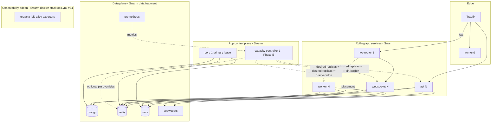

# Docker Swarm migration — roadmap & backlog

> **Migration / backlog log — not live SoT.** Live stack docs → [stack/contents.md](../stack/contents.md).
>
> **Handoff status (2026-08-02; repo-verified same day):** **Compose runtime retired** — Swarm fragments only (`docker-stack.data.yml` / `docker-stack.yml` / optional `docker-stack.obs.yml`). Stub `docker-compose.yml` is cleanup-only. **Operator surface is the Deployment Tool only** (CLI / TUI) ([guide.md](../deployment/guide.md): bootstrap → `eip init` → `eip up`; day-2 `eip secrets` / `sync` / `update` / `rebuild` / `logs` / `cli` / `shutdown`). **#17 done.** **Done:** **#3 / #4 / #5 / #7 / #15 / #16 / #17 / #23 / #24 / #25 / #28 / #31 / #32 / #33 / #34 / #35**; **#21** minimum + force-close; core boxed (**#9–#14 + #28**). Data ensure = `EnsureS3` ‖ `EnsureMongo` (Ready). **Partial:** **#2** (durable identity across scale), **#8** (soft divert / hosted-tenant), **#19** (sync apply landed; controller schema consume open), **#21** (armed evacuate CLI → #18). **#33/#35** bake path done; public `eip rebuild` is full-group only (`--no-cache`); bake HCL embedded + in-memory `TAG_*` (no `.eip-local-build.env` writer). **Next:** **#18** track (**#19 remainder → #30 → #27 → #18**); Ensure `*_API` users follow-up; network polish **#36** (small); sims **#26 / #27 / #29**. Live docs: [testing/contents.md](../testing/contents.md), [guide.md](../deployment/guide.md), [secrets.md](../stack/secrets.md), [config.md](../stack/config.md), [network.md](../stack/network.md), [deploy.md](../deployment/deployment-tool/cli/deploy.md), [verbs.md](../deployment/deployment-tool/cli/verbs.md), [stack.md](../stack/stack.md).

Tracks the single-host Swarm stack: **data fragment** (mongo/redis/nats/SeaweedFS/Prometheus) + **app fragment** (Traefik, api, websocket, worker, ws-router, core, frontend); optional Swarm **observability** fragment (`docker-stack.obs.yml`, #34). **Operator surface: [Deployment Tool](../deployment/guide.md) ([`deployment-tool/`](../../deployment-tool/) CLI + TUI; commands use `eip …`).

Later, Swarm’s fixed replica counts are driven by a **capacity controller** (not a naive CPU HPA). Swarm does not autoscale by itself. Prep for the controller is **woven into earlier items** so Phase E is mostly policy + Docker/Traefik ops, not inventing identity or metrics from scratch.

**Scope (intentional):** **one host forever** for this product (current design; multi-node HA / multi-manager are out of scope). Multi-node overlay, Mongo multi-host, K8s, replacing NATS stay out of scope.

**Non-goals for v1:** multi-active core scheduler/changestream (lease-gated single-primary is the design — see [core.md](../backend/core/core.md)); letting every replica call the Docker API to scale itself; auto-scaling the data plane; polishing data-plane live swaps before a basic Swarm cutover works; **Redis on the changelog / JetStream hot path** (placement GET on `/ws` connect is intentional - see [WS placement](#ws-placement-model-router--redis)); treating Phase E as a naive CPU “autoscaler” instead of a **capacity controller**; teaching public operators a Compose-vs-Swarm mental model; maintaining Compose as a runtime plane (retired — stub only); inventing a second host-ops surface beside the Deployment Tool.

**Dev vs prod (same product):** **`eip dev`** bakes and runs the app locally (images from Dockerfiles / bake). **Prod** uses **`eip up`** / **`eip update`** with the **same service set / same built images** and published tags — not a different architecture. Staging ≃ local/dev shape; orchestration is **Swarm fragments** (same manifests; scale/addons via `eip.config.yaml` + **`eip sync`**).

---

## Start here for a new session

1. **Goal of next implementation slice:** start **#18** capacity-controller prep (**#19 remainder → #30 → #27 → #18**). Compose→Swarm migrate **done**. **#32/#34** done. Hosted-tenant / soft divert parked with **#18**. **Core boxed off** (#9–#14 + #28). Operator path is the **Deployment Tool** (`eip …` verbs).

2. **Pickup order:** [Recommended pickup order](#recommended-pickup-order) — next live work is the **#18** track (then **#20**, **#22** last).

3. **WS placement (locked):** Redis **tenant -> websocket slot** via Swarm **`eip_ws_router`**; Traefik routes `/ws` -> router. Cookie `eip_tenant_affinity` is the key. Sticky = fallback. During Swarm rolls, router **prefers newest bake** among eligible slots. Drain + force-close: [websocket.md](../backend/websocket/websocket.md). Placement ops CLI next home is **#18** (and `eip`).

4. **Auth** rolls **in parallel** - account-key cookie now; widen when corp/alliance claims exist.

5. **Related roadmaps:** [document-lock](../backend/api/document-lock/roadmap.md) (multi-tenant #30-#37, especially #32), [auth](../backend/api/auth/roadmap.md), [guide.md](../deployment/guide.md), [cli/contents.md](../deployment/deployment-tool/cli/contents.md), stack YAML in project home / kit.

6. **Code anchors already in tree:** `services/shared/core/instanceid`, `services/core/singleton` + `redis/lease`, websocket JetStream durables, `tenant_affinity_cookie.go`, `services/ws-router/` (`preferNewestSlots`), stack Traefik `/ws` → `eip_ws_router` labels, **`deployment-tool/`** (deploy/sync/secrets/rebuild/update/cli).

7. **Testing:** **#25 done** — live map [testing/contents.md](../testing/contents.md) ([overview](../testing/overview.md), [services](../testing/services/contents.md), [Deployment Tool testing](../deployment/deployment-tool/cli/testing.md)). Grow sims **#26 / #27 / #29** as features land; weave tests into PRs for #8/#18/#21/etc.

Companion context:

- Current prod path: **eip-bootstrap** → **`eip init`** → **`eip up`** ([guide.md](../deployment/guide.md))
- Deployment Tool: [deploy.md](../deployment/deployment-tool/cli/deploy.md) (Ready / Ensure*) · [verbs.md](../deployment/deployment-tool/cli/verbs.md) (sync / secrets / update) · [engineering.md](../deployment/deployment-tool/cli/engineering.md)
- Shared network contract: [network.md](../stack/network.md) (`eip-core` mesh + `eip-public` edge + `eip-obs` / `eip-docker-*`)
- Replica identity: [stack.md](../stack/stack.md) § Replica identity + `services/shared/core/instanceid` → JetStream durables / OTLP `service.instance.id`
- Elastic Swarm stack (live): [stack.md](../stack/stack.md) + `docker-stack.yml` — Traefik + api/websocket/worker/ws-router/**core**/**frontend**
- Entry points: **`eip up` / `eip dev` / `eip rebuild` / `eip secrets` / `eip sync` / `eip update` / `eip cli` / `eip logs` / `eip shutdown` / `eip repair`**
- Edge: [traefik.md](../stack/traefik.md) — Swarm `eip_traefik` (ingress); `/ws` → [ws-router.md](../backend/ws-router/ws-router.md); frontend via swarm provider
- WS placement: [ws-router.md](../backend/ws-router/ws-router.md) — Redis tenant→slot; sticky fallback; prefer-newest bake mid-roll
- App images / day-2 rolls: [verbs.md](../deployment/deployment-tool/cli/verbs.md) — **`eip update`** (pull+digest-reconcile) / **`eip rebuild`** (bake)
- Secrets / apply: [secrets.md](../stack/secrets.md) — **`.env` = secrets** → **`eip secrets`**; [config.md](../stack/config.md) — **`eip.config.yaml`** → **`eip sync`**; FE public knobs via `x-frontend-public-env`; **`eip ensure-s3`** / **`eip ensure-mongo`**
- Core control plane: [core.md](../backend/core/core.md) — `lease:core:primary` + `servicemanager`; nested singleton leases; changestream resume in `core/primaryhandoff`
- **Multi-tenant product:** [document-lock ROADMAP Strategic direction](../backend/api/document-lock/roadmap.md#strategic-direction--multi-tenant-locks-account--corporation--alliance)
- Public deploy: day-2 YAML via **`eip sync`**, secrets via **`eip secrets`** (not full bring-up)


> Per item: **status** - **size** (S/M/L) - **where** - **why** - **how** - optional **acceptance**.  
> Add **new** open items at the bottom **without renumbering** existing ids.  
> All backlog items are **open / not started** unless marked otherwise.

---

## How to use this document

| Section | Purpose |
|---------|---------|
| [Start here](#start-here-for-a-new-session) | Handoff entry for a new agent/session |
| [Current state](#current-state) | What runs today and remaining pains |
| [Target shape](#target-shape-single-host) | What “done” looks like on one machine |
| [WS placement model](#ws-placement-model-router--redis) | How connections reach the right websocket (Redis + ws-router) |
| [Multi-tenant fit](#multi-tenant-fit-account--corp--alliance) | How Swarm/scale/placement anticipates product direction |
| [Changelog delivery](#changelog-delivery-core--jetstream--ws) | How Mongo changes reach containers (today vs #20) |
| [Principles](#principles) | Guardrails while migrating |
| [Phases](#phases) | Ordered delivery |
| [Capacity controller build-up](#capacity-controller-build-up-woven) | How earlier work feeds Phase E |
| [Testing & simulation](#testing--simulation) | How we prove cutover, affinity, scale, and management |
| [Backlog](#backlog) | Numbered work items **#1–#36** |
| [Impact map](#impact-map) | What improves vs what breaks |
| [Pickup order](#recommended-pickup-order) | Suggested sequencing |
| [Follow-ups](#follow-ups-detail-later) | Design notes still to write |
| [Decisions log](#decisions-log) | Locked decisions from planning |

---

## Current state

| Layer | Today | Pain |
|-------|--------|------|
| Deploy | **`eip up`** / **`eip dev`** — two-pass stack deploy + Ready (`EnsureS3` ‖ `EnsureMongo`) via [deploy.md](../deployment/deployment-tool/cli/deploy.md) | Day-2: **`eip sync`**, **`eip secrets`**, **`eip rebuild`**, **`eip update`** ([verbs.md](../deployment/deployment-tool/cli/verbs.md); #32 / #33 / #23) |
| Operator UX | Host **`eip`** binary (TUI + CLI); bootstrap installs it | #17 done — keep verbs in Deployment Tool catalog / TUI |
| api / websocket / worker / ws-router / Traefik / **core** / **frontend** | Swarm `docker-stack.yml` | #4/#21 min/#7/#16 done; #8 soft divert / hosted-tenant open; #6 absorbed into #23; core Phase B/C done |
| websocket identity | `OTEL_SERVICE_INSTANCE_ID` -> … -> `HOSTNAME` (`instanceid.Replica`) | Unstable names; orphan durables need `InactiveThreshold` + reconcile |
| core | Swarm `eip_core` (`replicas: 1`, `start-first`); probes `:19100`; primary lease + Redis changestream resume | Optional warm `replicas: 2` parked; **#28** dual-publisher failover tests done |
| Edge | Swarm `eip_traefik` (docker + swarm providers); `/ws` -> **ws-router** | #4/#21 min done; sticky fallback; mid-wave **prefer newest bake** |
| Observability | Optional Swarm fragment `docker-stack.obs.yml` (#34 **done** — toggle via YAML / `eip up`/`dev`) | Default **off**; Prom always on Swarm **data** fragment (not in addon) |
| Dev | **`eip dev`** — bake local images + deploy; day-2 **`eip rebuild`** | Same app as prod; cache bake; no data-plane bounce by default |

Elastic / dynamic process set (by design): **api**, **websocket**, **worker**, **ws-router**.  
Control plane: **core** — Swarm singleton with lease-gated hot-swap (`lease:core:primary`); scheduler/changestream run on the primary only (not multi-active).

---

## Target shape (single host)



| Service | Replicas | Update order (target) | Identity |
|---------|----------|----------------------|----------|
| api | ≥1 (later capacity-controlled; defaults in operator config) | `start-first` | `api-{{.Task.Slot}}` -> `OTEL_SERVICE_INSTANCE_ID` |
| ws-router | **1** (v1; `start-first` handover; scale to 2 later OK) | `start-first` | `ws-router-{{.Task.Slot}}` |
| websocket | ≥1-2 (capacity-controlled + drain; lean default 1) | `start-first` | `websocket-{{.Task.Slot}}` |
| worker | ≥1 (first capacity-control target) | `start-first` | `worker-{{.Task.Slot}}` (tune Asynq concurrency if N>1) |
| core | 1 | `start-first` (primary lease handoff) | fixed `core` (or slot `1`) |
| capacity-controller | 0 until Phase E; then 1 | `start-first` (lease-gated; same spirit as core Phase C) | singleton slot; owns desired shape (replicas, drain, optional pins) - Swarm executes |
| prometheus | 1 (data fragment) | Swarm **data** fragment | lean scrapes; **not** gated by addon |
| frontend | 1-2 | `start-first` | optional |
| mongo / redis / nats | 1 | rare / manual | stable DNS on Swarm data fragment |
| observability addon | 0 unless enabled | Swarm `docker-stack.obs.yml` (toggle = omit) | Grafana, Loki, Alloy, exporters, asynqmon UI (#34) — **no Prometheus** |

**Current topology:** Swarm **data** + **app** + optional **obs** fragments on external **`eip-core`** (stack namespace still `eip_*` services). Frontend on Swarm (**#16**) with `x-frontend-public-env`. Data-plane desired state via deployment-tool **`EnsureS3`** / **`EnsureMongo`**. Operator UX is the **Deployment Tool only** (CLI / TUI). Obs addon (#34) done — `addons.observability.enabled` merges `docker-stack.obs.yml`. Compose runtime retired (stub `docker-compose.yml` for leftover cleanup only).

---

## WS placement model (router + Redis)

Traefik **already** terminates TLS and can load-balance `/ws`, but Traefik v3 **cannot hash cookie values** (sticky + IP `hrw` only). Opaque sticky cookies group **browsers**, not **corps**. Org co-location needs a tenant-aware balancer.

### Default (locked - Redis placement on connect)

1. At login / session create, set cookie **`eip_tenant_affinity`** whose **value** is the primary affinity key: `alliance:{id}` -> else `corporation:{id}` -> else `account:{id}` (app already sets `account:{id}`).
2. Traefik routes `PathPrefix(/ws)` to Swarm service **`eip_ws_router`** (not directly to websocket tasks).
3. Router **GET/SET** Redis placement `tenant -> websocket slot` (TTL + refresh on successful place). Miss or dead slot -> pick a ready slot and write Redis. See [ws-router.md](../backend/ws-router/ws-router.md).
4. Router reverse-proxies the WebSocket upgrade to `websocket-N:4001`. Session auth still runs on the websocket process (existing Redis session path).

Sticky (`eip_ws_affinity`) is **fallback** when the affinity cookie is missing or Redis is down - not the steady-state org model.

### Why Swarm for the router

Compose recreate of a singleton proxy would drop every live `/ws` tunnel. Router uses `start-first`, **replicas: 1** (handover on roll; dual replicas optional later), slot id `ws-router-{{.Task.Slot}}`, same class as other elastic Swarm services.

### Ops / scale-in (#21 - minimum landed)

Controlled **cordon / drain / evacuate / pin overlays** sit on the same Redis map. Instant reassign on connect keeps the balancer correct when a slot dies; #21 is required for **safe scale-in** (do not cold-kill a hot alliance). Placement map + acceptance **done** (#4). **#21 minimum + force-close:** Redis cordon/pin/evacuate + drain PUBLISH / WS bounce. Later: verbs live on **#18 controller** (and `eip`); Redis stays SoT.

Capacity controller (#18) later may write pins / desired replicas; it does not replace the router.

### Separation of concerns

- **Swarm** schedules containers.
- **Traefik** TLS + `/ws` -> router (CORS labels live on the router with `/ws`).
- **ws-router** tenant->slot placement + proxy.
- **Capacity controller** (Phase E) desired cluster shape (replica counts, cordon/drain, reserve, optional pins).

### Not the design

- Waiting for Traefik native hash-on-cookie-value (unavailable in v3).
- Per-browser Traefik sticky as the long-term model.
- Placement scout / core Redis SCAN to derive live occupancy.
- Redis on the **changelog** hot path (#20 still: JetStream filters; interest registry on connect/move only).
- Live TCP teleport of sockets between containers (reconnect + existing `ws:session_handoff` instead).
- Compose-hosted router in hybrid mode (Compose-hosted router is out of scope (hybrid only)).

---

## Changelog delivery (core -> JetStream -> WS)

**Today:** core changestream publishes once to `doc.update.{collection}.{docID}` (JetStream). Each websocket replica has its own durable on `doc.update.>` so **every** replica receives **every** message, then filters locally to connected clients.

**With affinity alone:** co-location improves in-process density; the bus firehose remains until #20.

**Target (#20):** tenant (or shard) in subject; each slot keeps **one durable** with a **mutable filter set** for hosted tenants; core still publishes once - **no Redis on the changelog hot path**. Interest registry in Redis is for connect/move/ops. Dead slots: Redis TTL + JetStream `InactiveThreshold` + reconcile (same spirit as today’s orphan durable cleanup). On filter change after a move, define stream `MaxAge` and new-only vs backlog policy so reconnects don’t dump history or skip events.

**Core hot-swap:** core is the publisher leader (`lease:core:primary` + `start-first`; scheduler/changestream leader-only). Websocket consumers do not move with core.

---

## Multi-tenant fit (account | corp | alliance)

Product direction (locks, docs, WS fan-out) is **one planner** that serves **personal**, **corporation**, and **alliance** scopes together - not three separate apps. Infra choices here must not paint us into an account-only corner.

| Concern | Implication for Swarm / Traefik / capacity controller |
|---------|------------------------------------------|
| Tenants chatty on the same docs/locks | Prefer **placing clients that share a corp/alliance on the same WS replica within reason** so in-process fan-out hits more of that org’s tabs |
| **Today’s JetStream WS path** | Each replica uses its own durable on `doc.update.>` / `doc.lock.>` so **every** replica receives **every** message, then discards if no local listeners - correct when sticky scatters users; becomes a **worthless bottleneck** once affinity groups orgs |
| Selective fan-out (follow-on) | Know **which replicas host which tenants** and deliver only there (plus overflow/miss path) - see **#20**; pairs with affinity (#4) and tenant subjects (document-lock **#32**) |
| Personal + corp + alliance open at once | A session may need **multiple tenant subscriptions**; placement key is a **primary affinity** (e.g. largest/most-active org for that session), not “only one tenant forever”; interest registry must track **all** tenants with live sockets on that replica |
| Cookie sticky (`eip_ws_affinity`) | Pins a **browser**, not an **org** - random relative to corp mates. **Fallback only** (#4 router owns steady-state placement) |
| Scale signals | Global client/queue depth first; later add **hot-tenant** pressure (clients or backlog attributed to `corporation:*` / `alliance:*`) in #8 / #19 / metrics so one large alliance cannot silently soak a replica without scale-up |
| Workers | Today personal/Asynq queues; leave policy room for **per-tenant or per-queue-family** triggers when corp/alliance job pipelines exist (#7 / #19) |
| Drain / scale-down | Must consider **tenant concentration** - do not shrink away the only replica hosting a hot alliance without drain (#8 / #21); interest map must drop that replica’s tenants on drain |
| **Move / rebalance tenants** | Redis placement is sticky until reassigned; **#21** cordon/evacuate/pin overrides + reconnect. Prefer reconnect over live teleport |

**Affinity key (target):** `alliance:{id}` -> else `corporation:{id}` -> else `account:{id}` (same encoding as lock tenants). **Default routing = Redis placement via ws-router (#4).** Controlled overrides / evacuate = **#21**.

**Rebalance model (target):** ops / capacity controller change pin or cordon (#21), signal clients to reconnect, router honours Redis map. Session handoff/resume already exists. Scale-in always **drains** first (#21).

**Why selective fan-out matters with affinity:** Co-location alone does not cut NATS/CPU if every `websocket-N` still pulls `doc.update.>`. #20 narrows delivery; see [Changelog delivery](#changelog-delivery-core--jetstream--ws).

Cross-links: document-lock **#32** (WS fan-out by tenant), **#30** (tenant string encoding). Placement can ship with **account-key affinity** before corp collections exist, then widen the key as membership claims land in session/auth - without going back to per-browser sticky as the primary model.

---

## Principles

1. **Single host is the product** - design for one machine; no multi-node volume/network designs.
2. **Stable slot IDs** for JetStream durables / `ws_instance_id` (and sane scale-up naming).
3. **Never run two core leaders** until scheduler + changestream are lease-gated.
4. **Same app, two run modes** - `eip dev` builds/runs locally; prod uses `eip up` / `eip update` with the same images and live env. Keep topology/env contracts aligned so staging isn’t a different animal.
5. **Product safety over clever rollouts** - never run two primary publishers; standby may overlap under `start-first` while waiting on `lease:core:primary`.
6. **Deep-dive before coding each phase** - detailed designs land in follow-ups / ADRs as items are picked up.
7. **Centralise capacity decisions** - a singleton **capacity controller** (or operator) owns desired replica counts, drain/cordon, reserve capacity, and optional placement overrides. App replicas must not call the Docker API to scale themselves.
8. **Lay capacity-controller groundwork early** - metrics, Traefik, drain, YAML policy feed Phase E (see [Capacity controller build-up](#capacity-controller-build-up-woven)).
9. **Operator-owned policy file** - ceilings, targets, reserve %, cooldowns in mounted YAML (#19), including **host resource headroom**.
10. **Design for multi-tenant from day one** - tenant-shaped placement/scale keys; auth claims roll in parallel.
11. **Org-aware WS placement over sticky** - Redis tenant->slot via **ws-router** (#4); Traefik only terminates `/ws` to the router. Sticky is fallback. **#21** evacuate/move for safe scale-in (next).
12. **Selective WS bus delivery follows affinity** - #20; no Redis on changelog hot path; one durable per slot + mutable filters.
13. **Tenant placement is movable** - #21 evacuate/move on the same Redis map; lock UX during moves with doc-lock corp/alliance work.
14. **Hard cutover, then deepen** - minimal Swarm first; then GHCR day-2 rolls (#23), affinity depth, capacity controller.
15. **Two public config surfaces** - **`.env` = secrets**; separate **operator config YAML** (`eip.config.yaml`) = replicas, capacity, addon toggles, non-secret tunables (#19 / #24 / #34). Day-2: **`eip sync`** (YAML) / **`eip secrets`** (`.env`) (#32), not full `eip up`.
16. **This roadmap is the handoff** - implement from here; don’t re-derive from chat.
17. **Test as we build** - every major capability gets automated coverage and a **simulation/harness** path (affinity, connections, scale, evacuate/move, core failover). Prefer dry-run / fake Docker / load generators over “try it in prod.” Weave tests into item acceptance; live map → [testing/contents.md](../testing/contents.md); remaining sims **#26 / #27 / #29**.
18. **Bring-up vs apply** - `eip up` / `eip dev` create the world; **`eip sync` / `eip secrets` / `eip rebuild` / `eip update`** mutate it. Do not use full bring-up as the config apply hammer.
19. **Public UX hides orchestration internals** - operators learn **`eip`** + config files; NETWORK/STACK are implementer docs.
20. **Same `eip` experience on Windows, Linux, and macOS** - one Go binary (TUI + CLI); bootstrap `.sh` / `.ps1` only places the binary (#17 / #32 / #33 / #35). No OS-specific public command set.
21. **Observability is an optional addon** - default off for lean self-hosts (#34 **done**). **No separate metrics toggle.** Prometheus lives on the Swarm **data** fragment (with SeaweedFS), **not** in the obs fragment — #34 omits `docker-stack.obs.yml`. Apps must run with observability off.
22. **Host ops = Deployment Tool** - verbs in catalog / TUI only: [guide.md](../deployment/guide.md) / [verbs.md](../deployment/deployment-tool/cli/verbs.md).

---

## Phases

### Phase 0 - Prep (**closed**)

Prepare files/network/identity for the **hard cutover**. Defer ordered multi-service roll sophistication, data-plane live swaps, and full corp affinity until after cutover is boring.

- Pin / document replica env vars ([stack.md](../stack/stack.md) § Replica identity) - **done**.
- Inventory bind mounts -> configs/volumes plan (#3) - **done** ([secrets.md](../stack/secrets.md) § Remaining host binds); adminSDK binds removed; Swarm secrets + narrow Go config landed.
- External attachable **`eip-core`** (#1) - mesh overlay for Swarm stack - **done** (rename from `eip`; polish **#36**).
- Minimal stack file (#5) + Traefik swarm (#4/#31) + **ws-router** - **done**; account-key **cookie** done; sticky is router fallback only.
- Document `.env` → Swarm secrets + day-2 apply (#24) - **done** ([secrets.md](../stack/secrets.md), [config.md](../stack/config.md), [guide.md](../deployment/guide.md)); operator verbs now **`eip secrets`** / **`eip sync`**.

**Phase 0 exit:** prep artifacts + smoke + tenant affinity cookie + bind-mount inventory. Met. (ws-router + Swarm Traefik + Swarm secrets + day-2 apply + obs fragment toggle landed.)

### Phase A - Hard cutover: basic Swarm for elastic path

**Hard cutover** to Swarm for **Traefik + api / websocket / worker / ws-router**. Data plane on Swarm **data fragment** (mongo/redis/nats/SeaweedFS/Prometheus); app fragment owns Traefik + elastic + core + frontend.

**Landed (local / branch `swarm/hard-cutover`):** bring-up via **`eip up` / `eip dev`** (deployment-tool), data+app(+optional obs) Swarm fragments, Traefik ingress (#31), api/websocket/worker + ws-router + core + frontend (#4/#5/#16), affinity cookie, Redis placement path, Desktop localhost publish. Compose runtime retired (stub only); host ops = Deployment Tool (#17 / #34).

- Slot-stable identity (#2) - env verified; durable continuity across scale still open.
- `start-first` rolls for elastic services - in stack config; day-2 ship **#23** / #6 absorbed (`eip update` / `eip rebuild`).
- Traefik swarm + **ws-router Redis placement** (#4) - **done** (incl. same-tenant acceptance); sticky = fallback only.
- Capacity envelope drafted (#7 / #19) — **#7 done** (50 concurrency; worker max 2); **#8 docs** (drain checklist + websocket YAML); example YAML seeded.

**Exit criteria:** Swarm fragments are the working prod/dev shape; recover with **`eip up` / `eip dev`**. Day-2 image rolls are **#23** (+ #6 absorbed), not a hard-cutover gate. (Stay inside the #7 envelope — do not scale workers blindly.)

**Then build outward:** **#8 code**, day-2 rolls already on Swarm methods (**#23** done), #20, **capacity controller** (core Phase B/C closed). (#24 day-2 apply done.)

### Phase B - Core as Swarm singleton — **done**

Goal: **replace core without bouncing the whole stack**.

- Core in app fragment; orchestration probes on `:19100`; graceful SIGTERM cleanup.
- Compose `depends_on: core healthy` replaced by HTTP `/ready` (#10).
- Interim used `stop-first`; superseded by Phase C.

### Phase C - Core hot-swap / active-passive — **done**

Goal: **new core becomes handoff-ready before old releases**, then takes `lease:core:primary`.

| Workload | Landed |
|----------|--------|
| `singleton/*` | Nested Redis leases on every replica |
| Scheduler / changestream | `primarycontroller` + `servicemanager` — leader only |
| In-flight cron | gocron job `context.Context` cancelled on lose-primary / Shutdown (market-prices micro-batch stops early) |
| Changestream resume | Redis tokens `eip:core:handoff:v1:cs:resume:{groupID}` + Mongo `StartAfter`; cancel watch on lose-primary; at-least-once |
| Soft reports (schema lag / keyring) | Standby OK; not primary-gated. App Mongo indexes: deployment-tool `EnsureMongo`, not core. |
| Swarm roll | `order: start-first`; healthcheck `/ready` = standby handoff (not `is_leader`) |

JetStream **consumers** stay on websocket slots; only the **publisher** (core) moves.

**Exit criteria (met):** core image roll with resume-bounded handoff (no intentional cold Watch gap); no dual watchers; mid-publish lose-primary cancels scheduler work without gocron stop timeout; rollback if new never Healthy. **#28** done — unit/miniredis + dual-replica Managed publisher harness (`core/leadership`).

### Phase D - Remainder (optional)

- Alloy/label mapping for swarm tasks (#15) — **done** with Swarm obs/data move.
- ~~Fold mongo/redis/nats into Swarm~~ **done** (data fragment).
- ~~Observability addon as Swarm fragment (#34)~~ **done** — `docker-stack.obs.yml` + YAML toggle via deployment-tool.
- **Capacity-controller prep:** app/Asynq series Prometheus scrapes (and #15 labels); host headroom / node-exporter later. Full Grafana stack is **not** required for the controller.

Frontend on Swarm (**#16**) **done** — stack service + bake/train; public knobs only (`x-frontend-public-env`). Compose runtime retired.

### Phase E - Capacity controller (optional)

Swarm does **not** autoscale and does not understand org co-location. After elastic services are stable, add a **dedicated singleton Swarm service** for the **capacity controller** (#18) driven by operator YAML (#19) - **its own container**, not a sidecar of core/api/worker. **Prometheus comes up with this setup** as a Swarm **data** fragment service (lean scrapes: apps / Asynq) — same plane as SeaweedFS, outside the observability fragment. The **observability addon** (#34) remains optional (omit `docker-stack.obs.yml`) and is **not** a Phase E prerequisite.

**Roll / swap:** same class of problem as core. From day one use **lease-gated hot-swap** (core Phase C pattern): `replicas: 1` (or 2 with warm standby), `order: start-first`, Redis lease so only one controller mutates Docker; new task acquires lease -> becomes active -> old loses lease / SIGTERM -> exits. Brief dual-process overlap is fine; **dual armed mutators are not**. A stop-first gap is acceptable only as an emergency fallback, not the design target.

It is **not** a simple CPU watcher. It manages **cluster shape**:

| Decision | Examples |
|----------|----------|
| Replica counts | worker / websocket / api min-max from queue depth, client load, host headroom |
| Spare capacity | e.g. keep ~20% WS headroom (`reserve_capacity`) before average utilisation forces scale-up |
| Soft vs cutoff | `target_clients` vs `client_cutoff` per WS slot |
| Scale-up | raise desired replicas; wait healthy; optionally prefer **new** slot for new tenants (pin / cordon policy) |
| Scale-down | **never** instant kill - cordon -> drain (#21) -> when empty `service scale` down |
| Migrate / evacuate | which tenant leaves which slot under imbalance or deploys |
| Kill switches | per-service `capacity_controller_managed: false` in YAML |

**Division of labour**

- **Swarm** - schedules/runs the desired task count  
- **Traefik** - routes `/ws` -> **ws-router**; router owns Redis tenant->slot  
- **Capacity controller** - decides what the cluster *should* look like  

Similar spirit to K8s splitting scheduler vs HPA vs cluster-autoscaler, without adopting Kubernetes.

**Exit criteria:** capacity-controller service rolls via Swarm hot-swap with single lease holder; worker and WS desired state converge under policy without hand-scaling; scale-down always drains; dry-run (#27) proven before armed Docker mutations; operators edit YAML not code.

---

## Capacity controller build-up (woven)

Do not wait for Phase E to invent signals. Each earlier item owns a slice:

| When doing… | Also leave behind… | Feeds |
|-------------|-------------------|--------|
| **#2** slot identity | Continuous `ws_instance_id` / OTLP instance series as replica count changes | WS utilisation math |
| **#4** Traefik swarm + **ws-router placement** | Redis tenant->slot; sticky fallback; no per-browser sticky as end state | WS scale-up + co-located orgs; **prerequisite for #20 / #21** |
| **#5** stack file | Mount point for policy YAML; optional label mirrors | #18 / #19 |
| **#6** roll playbook | Manual `service scale`; note affinity impact on reconnect | Operator + controller parity |
| **#7** worker capacity | **done** — 50 concurrency default+cap; replicas max 2; [worker.md](../backend/worker/worker.md); draft `worker:` in `yamldefaults.DefaultConfig` | #19 worker section |
| **#8** WS reconnect / drain | **partial** — docs/YAML + force-close; soft caps / hosted-tenant open ([websocket.md](../backend/websocket/websocket.md)) | #19 WS; feeds #20 / #21 |
| **#15** Swarm metric/log labels | Trustworthy series for Prom scrapes + addon dashboards | #18 inputs; #34 when addon on |
| **#17** Operator surface (`eip`) | `eip sync` / `secrets` / `rebuild` / `update`; YAML edit/reload (scale via YAML; auto = #18) | Ops path (#32 / #33) — **done** |
| **#11-#13** core leases | Same lease-election pattern reused by capacity controller (#18) | #18 hot-swap |
| **#19** operator config YAML | Schema: mins/maxes, targets, reserve %, drain, host ceilings, **addons** | #18 + #34 source of truth |
| **#30** cluster abstraction | Observe/Apply API hiding Docker; fake impl for #27 | #18 packages |
| **#20** selective fan-out | Interest map + tenant-scoped delivery | Honest per-slot load |
| **#21** drain / evacuate / move | Ops the controller invokes on scale-in / rebalance | Management under affinity |
| **#25-#29** testing harness | #25 done (live testing map); sims #26/#27/#29 still open | Confidence for #18 / #21 |

Phase E (#18) should **evaluate cluster health periodically** from metrics + policy (#19), then call Swarm/Traefik-facing ops (scale, cordon, drain, optional pins) - not react to a single CPU sample. Prefer **dry-run** (#27) before armed mutations.

---

## Testing & simulation

Swarm, affinity, and capacity control are easy to get subtly wrong. Build a **layered suite** as features land - not a single big-bang QA project at the end.

### Layers

| Layer | What | Examples |
|-------|------|----------|
| **Unit** | Pure logic | Affinity key selection; placement pick_slot / TTL refresh; capacity-controller policy decisions from fake cluster state; lease acquire/release; filter-set reconcile; YAML schema validate |
| **Integration** | Real Redis/NATS/Mongo in CI (or testcontainers) | Session handoff; JetStream durable create + InactiveThreshold; hosted-tenant interest TTL; core lease failover for #11/#12 |
| **Contract / component** | HTTP/WS against running services (`eip dev` / local Swarm) | Traefik routes `/ws` -> router; two clients same affinity key -> same WS slot; sticky fallback when cookie/Redis missing; digest-reconcile / roll drills (#29) |
| **Simulation / load** | Generators + harnesses | N concurrent WS clients with corp/account keys; queue depth fake for Asynq; capacity dry-run printing `would scale websocket 2->3` then `drain WS-3`; evacuate/move without prod Docker socket |
| **Chaos / failover drills** | Scripted fault injection | Kill websocket slot; kill core leader; assert recover within SLA; orphan durable cleanup |

### What must be simulatable (management surface)

Operators and CI should be able to exercise without hoping traffic appears:

1. **Connections** - spawn many WS clients with chosen affinity keys; assert co-location / reconnect / handoff.
2. **Capacity control** - feed synthetic per-slot metrics into the policy engine; assert full decisions (scale, drain, reserve headroom, optional pins); **dry-run mode** that never calls Docker until explicitly armed (#27).
3. **Manual scale** - `eip sync` / Moby `ServiceUpdate` paths covered by integration or documented drills.
4. **Evacuate / move / cordon (#21)** - controller/`eip` ops (when armed) to move a fake tenant between slots; assert reconnect + interest map.
5. **Core leadership** - two core processes in test; kill leader; assert single changestream/scheduler.
6. **`.env` apply (#24)** - `eip secrets` recreate path in CI smoke where feasible.
7. **Selective fan-out (#20)** - publish tenant-keyed messages; assert non-hosting slot pull count ≈ 0.

### Woven into other items

When implementing #4, #6-#8, #11-#13, #18-#21, #23: add/extend tests in the same PR when practical. **#25 done** — live suite map under [testing/contents.md](../testing/contents.md). Grow sims (**#26/#27/#29**) as features land. Host unit tests: `deployment-tool` + `services/` Go packages.

### Dev mirror

**`eip dev`** should be able to run (or invoke) the same harnesses against local stacks so prod Swarm behaviour isn’t only testable on the live box.

---

## Backlog

### Prep & platform

#### #1 - External attachable mesh network (`eip-core`)
- **status:** **done** (2026-07-19; renamed `eip` → **`eip-core`**, Compose hybrid retired) — attachable overlay; data + app (+ dual-homed obs) resolve by name
- **size:** S
- **where:** fragment `networks:` + `engine.Ready` / `stack.ExternalNetworks`; [network.md](../stack/network.md) (single SoT; former `NETWORK_MAP.md` folded in)
- **why:** Data + app (+ obs) Swarm fragments need shared DNS on one mesh overlay
- **how (landed):** External attachable **`eip-core`**; stack-owned **`eip-public`** / **`eip-docker-*`** / optional **`eip-obs`**. Ready creates external nets from YAML.
- **acceptance:** `api` resolves `mongo` / `redis` / `nats` by name — verified; all data-plane services on Swarm data fragment.
- **follow-ups:** see **#36** (doc/code polish — prometheus/`eip-obs`, grafana websecure, capacity proxy net stays on #18).

#### #2 - Replica identity contract (prod)
- **status:** partial — Swarm slot templates in `docker-stack.yml` + `instanceid.Replica` landed; durable continuity across `service scale` / recreate still to confirm
- **size:** S
- **where:** `instanceid.Replica`; [stack.md](../stack/stack.md) § Replica identity; [`docker-stack.yml`](../../docker-stack.yml); websocket JetStream durables
- **why:** Unstable HOSTNAME/container IDs thrash durables and Grafana series; capacity control also needs continuous per-slot series
- **how (landed):** Swarm `{{.Task.Slot}}` env on api/websocket/worker/ws-router; core fixed `core`; resolution order in `instanceid.Replica`
- **acceptance:** After recreate **or** `service scale`, durables/metrics reuse `doc-live-updates-websocket-<slot>` (etc.) for each live slot - **slot env verified** on local smoke (`api-1`, `websocket-1`/`websocket-2`). Durable continuity across scale still to confirm.
- **capacity-controller build-up:** required input for per-slot WS utilisation averages without orphan label explosion

#### #3 - Secrets / configs instead of fragile bind mounts
- **status:** **done** (2026-07-23) — inventory/adminSDK/mesh; narrow Go loaders + `swarmsecret`; real Swarm `docker secret` objects + per-service attach (no `env_file`); **#16** FE on Swarm. Optional `MONGO_*_API` / `REDIS_*_API` prefer-when-set with fallback; attach api-only when present. **Creating** those DB/ACL users is deferred (Ensure follow-up). Root/app mongo users + indexes: `EnsureMongo` (done).
- **size:** L
- **where:** [secrets.md](../stack/secrets.md) (§ Remaining host binds); `docker-stack.yml`; deployment-tool `swarm` secrets + **`eip secrets`**; `services/shared/core/swarmsecret`; `services/shared/core/config`
- **why:** Swarm stacks handle bind mounts poorly; full `.env` on every elastic task over-shares secrets; a god `LoadConfig()` that requires every credential fights per-service Swarm secrets; frontend build/runtime env is part of the same attachment story
- **how (landed):**
  - Dropped `./adminSDK*.json` from stack/Compose (migration-only).
  - **Mesh networking from stack** (required): `x-mongo-env` / `x-redis-env` / `x-nats-env` / `x-objectstore-env`.
  - **Narrow loaders + `swarmsecret`:** env then `/run/secrets/<name>`; no god `LoadConfig()`. Api `ConnectAPI` for optional `*_API` creds (fallback to shared).
  - **Swarm secrets:** **`eip secrets`** / stack deploy → versioned `eip_<KEY>_<hash>` + per-service attach (Moby Secret*). Elastic services dropped `env_file`.
  - **#16 frontend on Swarm:** `x-frontend-public-env` (public knobs only); no docker secrets for FE.
- **deferred (Ensure follow-up):** create `MONGO_*_API` / `REDIS_*_API` users in Mongo/Redis when wanted (root/app mongo users + indexes already via `dataplane.EnsureMongo`).
- **acceptance:** App services deploy without `./file` host binds for secrets; **`eip secrets`** rotates without teaching raw `docker secret`; frontend on stack — **met**. Least-privilege DB users — **opt-in later** (app works on shared creds until then).
- **pairs with:** #16 (done), #24 (apply UX), #32 (day-2 verbs), Ensure follow-up
#### #4 - Traefik swarm provider cutover + ws-router tenant placement
- **status:** **done** (2026-07-19): swarm provider; affinity cookie; Swarm `eip_ws_router` + Traefik `/ws` cutover ([ws-router.md](../backend/ws-router/ws-router.md); replicas **1**, `start-first`); Redis placement + sticky fallback; acceptance proven on local smoke.
- **size:** L
- **where:** `docker-stack.yml` Traefik + `deploy.labels`; `services/ws-router/`; Redis placement keys; [traefik.md](../stack/traefik.md); [ws-router.md](../backend/ws-router/ws-router.md); `services/api/helper/auth/tenant_affinity_cookie.go`
- **why:** Stack tasks need swarm provider; opaque sticky groups browsers not orgs; Traefik cannot hash cookie values so Redis + thin router is the placement path
- **how:**
  1. Enable `providers.swarm`; network `eip-public`; `/api` + frontend via swarm provider (#16) - **done**
  2. App affinity cookie `account:{id}` (widen to corp/alliance later) - **done** (Phase 0)
  3. **Default placement:** Swarm `eip_ws_router` (replicas **1**, `start-first` handover); Traefik `/ws` -> router; Redis GET/SET tenant->slot with TTL + refresh; dead slot -> reassign on connect; sticky fallback; CORS labels on router with `/ws` - **done** (local smoke: stack healthy, `/ws` reaches router, placement backends=2)
  4. Remove opaque sticky as steady-state (emergency / escape-hatch / Redis-down fallback only)
  5. Redis session handoff / SPA resume when reconnect moves slots - handoff exists
  6. Track local hosted-tenant set for future #20 - deferred (websocket in-memory maps -> gauges under #8)
  7. **#21 next** - cordon/evacuate/pin overrides on the same Redis map (not in router MVP)
- **acceptance:** Swarm routing works - **verified locally**. Cookie set at session - **done**. Two clients same affinity key -> same WS replica - **done**. No Compose-elastic escape hatch - recover with **`eip up` / `eip dev`**.
- **capacity-controller build-up:** lean router `/metrics` + later WS occupancy gauges; scale-down needs #21 evacuate

### Elastic services (Phase A)

#### #5 - Stack file for api / websocket / worker
- **status:** **done** for data+app Swarm fragments (mongo/redis/nats on data fragment; `EnsureMongo` for mongo). Historical note: 2026-07-19 smoke was hybrid Compose data plane. Day-2 roll playbook (#6) with #23.
- **size:** M
- **where:** `docker-stack.yml`; [stack.md](../stack/stack.md); deployment-tool `stack` / `dockercli.StackDeploy` (two-pass deploy via **`eip up` / `eip dev`**)
- **why:** Need Swarm-honoured `deploy.update_config` and slot templates
- **how:** Extract elastic services; pin images via `APP_VERSION`; wire volumes (`api_data`, `worker_data`); SDE in SeaweedFS (`objectstore`); reserve `capacity_config` volume for `#19`; optional `eip.capacity.*` deploy labels. Deploy expands `.env` via compose-go (`deployment-tool` Expand) and strips top-level `name:` for Swarm.
- **acceptance:** `docker stack deploy` runs Traefik + elastic + ws-router beside data plane - **verified local smoke** (stack.md). `/ws` -> ws-router - **done** (#4). Remaining: durable continuity / ops polish.
- **capacity-controller build-up:** config mount path + optional label mirrors for #18 / #19

#### #6 - Rolling update playbook (api / ws / worker)
- **status:** **absorbed into #23** (2026-07-19) — operator path **`eip update`** / **`eip rebuild`**
- **size:** S
- **where:** [verbs.md](../deployment/deployment-tool/cli/verbs.md); pairs with **#23**
- **why:** Operators need a release path that is not `eip up` sledgehammer
- **how (landed):** Day-2 via **`eip rebuild`** (dev bake) / **`eip update`** (binary + stacks + images); Swarm roll order from stack YAML; WS scale-in stays on #21 evacuate
- **acceptance:** Day-2 ship without data-plane bounce — **met** under #23
- **capacity-controller build-up:** controller later automates the same scale/drain path operators already practice

#### #7 - Worker replica vs Asynq concurrency policy
- **status:** done (2026-07-19) — cap **50** for now; raise later with evidence
- **size:** S
- **where:** `services/worker/asynq` (`MaxConcurrency` / `WORKER_ASYNQ_CONCURRENCY`); stack `eip.capacity.max=2`; [worker.md](../backend/worker/worker.md); `kit/templates/yamldefaults.DefaultConfig`
- **why:** Each process already uses a large concurrency pool; N replicas can overwhelm Redis/ESI; this envelope is the capacity controller’s ceiling; corp/alliance workloads will add more queue families later
- **how (landed):** Default + hard-cap **50** per process; Swarm replicas **1** (labels min 1 / max **2**); cluster inflight ≈ `replicas × concurrency`; document that raising both multiplies ESI pressure; draft `worker.concurrency: 50` + lean max in example YAML; day-2 via **`eip sync`** → Moby `ServiceUpdate` (not sync-env / not `.env`)
- **acceptance:** Written min/max replicas and concurrency; YAML draft includes extensibility notes for multi-tenant queues. (asynqmon/Grafana soak = optional ops follow-up, not blocking the envelope lock)
- **capacity-controller build-up:** **primary** worker section for #19 -> #18

#### #8 - Websocket rollout, affinity reconnect, and drain
- **status:** partial (2026-07-19) — docs + YAML + **force-close on cordon/evacuate**; soft caps / hosted-tenant set still open
- **size:** M
- **where:** [websocket.md](../backend/websocket/websocket.md); `deployment-tool/.../yamldefaults` `websocket:`; `services/websocket/server/cordon_drain.go`; Redis drain PUBLISH / cordon (armed ops CLI next home **#18**); Redis `ws:session_handoff:v1`
- **why:** Replica rolls and scale-down still drop sockets; org co-location makes “which replica we drain” product-sensitive (do not evaporate the alliance’s home replica carelessly)
- **how (landed):** Drain checklist; websocket YAML; ops SET cordon + **PUBLISH** `eip:ws:drain:v1` → matching slot `ForceCloseLocalClients` (`please_reconnect` + 1001); refuse upgrades while cordoned; startup EXISTS catch for missed publish. **Redis pub/sub notify is temporary** — SoT stays Redis; NATS drain notify is the #18 target (avoid a second long-term fan-out bus).
- **how (still open):** Soft `target_clients` still policy-only (no soft divert). **Client cutoff + router full divert landed** (`WS_SLOT_CLIENT_CUTOFF` + Redis `eip:ws:full:v1`). Per-slot gauges polish; mid-edit roll soak. **Hosted-tenant query surface parked** until capacity-controller design (#18): in-process indexes already exist (`userConnections` / corp / alliance); do **not** pick HTTP vs Redis interest mirror yet — that choice must fit how #18 observes and how #20 interest lands. Until then ops uses placement Redis + gauges.
- **acceptance (partial):** Drain/cordon checklist + YAML + force-close + **client_cutoff refuse** + **router skip-full** exist; sticky called out as fallback. Remaining: soft divert / hosted-tenant surface with #18; soak evidence
- **acceptance (partial):** Drain/cordon checklist + YAML + force-close path exist; sticky called out as fallback. Remaining: soft caps; hosted-tenant set for #20; soak evidence
- **capacity-controller build-up:** WS section for #19 -> #18; hosted-tenant set feeds #20/#21; no automatic scale-down until drain + affinity rules are real

### Core (Phase B / C) - switching core on the fly

Core is the **control plane** (changestream -> JetStream, scheduler -> tasks, singleton jobs). It is not scaled like websocket. “Switch on the fly” means **safe ownership transfer**, not N active cores.

#### #9 - Core Swarm singleton (Phase B)
- **status:** done
- **size:** M
- **where:** `docker-stack.yml` `core`; graceful SIGTERM via lifecycle group
- **why:** Ship core image bumps without whole Compose reconcile
- **how (landed):** `replicas: 1` in app fragment; `stop_grace_period: 60s`; probes on `:19100` (was `:4010`). Interim `stop-first` superseded by #13.
- **acceptance:** Core rolls alone; dependents survive

#### #10 - Ready signal without Compose `depends_on`
- **status:** done
- **size:** M
- **where:** `shared/orchestrationprobes`; all app roles `:19100`; Traefik `healthcheck.port=19100` for api/ws-router
- **why:** Swarm lacks Compose health depends_on; probes must stay off traffic ports
- **how (landed):** Thin HTTP probes on dedicated listener. Core `/ready` = **handoff-ready standby** (deps + election loop + managed changeover) — **not** “holds primary.” Gated NATS health census bus scaffolded (`health.command.ping`, Enabled=false).
- **acceptance:** api/worker start order-independent; Swarm can Healthy a standby core during `start-first`

#### #11 - Lease-gate scheduler (leader only)
- **status:** done — validated on live roll
- **size:** L
- **where:** `core/scheduler` + `core/servicemanager` + `core/primarycontroller`
- **why:** Two cores would double-fire gocron / duplicate schedule publishes
- **how (landed):** Follow `lease:core:primary` state channel; start/stop under leader only; sticky Ready fail on bad leader start. Cron/one-time jobs take `context.Context` so gocron cancels in-flight work on Shutdown (e.g. market-prices micro-batch).
- **acceptance:** Two core processes may overlap; exactly one runs scheduler; kill/release leader -> standby takes over; mid-publish lose-primary stops early (no sustained dual publishers)

#### #12 - Lease-gate changestream watcher
- **status:** done — lease gate validated live; Redis resume + cancel-on-stop landed
- **size:** L
- **where:** `core/changestream` + `servicemanager` / `primarycontroller` + `core/primaryhandoff`
- **why:** Two watchers duplicate `doc.update` publishes; cold Watch on handoff misses oplog
- **how (landed):** Same primary gate as #11. Resume tokens in Redis (`eip:core:handoff:v1:cs:resume:{groupID}`) + `StartAfter` on acquire; cancel watch on lose-primary. At-least-once (rare dups OK). #20 remains separate (selective fan-out).
- **acceptance:** Kill leader -> standby resumes without sustained dual-watcher storm; bounded gap closed via resume

#### #13 - Core `start-first` / warm standby (Phase C hot-swap)
- **status:** done — validated on live roll
- **size:** M
- **where:** core `deploy.update_config` in `docker-stack.yml`
- **why:** Remove intentional dark window for live fan-out and schedules
- **how (landed):** `order: start-first`; healthcheck `/ready`; explicit primary lease release on Stop + unhealthy grace. Optional `replicas: 2` warm standby still parked.
- **acceptance:** Core image roll with resume-bounded handoff; no dual watchers; rollback if new never Healthy

#### #14 - Core CLI / one-shot job ops under Swarm
- **status:** done — validated mid-roll wait + one-shot
- **size:** S
- **where:** **`eip cli`** → `deployment-tool/internal/ops/core_cli.go`; TUI More → Command / `:`; [verbs.md](../deployment/deployment-tool/cli/verbs.md); core `tasks` wrapper unchanged
- **why:** `docker exec` + Compose `container_name: core` breaks under Swarm task IDs
- **how (landed):** Core-only (no api/worker/websocket CLI). Resolve sole running `eip_core` via Swarm service label; on `UpdateStatus=updating` (or multiple tasks) announce mid-roll, snapshot baseline, wait until the **new** task is sole owner; fail on pause/rollback/timeout. One-shots: `eip cli list` → container `tasks list` (no typed `tasks` prefix). Bare `eip cli` = interactive shell (terminal). TUI: Command session in OUTPUT pane (host verbs + core tasks).
- **acceptance:** Common migrations/tasks runnable without Compose container names; safe during `start-first` overlap

### Observability & edge (Phase D-ish)

#### #15 - Alloy / Loki / Prom label compatibility for Swarm tasks
- **status:** **done** (2026-07-24) — with Swarm obs/data stack move (`docker-stack.obs.yml` / Alloy on `eip-core`)
- **size:** M
- **where:** [`observability/alloy/config.alloy`](../../observability/alloy/config.alloy); Loki OTLP index labels; Prom scrape notes; Grafana log dashboards (`compose_service`)
- **why:** Compose label `com.docker.compose.service` missing on Swarm tasks broke LogQL filters
- **how (landed):** Alloy `discovery.docker` status filter + relabel: Swarm `eip_<role>` → `compose_service` / `swarm_service` / `task_slot` / `swarm_stack`; keep Compose labels during hybrid; drop Go OTLP services + socket proxies from docker-log scrape; Loki indexes `compose_service` (+ swarm labels); apps already set OTLP `compose_service` via telemetry
- **acceptance:** Stack task logs filter as `{compose_service="traefik"|"frontend"|…}`; Go services stay OTLP-only; Prom still scrapes Traefik + obs exporters when addon is up
- **capacity-controller build-up:** Prom + Asynq/Traefik series ready for #18; independent of full Grafana UI

#### #16 - Frontend on Swarm (with #3 secrets/config track)
- **status:** **done** (2026-07-23) — Swarm service in `docker-stack.yml` / `docker-stack.dev.yml`; bake group `swarm` includes frontend; public runtime env only
- **size:** M (env/secret attachment + bake/release path; not just a YAML service block)
- **where:** frontend in app fragment `docker-stack.yml`; `x-frontend-public-env`; [secrets.md](../stack/secrets.md) (FE public knobs note); #23 / [verbs.md](../deployment/deployment-tool/cli/verbs.md); deployment-tool images bake / **`eip dev`** / **`eip rebuild`**
- **why:** Same rolling-deploy story as api; FE needs public client knobs at start — under the Swarm env model, not a second Compose-only path
- **how (landed):** `frontend` on stack (`start-first`, Traefik swarm labels); `x-frontend-public-env` (public knobs only — no docker secrets for FE); bake/promote like other app roles; **`eip dev`** bakes then two-pass deploy; **`eip rebuild`** / **`eip update`** roll FE with other app services
- **acceptance:** Frontend on Swarm; rolls with app images without data-plane bounce; required boot env from stack public env attachment (not a full shared god `.env` dump) — **met**
- **pairs with:** #3 (done; `*_API` user creation = Ensure follow-up), #23/#33/#35 (ship/bake), #24/#32 (apply verbs)

#### #17 - Operator surface (Deployment Tool / `eip`)
- **status:** **done** (2026-07-23; scripts cleanup 2026-08-02) — operator surface is the **Deployment Tool** only (CLI + TUI).
- **size:** M
- **where:** [`deployment-tool/`](../../deployment-tool/); eip-bootstrap; `scripts/deployment-tool/build-host.*`; [guide.md](../deployment/guide.md); [deploy.md](../deployment/deployment-tool/cli/deploy.md); [verbs.md](../deployment/deployment-tool/cli/verbs.md); [engineering.md](../deployment/deployment-tool/cli/engineering.md)
- **why:** Public users need one bring-up story and clear day-2 apply/rebuild - without learning hybrid internals or OS-specific commands
- **how (landed):** Bootstrap + `eip` (up/dev/sync/secrets/rebuild/update/logs/cli/shutdown/repair/init/ensure-*). Scale = YAML + **`eip sync`** (automatic = **#18**). Cross-platform = one Go binary.
- **acceptance:** Docs teach Deployment Tool bring-up vs apply vs rebuild; no Compose-elastic product path — **met**
- **capacity-controller build-up:** #18 will own automatic scale; operators use YAML + `eip sync` as the manual path

### Capacity controller (Phase E)

#### #18 - Capacity controller (singleton Swarm service)
- **status:** open - prep: finish **#19** controller schema consume, then **#30** cluster seam + **#27** dry-run before arming. Prerequisites landed: #4/#5/#7/#15/#21-min; #8 soft divert / hosted-tenant still open (parked). WS scale-down needs #21 evacuate path armed on controller
- **size:** L
- **where:** **dedicated** app image/service (`capacity-controller`); Docker API via its **own** allowlisted proxy (`capacity-controller-docker-proxy` — pencil stub in `docker-stack.yml`); **Prometheus on Swarm data fragment** (`docker-stack.data.yml`, with SeaweedFS) + Prom query client; mounted YAML from #19; Redis lease + optional pin overrides
- **why:** Swarm only holds a desired replica count. Something still must decide **cluster shape**: how many worker/WS/api replicas, when to drain/remove a slot, how much spare capacity to keep, and (later) which replica should receive a new or migrated tenant. That is richer than watching CPU. Own container keeps Docker privileges and scale loops out of core/api/worker, and lets Swarm replace it like other singletons.
- **how:** Dedicated **capacity controller** service only (no app replica calls Docker to scale itself). **Docker socket pattern (locked with Traefik/ws-router):** one `tecnativa/docker-socket-proxy` per trust boundary on its **own** overlay (`eip-docker-traefik` / `eip-docker-ws` / `eip-docker-capacity`) — never mount the sock on the controller, never put proxies on `eip-core`, never share docker nets across consumers, and never widen `traefik-docker-proxy` / `ws-docker-proxy` for Apply. Controller proxy is the only one that may enable `POST` (scale/update) after **#27** dry-run + **#30** executor. **Swap model (locked):** lease-gated **hot-swap from day one** - same spirit as core Phase C (`start-first`, single leader via Redis lease; optional warm standby). New task acquires lease before arming mutations; old task releases lease on SIGTERM. Cooldown/hysteresis state may live in Redis so a roll does not forget recent scale decisions.

  **Internal shape (same binary, three packages - not three services):**

  ```text
  capacity-controller/
    policy/     // "what should happen?" - pure Evaluate(state, yaml) -> desired
    cluster/    // "what exists?" - read observations + Apply mutations via #30
    executor/   // "make reality match desired" - ordered scale/drain/pin ops
  ```

  **Reconciliation loop (golden rule):** `Observe -> Evaluate -> Apply -> Wait`. Policy evaluation is **deterministic and side-effect free**; Docker (and later drain/pin side effects) live only behind the cluster/executor boundary (#30). That keeps #18 coherent as one product owner without one undifferentiated blob.

  Periodically evaluate the cluster against YAML (#19), not a single metric sample. Responsibilities:
  1. **Desired replica counts** - worker / websocket / api within min-max from queue depth, client load, host headroom.
  2. **Reserve / spare capacity** - e.g. keep `reserve_capacity` headroom before average WS utilisation forces scale-up.
  3. **Scale-up sequence** - raise desired replicas -> wait healthy -> optionally prefer the new slot for **new** tenants (soft pin / cordon policy).
  4. **Scale-down sequence** - cordon -> drain/evacuate (#21) -> when empty `docker service scale` down (never instant kill of a hot slot).
  5. **Optional placement overlays** - Redis pins / migrate targets written for #21 / controller; **default placement remains ws-router Redis map (#4)**.
  6. **Kill switches & lease** - per-service `capacity_controller_managed: false`; only the lease holder mutates Docker; hot-reload config.
  7. **Human ops CLI** - When #18 is armed, evacuate/cordon/pin verbs live on the **capacity controller** (and `eip`); single write path — no parallel Redis script writer.
  
  Signals: Asynq queue depth/age; per-slot WS clients / hot-tenant; optional API latency/CPU. **Prometheus is part of this setup** — Swarm **data** fragment service (lean scrapes), independent of #34. **node-exporter / host headroom later** - not v1. Observability addon (#34) not required. Introduce order: **worker -> websocket (up first, down only with drain) -> api**.

  Illustrative loop: two WS slots at ~90% of `target_clients` -> decide scale to 3 -> wait WS-3 healthy -> place new tenants on WS-3; later average ~30% -> drain WS-3 -> when empty scale to 2.
- **acceptance:** Controller is its own Swarm service and rolls via `service update` without bouncing the stack; hot-swap transfers lease with no dual Docker mutators; packages keep policy pure (fixture-tested) and Docker confined to cluster/executor; worker and WS desired state converge under YAML without hand-scaling; operators can disable/clamp via YAML; scale-up respects host ceilings when configured; WS scale-down always drains; no replica stampede; **#27 dry-run** + **#30** fake cluster proven before arming Docker mutations in any environment

#### #19 - Operator config YAML (capacity + addons + tunables)
- **status:** partial (2026-07-20; sync-env ephemeral 2026-07-23; addon toggle with #34) — **`eip sync`** consumes replicas/capacity/bridges, ports/paths, concurrency, cutoff, proxy, file configs; obs fragment merge on up/dev/rematerialize (**#34 done**); durable **`.eip-sync.env` retired**
- **size:** M
- **where:** [`yamldefaults.DefaultConfig`](../../deployment-tool/internal/kit/templates/yamldefaults/default.go); `eip.config.yaml` (project home); deployment-tool `config.Sync` / Expand; [config.md](../stack/config.md); [verbs.md](../deployment/deployment-tool/cli/verbs.md)
- **why:** Ceilings, targets, reserve %, drain timeouts, kill-switches, **and addon toggles** must be tunable without rebuilding images; multi-tenant product will need more knobs than “global clients > N”; secrets stay in `.env`
- **how (seeded / applied today):** Versioned defaults in kit templates; Go validate; **`eip sync`** / stack expand → **ephemeral** SyncEnvMap (not a durable `.eip-sync.env`). Applied: `services.*.min`→replicas + `eip.capacity.min/max` labels; `services.worker.concurrency`; `services.websocket.client_cutoff`; `ports.*`; `paths.*`; `proxy.*`; `eip.config.sync` file-config hash rolls. Obs toggle → fragment merge on rematerialize (#34). Live SoT narrative → [config.md](../stack/config.md).
- **schema reserved for #18 / soft divert (validated, not consumed yet):**
  - `scale_timing` (`cooldown`, `scale_up_stabilization`, `scale_down_stabilization`) — controller pacing
  - `services.*.capacity_controller_managed` — per-role kill switch so the controller may not mutate that service
  - `services.websocket.target_clients` — soft planning target (vs hard `client_cutoff`, which sync already applies)
  - `services.websocket.reserve_capacity` — spare headroom fraction before scale-up
  - `services.websocket.drain_timeout` — drain window when scaling down
  - Automatic use of `services.*.max` as a live scale ceiling (labels written today; controller not armed)
- **how (still open):** #18 (and soft divert / #8) must **consume** the reserved keys above; optional dry-run policy print for controller; production mount if controller needs a file mount beyond reading project-home YAML
- **acceptance (partial):** Example YAML in-repo; **`eip sync`** + obs toggle apply without data-plane bounce — **met**. Remaining: #18 consume path for reserved keys.

### Multi-tenant realtime efficiency (after affinity)

#### #20 - Selective JetStream / WS fan-out (interest-based)
- **status:** open - blocked on usable affinity (#4) + hosted-tenant tracking (#8); strongly paired with document-lock **#32** (tenant subjects / WS subscribe set)
- **size:** L
- **where:** websocket JetStream consumers (`doc.update.>`, `doc.lock.>` today); Redis interest registry (connect/move path only); changestream / lock publishers; tenant (or shard) in subject
- **why:** Today each replica’s durable filters `doc.update.>` / `doc.lock.>` so **every container receives every message**, then `deliverOutbound*` no-ops when no local clients - fine when sticky scatters users; once orgs are co-located, this is pure firehose cost on replicas that will never deliver
- **how (direction - prefer no Redis on changelog hot path):**
  1. **Interest registry in Redis** - updated on connect/disconnect/move/heartbeat only. **Not** queried per changelog. Used for placement (#4/#21), ops visibility, and reconciling what a slot *should* be subscribed to.
  2. **Preferred delivery: dynamic subscribe on the WS side** - core still publishes **once** to a tenant-keyed (or shard-keyed) subject. Each slot consumes only what it hosts. Avoid publish-time Redis lookup.
  3. **Keep consumer cardinality small (cleanup hygiene):**
     - **Do not** mint one long-lived JetStream durable per `(slot, tenant)` - that is what gets messy (orphans × tenants × deploys).
     - **Prefer one durable per slot** (same naming generation as today: `doc-live-updates-websocket-N`) whose **filter set** is updated as tenants join/leave that slot (JetStream `FilterSubjects` / consumer update, or equivalent). Dead **slot** -> one durable to reap, not thousands.
     - **Alternative if filter churn hurts:** coarse **shards** (`doc.update.shard.{0..K}.>`), slot subscribes to a few shard subjects; tenants map to shards via hash - fewer subscribe mutations, slightly less precise than per-tenant.
     - **Ephemeral / pull consumers tied to process lifetime** where JS allows - vanish when the task dies; less durable garbage.
  4. **Dead subscriber cleanup (layered, reuse what you already have):**
     - Redis interest keys: **TTL + heartbeat**; failed slot disappears from the map without a delete message.
     - JetStream: set **`InactiveThreshold`** on fan-out durables (already used for today’s per-replica durables) so abandoned pull consumers self-delete.
     - Startup / periodic **reconcile** (same idea as `DocUpdateFanoutKeepPolicy` / stream consumer reconcile): allowlist current slot durable(s); delete orphans from old slots or old naming generations.
     - On shutdown / cordon / evacuate (#21): explicitly remove interest + shrink filters before exit when possible; TTL/InactiveThreshold cover crashes.
  5. **Safety:** short grace or dual-interest while #21 moves; optional low-rate catch-all only for miss windows - not a permanent second firehose.
  6. **JetStream retention / replay:** selective filters change which messages a slot *pulls*, not what the stream *stores*. After a move/filter widen, a slot might see a backlog (or nothing if messages already aged out). Define stream `MaxAge` / limits and whether new filters start at “new only” vs resume - so #21 reconnect doesn’t dump hours of history or silently miss. Detail in the #20 design note.
  7. **Metrics:** messages pulled vs delivered per slot; filter/interest size; orphan durables deleted; miss/retry counts.
  8. **Not** required for Phase A hard cutover.
- **acceptance:** Hot corp load test: non-hosting slots pull ~zero for that tenant; kill a slot -> interest/durable cleanup clean; documented backlog vs new-only policy on filter change
- **capacity-controller build-up:** hot-tenant metrics honest; #18 / #8 / #21 know where tenants live without a Redis GET on every Mongo change

#### #21 - Tenant rebalance / evacuate / move (WS placement control plane)
- **status:** partial — **minimum + force-close done** (2026-07-19; Redis overlays + drain PUBLISH). Armed operator CLI **not** in `eip` yet (next home **#18**). Hosted-tenant **query surface parked** with #18/#20; soft caps still open (#8).
- **size:** M
- **where:** Redis placement map + pin/cordon keys; WS control/close codes; SPA reconnect; ops / capacity-controller hooks; [ws-router.md](../backend/ws-router/ws-router.md)
- **why:** Router MVP **instant-reassigns** dead slots on connect (balancer stays correct). Safe **scale-in** needs controlled cordon / drain / evacuate so a hot alliance is not cold-killed when shrinking or migrating.
- **how (direction - prefer reconnect over live TCP migrate):**
  1. **Default remains Redis placement** via ws-router (#4). Pins/cordon are **ops overlays** on the same map.
  2. **Operations:** evacuate slot / move tenant / rebalance - write overlays, cordon (refuse new upgrades), signal reconnect; clients land via router using updated Redis state. **When #18 is armed:** evacuate/cordon/pin verbs on the **capacity controller** (and `eip`); controller applies Redis + NATS drain notify — single write path.
  3. Instant reassign on connect remains the crash/miss fallback - not a substitute for planned evacuate.
  4. **Safety** + doc-lock coordination; dual-interest grace for #20.
  5. Not required for basic place-to-live-slot; **required** before automated WS scale-down (#18).
- **acceptance:** Evacuate/move works without cold-killing a hot slot; scale-in playbook evacuates before `service scale` down
- **capacity-controller build-up:** #18 WS scale-down should call evacuate when shrinking would leave a hot slot dying cold

### Release / ops (after basic cutover)

#### #22 - Data-plane container updates (mongo / redis / nats) - later
- **status:** open - **low priority** - Compose→Swarm migrate done; no first-class data-plane day-2 verb/playbook yet
- **size:** M
- **where:** mongo / redis / nats; named volumes; `docker-stack.data.yml` (`stop-first`); deploy docs / [verbs.md](../deployment/deployment-tool/cli/verbs.md)
- **why:** One DB per deployment stays; bumping the DB **container** without taking the whole app down would help
- **how:** Volume-preserving **stop-first** replace; brief gap OK (same spirit as core Phase B). No data-plane capacity control. Explicit “touch rarely.” **Not** a Phase A blocker.
- **code note (2026-08-02):** `images.LiveImageRefs` already includes the data fragment, so **`eip update`** may pull data images when resolving live refs — that is **not** an operator playbook for intentional data-plane bumps (verbs.md still excludes data from day-2 ship). #22 is the explicit safe bump path.
- **acceptance:** Playbook to bump mongo/redis/nats image without full-stack down; data intact

#### #23 - App image day-2 ship (Swarm rolls; data plane untouched)
- **status:** **done** — day-2 ship is **`eip update`** (GHCR pull + digest-reconcile) / **`eip rebuild`** (local bake + rematerialize); absorbs **#6**. Standard Swarm `start-first` / `stop-first` from stack YAML
- **size:** M
- **where:** deployment-tool `update` / `rebuild` / `images.ReconcileLive`; [verbs.md](../deployment/deployment-tool/cli/verbs.md) (§ Day-2 app images); pairs with #33 rebuild
- **why:** Full bring-up can bounce the data layer. Day-2 must ship app images without taking mongo/redis/nats offline
- **how (landed):** **`eip update`** — binary / stack YAML / pull live images + digest-reconcile (force-update services whose running digest drifted). **`eip rebuild`** — bake + rematerialize (no Ready). Swarm owns rolling replacement. ws-router **prefers newest bake** mid-roll; FE snackbar does not block WS reconnect. Operator contract: app (and obs when enabled) ship; intentional data-plane bumps stay **#22** (see LiveImageRefs note there).
- **acceptance:** Day-2 app ship without data-plane bounce via **`eip update`** / **`eip rebuild`** — **met**. Optional later: Redis advertise polish from `eip`; controller soft-cutover (#18)

#### #24 - Secrets apply + day-2 config refresh (public deploy)
- **status:** **done** (2026-07-23; operator verbs **`eip secrets` / `eip sync`** after #17) — mechanics + public docs; guide / secrets / config / stack aligned (`.env` schema = `EnvFields` Go SoT). Optional `*_API` user creation = Ensure follow-up (out of #24).
- **size:** M
- **where:** [secrets.md](../stack/secrets.md); [config.md](../stack/config.md); #32; [guide.md](../deployment/guide.md); `docker-stack.yml`; deployment-tool `swarm` + `config.Sync`; operator config YAML (#19)
- **why:** Public tool - operators edit secrets and config. Swarm tasks do not auto-reload; need a clear apply path that is not full `eip up`
- **how (landed):** **`.env` = secrets** → **`eip secrets`** (versioned Swarm secrets + `/run/secrets/<KEY>` + rematerialize); non-secrets in operator YAML (#19) via **`eip sync`** (ephemeral sync-env + ServiceUpdate). Mesh hosts/URLs from stack anchors. Frontend public knobs via `x-frontend-public-env` (#16). Operators taught day-2 verbs, not raw `docker secret` / stack-deploy.
- **acceptance:** Following the doc, a user changes a documented secret via **`eip secrets`** or config via **`eip sync`** without bouncing the data plane unnecessarily — **met**.
- **acceptance detail (rescued from former env.md):** Operator can (1) change an elastic secret in `.env` → **`eip secrets`** → confirm `/run/secrets/<KEY>` remount on `eip_api` (etc.) without bouncing mongo/redis/nats; (2) edit `eip.config.yaml` → **`eip sync`** → capacity / ports / paths update without a data-plane bounce. Do not teach raw `docker secret`; rematerialize is internal to `eip up` / `eip secrets`.
- **out of #24 (rescued):** Creating Mongo/Redis `*_API` users (optional later — app falls back to shared creds). Obs addon toggle is **#34** (done).
- **pairs with:** #3, #16, #32 (done); #17 (operator surface)

### Testing & simulation harnesses

#### #25 - Swarm test suite foundation
- **status:** **done** (2026-08-02) — live testing map + existing host unit/integration; sims stay on **#26 / #27 / #29**
- **size:** M
- **where:** [testing/contents.md](../testing/contents.md); [overview.md](../testing/overview.md); [services/contents.md](../testing/services/contents.md); [deployment-tool CLI testing](../deployment/deployment-tool/cli/testing.md); CI `deployment-tool` workflow
- **why:** Need one place for unit/integration entrypoints so features don’t ship untestable
- **how (landed):** Cross-cutting testing section (contents + overview + services); Deployment Tool unit / `enginetest` / Swarm `integration` + CI; `services/` `go test ./…` documented; core leadership (#28); ws-router / websocket cordon-drain units. Optional later: dedicated `services/` CI workflow (called out in overview — not required to close #25).
- **acceptance:** Documented `go test` entrypoints + live suite map linked from Start here — **met**. Affinity load / capacity dry-run / management drills = **#26 / #27 / #29**.

#### #26 - WebSocket connection / affinity simulator
- **status:** open - pairs with #4 / #8
- **size:** M
- **where:** load/sim tool (Go or existing stack) that opens many `/ws` with chosen affinity cookies; asserts backend co-location and reconnect/handoff
- **why:** Cannot validate Redis placement co-location or drain behaviour with a handful of manual browsers
- **how:** Configurable N clients, affinity key distribution (same corp vs many accounts), reconnect storms, optional mid-test kill of a slot; report which backend each client landed on (via debug header, metrics, or server-side counter)
- **acceptance:** Script can prove “N clients with key K -> same slot”; reconnect after kill recovers; runnable against local stack via **`eip dev`**

#### #27 - Capacity controller dry-run / simulation
- **status:** open - pairs with #18 / #19 / #30; **required before arming real Docker mutations** (`service scale`, drain, optional pins)
- **size:** M
- **where:** `policy.Evaluate` unit tests + capacity-controller flags (`--dry-run`); fake `#30` cluster impl that records Apply calls
- **why:** Must simulate full **cluster-shape** decisions (queue spikes, client floods, reserve headroom, drain-then-scale-down, host ceiling) without mutating prod Swarm
- **how:** Golden fixtures for pure `Evaluate` (e.g. “two slots @90% -> scale to 3”; “three slots @30% -> drain newest -> scale to 2”); dry-run wires Observe -> Evaluate -> Apply against a recording cluster; never opens Docker socket unless `EIP_CAPACITY_ARMED=1`
- **acceptance:** Full policy suite without Docker; documented sims of worker scale-up/down, WS reserve/scale/drain cycle, and host-ceiling pause

#### #28 - Core leadership / failover tests
- **status:** done (2026-07-22)
- **size:** M
- **where:** `core/primarycontroller`, `core/servicemanager`, `core/scheduler`, `core/health`, `core/changestream`, **`core/leadership`** (cross-package dual-publisher)
- **why:** Dual changestream/scheduler is catastrophic; must prove single-leader and takeover SLA
- **how (landed):** Dual-replica election + standby Ready; Managed lose-primary stop; scheduler in-flight cancel; `/ready` handoff HTTP; changestream resume + cancel-on-stop; **`leadership.TestDualReplica_exactlyOnePublisherAndTakeover`** (two controllers + Managed fake publishers on shared miniredis — never dual `IsLeader`, steady-state one armed publisher, Stop→takeover republish, no sustained dual arm); **`TestDualReplica_takeoverBoundOnStop`** (clean Stop SLA). Crash/TTL takeover covered by `lease.TestRunWhileHeld_TakeoverAfterLeaderDies`. Full OS dual-binary smoke not required — property is the mutual-exclusion gate.
- **acceptance:** Automated test fails on dual leader / sustained dual publisher; clean-Stop takeover within bound; in-flight cron cancel — **met**
- **run:** `go test ./core/leadership/ ./core/primarycontroller/ ./core/servicemanager/ ./core/health/ ./core/changestream/ ./core/scheduler/ ./core/primaryhandoff/` (from `services/`)

#### #29 - Management ops simulator (evacuate / move / cordon / roll)
- **status:** open - pairs with #21 / #23 / #6
- **size:** M
- **where:** `eip` / capacity-controller dry-run hooks, or service admin endpoints gated for non-prod
- **why:** Ops paths must be rehearsable without waiting for a real hot alliance incident
- **how:** CLI/`eip` drills that: cordon a slot, move a synthetic tenant, dry-run digest-reconcile / force-update set, assert interest/map/client counts; use sim clients from #26 where needed
- **acceptance:** Documented drill: evacuate slot -> clients (#26) land elsewhere; roll dry-run prints affected services without applying; CI can run a subset without live Swarm

#### #30 - Cluster state abstraction (capacity controller)
- **status:** open - start with or just before #18 / #27; do **not** let Docker SDK types leak into `policy/`
- **size:** S
- **where:** `capacity-controller/cluster` (interface + Swarm impl + fake/recording impl)
- **why:** Before the Docker API leaks everywhere. Policy must not import Swarm client types; dry-run (#27) and future API/orchestrator churn stay confined. Not a bet on leaving Swarm - a seam for testability and executor hygiene.
- **how:** Define a small interface, e.g. observe workers/websockets/api (replica counts, slot IDs, client counts, health), plus Apply ops (`Scale`, `Cordon`, `Drain`, optional pin helpers). First impl talks to Docker Swarm (+ Prom/Redis reads as needed for Observe). Fake impl feeds fixtures and records mutations. Keep the surface minimal; grow only when #18/#21 need new ops.
- **acceptance:** `policy` package has **zero** Docker imports; #27 runs Evaluate + Apply against fake cluster; Swarm impl is the only production adapter

#### #31 - Docker Desktop host publish for Traefik (ingress)
- **status:** **done** (2026-07-19) - Swarm Traefik + **ingress** publish
- **size:** M
- **where:** `docker-stack.yml` service `traefik` -> `eip_traefik`; [traefik.md](../stack/traefik.md); **`eip up` / `eip dev`**
- **why:** Compose Traefik `ports:` on attachable overlay hung from Windows Desktop (`SYN_SENT` to overlay IP). Blocked localhost app + Grafana `/grafana`.
- **how (landed):** Run Traefik as a Swarm service with `mode: ingress` publish for `80`/`443`/`81`. Dual providers: docker on **`eip-core`**, swarm on **`eip-public`**. DNS alias `traefik` on mesh for Prom. No Compose Traefik fallback. No permanent `eip-edge` nginx.
- **acceptance:** From Windows host, `curl http://127.0.0.1/ping`, `/`, and `/grafana/login` (dev) return timely HTTP; in-Docker path still works; no Compose Traefik fallback. **Follow-on (#19/#32):** configurable `ports` / `paths` applied by **`eip sync`**.

#### #32 - `eip sync` / `eip secrets` (day-2 config + secrets)
- **status:** **done** (2026-07-20; ephemeral sync-env 2026-07-23; operator surface Deployment Tool after #17) — YAML targeted apply + secrets-only path; Swarm `secret` objects under **#3**; public docs under **#24**
- **size:** M
- **where:** deployment-tool `config.Sync` / `swarm` secrets / `Rematerialize`; [verbs.md](../deployment/deployment-tool/cli/verbs.md); [secrets.md](../stack/secrets.md); [config.md](../stack/config.md); [traefik.md](../stack/traefik.md)
- **why:** Full `eip up` is a sledgehammer for config/secrets edits while the stack is running; secrets and YAML must not share one easy-to-mistype verb
- **how (landed):** **`eip sync`** validate + ephemeral sync-env + Moby ServiceUpdate; **`eip secrets`** → versioned Swarm secrets + rematerialize (no YAML; no data-plane bounce); adminSDK binds removed; cross-platform via Go `eip`
- **acceptance:** Edit `eip.config.yaml` → **`eip sync`**; edit `.env` → **`eip secrets`** without mongo/redis/nats bounce — **met**. Optional `*_API` DB users = Ensure follow-up (out of #32). Minor rematerialize UX polish can land without reopening.

#### #33 - `eip rebuild` (dev scoped image rebuild + roll)
- **status:** **done** (2026-07-20; FE on Swarm default 2026-07-23; CLI scope nuance 2026-08-02) for **dev day-2** — full bakeable app group (incl. frontend), Docker cache, rematerialize; prod GHCR path still with #23 / **`eip update`**
- **size:** M
- **where:** deployment-tool `Rebuild` / `images` bake (`parseBakeArgs`); [verbs.md](../deployment/deployment-tool/cli/verbs.md)
- **why:** Local code changes should not require full down/up of mongo/redis/nats
- **how (landed):** **`eip rebuild`** bakes app images to `:bake`, promotes per-role `TAG_*` on digest change, rematerializes stack (no Ready). Public CLI: **`Args: cobra.NoArgs`** + opt-in `--no-cache` only (TUI same). Internal bake API already accepts role name args (`api`, `worker`, …) but they are **not** exposed on the operator verb yet.
- **how (still open):** Expose per-role selection on `eip rebuild` / TUI if wanted; dedicated GHCR/`APP_VERSION` rebuild path for prod day-2 if needed beyond **`eip update`**
- **acceptance:** Cached rebuild of full app fragment without bouncing healthy data plane — **met**. Selected-role UX still open.

#### #34 - Observability addon (optional; default off)
- **status:** **done** (Swarm fragment + deployment-tool toggle) — pairs with #15 / #19
- **size:** M
- **where:** [`docker-stack.obs.yml`](../../docker-stack.obs.yml); `addons.observability.enabled` in [`yamldefaults`](../../deployment-tool/internal/kit/templates/yamldefaults/default.go); deployment-tool `deploy` materialize / rematerialize / recipe; [deploy.md](../deployment/deployment-tool/cli/deploy.md)
- **why:** Lean self-hosts should not pay for Grafana/Loki/Alloy/exporters/asynqmon UI; controller needs Prom separately (#18), not the full addon
- **how (landed):** Toggle = include/omit Swarm obs fragment (no Prom inside it). Addon = Grafana, Loki, Alloy, mongo/redis/nats exporters, asynqmon UI, node_exporter. **`eip up` / `eip dev` / rematerialize** merge or prune obs when YAML enabled. Apps soft-fail OTLP / run with addon off. **Prometheus stays on Swarm data fragment** — always outside this toggle.
- **acceptance:** Default install runs core app path with obs off; enabling via config + bring-up starts only that fragment; apps healthy without Alloy; Prom scrapes lean app/Asynq targets — **met**

---

#### #35 - Buildx local bake for Swarm app images (`eip up` vs `eip dev`)
- **status:** **done** (2026-07-20; frontend in bake group 2026-07-23; path/tag flow clarified 2026-08-02) — bake group `swarm` = api/websocket/worker/ws-router/core/**frontend**
- **size:** M
- **where:** [`deployment-tool/internal/images/docker-bake.hcl`](../../deployment-tool/internal/images/docker-bake.hcl) (`//go:embed`, stdin `-f -`); `images.Bake` → in-memory `TAG_*` into stack expand; `docker-stack.dev.yml`; [deploy.md](../deployment/deployment-tool/cli/deploy.md); [verbs.md](../deployment/deployment-tool/cli/verbs.md)
- **why:** Swarm does not build images. Compose `--profile build-elastic` coupled bring-up and stamped Compose ownership on Swarm tasks.
- **how (landed):** buildx bake group `swarm` → stable `:bake`, then per-role promote to `${APP_VERSION}-<timestamp>` only when digest changes; digests via `docker image inspect`. **`TAG_*` are process/expand env** from `Bake()` / `TagsFromStack` — **not** written to a durable `.eip-local-build.env` (that name remains gitignored only). **`eip dev`** bakes then two-pass deploy; **`eip up`** pulls GHCR (no bake); **`eip rebuild`** bake + rematerialize. No `stack-force-local` (unique tags roll without `--force`). No repo-root `docker-bake.hcl`.
- **acceptance:** Local Swarm images build without Compose service definitions for app roles; `eip up` and `eip dev` diverge (pull vs bake); Desktop no longer implies app tasks are Compose-owned; Win/Linux/macOS via Go `eip` — **met**
- **pairs with:** #17 (operator surface), #33 (rebuild), #16 (frontend on Swarm)

#### #36 - Network plane polish (post-`eip-core` rename)
- **status:** **open** (live SoT in [network.md](../stack/network.md); code gaps below — formerly “Doc vs code gaps” on that file)
- **size:** S
- **where:** `docker-stack*.yml`; optional deployment-tool NetworkConnect; grafana Traefik labels; this ticket (gaps table)
- **why:** NETWORK audit found claims that do not match live setup; keep one SoT honest before #18 adds another proxy island
- **how / open work (checked YAML + deployment-tool 2026-08-02):**

| Gap | Reality today | Suggested follow-up |
|-----|---------------|---------------------|
| Prometheus dual-home onto `eip-obs` | **Not implemented.** Obs header / older docs claimed `eip sync`/`up` attaches prometheus; data fragment comment says “optional later”. Scrapes work because **exporters dual-home onto `eip-core`**. | Decide: keep exporter dual-home as SoT **or** implement NetworkConnect / service update for prometheus→`eip-obs` (#34 polish). |
| `EIP_NETWORK_NAME` / `engine.NetworkName` | **Not in code.** Ready uses `stack.ExternalNetworks` from YAML (`eip-core`). | Drop phantom knobs from docs (done in network.md / variables) unless a rename override is deliberately added. |
| Grafana `websecure` | Router labels use **`entrypoints=web` only**; api/frontend/ws also have websecure. | Add websecure (or redirect) if HTTPS `/grafana` should work without separate termination. |
| `eip-docker-capacity` | Absent from stack YAML | Stays with **#18** capacity-controller. |
| Legacy network name `eip` | Renamed to `eip-core` in fragments | Host cleanup only if an old `eip` net still exists. |

- **acceptance:** [network.md](../stack/network.md) matches YAML + Ready behavior; no phantom `EIP_NETWORK_NAME` / `engine.NetworkName`; chosen prometheus/obs scrape topology documented and implemented the same way; grafana entrypoints decision recorded in traefik/network.

---

## Impact map

| Area | Swarm effect |
|------|----------------|
| JetStream WS durables / `ws_instance_id` | **Better** with slot IDs (#2); stays coherent under scale |
| Live doc/lock during **ws/api** roll | **Better**; brief reconnect (#8) |
| Live doc/lock during **core** roll | **Worse** gap until #11-#13 |
| Document locks / Redis sessions | Neutral -> better with more API replicas; tenant locks ([doc-lock #30+](../backend/api/document-lock/roadmap.md)) need tenant-aware WS fan-out |
| Corp/alliance co-located WS | **Target** via ws-router Redis placement (#4); sticky fallback only |
| Full JetStream firehose to every WS replica | **Today’s design**; acceptable pre-affinity; **retire toward #20** once orgs are grouped |
| Asynq / ESI workers | Better throughput; overscale risk (#7); later capacity-controlled (#18); schema room for org queues (#19) |
| Websocket capacity | Affinity + manual/capacity control; drain must respect hot tenants (#8 -> #18); **moves** via #21 |
| Tenant pins stuck on one slot | Fixed by **#21** rebalance/evacuate; needed for scale-in |
| Alloy/`compose_service` logs | **Done (#15)** — Swarm → `compose_service` relabel |
| Observability footprint | **Done (#34):** addon off by default (Swarm obs fragment); Prom on data fragment |
| `docker exec core` / fixed names | **Done (#14)** — **`eip cli …`** / TUI Command |
| Traefik `/ws` routing | Swarm provider -> **ws-router**; not opaque sticky as end state |
| `eip dev` vs prod | Same app/images; day-2 **`eip sync` / `eip rebuild` / `eip update`** (#32 / #33 / #23) vs full bring-up |
| Mongo/Redis/NATS data | One DB; touch rarely; optional later volume-preserving swaps (#22) |
| Version bumps | App GHCR rolls via **`eip update`** (#23); Traefik rare/separate; data plane untouched |
| Public secrets / config edits | `.env` → **`eip secrets`**; YAML → **`eip sync`** (#24 / #32) |
| Testing / sims | **#25 done** (live testing map); required sims **#26–#29**; dry-run capacity controller (#27) + cluster seam (#30) before real scale/drain |
| Local Desktop host -> Traefik | **Done (#31)** - Swarm ingress `eip_traefik` |
| Cross-platform `eip` | Same Go binary on Win/Linux/macOS (#17 / #32 / #33 / #35) |

---

## Recommended pickup order

**Already landed (do not re-open):** Phase 0; Compose→Swarm migrate (data + app + obs fragments); **#3/#4/#5/#7/#9–#17/#23–#25/#28/#31–#35**; **#21** minimum; **#15/#34** obs; **#32** day-2 verbs. Testing map → [testing/contents.md](../testing/contents.md).

**Next (live):**

1. **#19 remainder → #30 → #27 → #18** — richer controller YAML consume + cluster seam + **dry-run** before armed capacity controller
2. **#8 / #21 deepen** — hosted-tenant surface + soft divert; armed evacuate/cordon verbs on **#18** / `eip`
3. **#20** + extend #26/#29 — selective fan-out
4. **#26 / #27 / #29** sim harnesses — weave into the above PRs (document under `testing/` when each lands)
5. **#22** data-plane image updates — last (explicit playbook; do not treat `eip update` LiveImageRefs as #22)
6. **Ensure `*_API` DB users** — optional follow-up on #3
7. **#36** network plane polish — prometheus/`eip-obs` decision, grafana websecure; live SoT [network.md](../stack/network.md); gaps on this ticket
8. **Optional polish:** `eip rebuild` per-role CLI args (#33 still open); durable local-tag file only if deliberately wanted (#35 uses in-memory `TAG_*`); dedicated `services/` CI workflow

---

## Follow-ups (detail later)

1. **#4 done** - placement + acceptance ([ws-router.md](../backend/ws-router/ws-router.md)).
2. **Tenant evacuate / rebalance (#21)** - minimum done; deepen with #8 reconnect signal; cordon/drain/pins on same Redis map.
3. **Hard cutover ops polish** - stack live; secrets/config day-2 (#24/#32 done); roll playbook (#6) absorbed into #23 (Swarm digest-reconcile / bake).
4. **Core readiness (#10)** — done.
5. **Scheduler lease (#11)** — done (incl. in-flight cancel).
6. **Changestream lease / resume (#12)** — done (Redis resume + cancel on lose-primary).
7. **Observability addon (#34) done** — Swarm `docker-stack.obs.yml` + YAML toggle; labels (#15) done.
8. **Worker + host capacity (#7 done / #19)** - node-exporter later.
9. **Operator runbooks** - **day-2 ship** ([verbs.md](../deployment/deployment-tool/cli/verbs.md) / #23); **`eip rebuild`** (#33); **`eip sync` / `eip secrets`** (#24/#32); **`eip cli`** (#14); evacuate (#21 → #18).
10. **Capacity controller (#18/#19/#30)** - `policy`/`cluster`/`executor`; Observe->Evaluate->Apply->Wait; **dry-run first (#27)**; Prom with controller.
11. **Multi-tenant infra sync** - locks + auth + placement.
12. **Selective WS fan-out (#20)** - filters; retention policy.
13. **Core hot-swap (#9/#13) + failover tests (#28) + CLI (#14)** — done (core boxed off).
14. **Data-plane update (#22)** - later; `LiveImageRefs` may already list data images under `eip update` — still not the intentional bump playbook.
15. **Ensure — least-privilege API DB users** — when wanted: create `MONGO_*_API` / `REDIS_*_API` in deployment-tool Ensure (Mongo user + Redis ACL), set keys in `.env`, `eip secrets`. App already falls back when unset (`ConnectAPI` / optional api-only secret attach). Mongo keyfile + root/app users + preimages + indexes already owned by `EnsureMongo`.
16. **Testing architecture (#25-#29)** - **#25 done** ([testing/contents.md](../testing/contents.md)). Still open: WS load tool (#26); capacity dry-run (#27); chaos/management drills (#29). Optional: `services/` CI workflow.
17. **Operator config split + `eip sync` / `eip rebuild`** — done (#17/#32/#33); rebuild per-role CLI polish still open on #33.
18. **Companion docs** - secrets.md / config.md / stack.md / guide.md / deploy.md / verbs.md / engineering.md / **network.md** aligned for Deployment Tool ops; remaining scrape topology → **#36**.
18a. **Docs cleanup (later — after swarm migration work)** — stack + guide + CI/channels + **Deployment Tool CLI/TUI** live-SoT pass landed; **Cursor Phase 3** landed (SoT in `technical-rules.md` / `documentation-rules.md`; thin `.mdc` pointers; `deployment-tool-*.mdc`). Remaining: backend/frontend large-doc breakdown when touching those services.
19. **Buildx local bake (#35) done** - embedded [`deployment-tool/internal/images/docker-bake.hcl`](../../deployment-tool/internal/images/docker-bake.hcl) → `:bake` + per-role `${APP_VERSION}-<timestamp>` as **in-memory `TAG_*`** into expand / `docker-stack.dev.yml` (group `swarm` includes **frontend**); **`eip up`** pull vs **`eip dev`** bake (no force-local). `.eip-local-build.env` is gitignored only — not written by current code.
20. **`.eip-sync.env` bridge — done/closed (2026-07-23)** — durable file retired. Capacity/ports/paths bridges are **ephemeral** at stack expand and **`eip sync`** (deployment-tool Expand / SyncEnv).
21. **Operator-config package cleanup (defer)** — stack discovery + advertise + YAML apply live in **deployment-tool** (`config` / `stack` / deploy). Keep yaml.v3 as the only YAML parser; clarify public vs internal surfaces. Do **not** start a big rename while still reshaping fragments. **Public ops target:** host **`eip` / `eip.exe`** from [`deployment-tool/`](../../deployment-tool/) — TUI + CLI. See [cli/contents.md](../deployment/deployment-tool/cli/contents.md).
22. **Auth affinity widen** — helper formats alliance→corp→account; login/refresh still set **`account:{id}` only** (`SetTenantAffinityCookieAccount`). Widen when corp/alliance claims are ready (parallel to #8/#20).

---

## Rescued from former stack.md (live-doc split)

Material removed from live [stack.md](../stack/stack.md) so history/checklists are not lost. Live topology SoT is stack / secrets / config / network.

### Not yet (open)

- Least-privilege `*_API` DB users (create in Mongo/Redis) — Ensure follow-up; app falls back until then (#3 attach path already landed) — see Follow-ups §15
- Optional controller soft-cutover / HTTP train cookie (later); capacity controller (**#18**)
- Proven affinity acceptance in CI (operator verifies locally; `#4` smoke is local)
- Durable continuity after `service scale` / recreate (acceptance still open below)
- Auth affinity cookie still **`account:{id}`** at login/refresh (helper supports alliance→corp→account) — see Follow-ups §22
- `eip rebuild` per-role CLI args not exposed (bake layer supports them) — #33
- Explicit data-plane image bump playbook — #22 (`eip update` LiveImageRefs may pull data images incidentally)

### Acceptance checklist (local smoke / history)

- [x] `eip` is overlay + attachable (smoke 2026-07-19) — mesh is **`eip-core`** today
- [x] Swarm data-fragment mongo/redis/nats healthy on `eip-core` (`EnsureMongo` for mongo desired state)
- [x] `eip up` / `eip dev` succeeds (`eip_traefik` 1/1, `eip_api` 1/1, `eip_websocket` 2/2, `eip_worker` 1/1, `eip_ws-router` 1/1, `eip_core` 1/1, `eip_frontend` 1/1)
- [x] Frontend on Swarm (#16) — public env via `x-frontend-public-env`; rolls with app images
- [x] From an `eip_api` task: resolve `mongo`, `redis`, `nats` by name
- [x] Websocket tasks show distinct `OTEL_SERVICE_INSTANCE_ID` (`websocket-1`, `websocket-2`)
- [x] Traefik swarm provider routes `/api` to stack; `/ws` → **ws-router**
- [x] Tenant affinity cookie set at login (`account:{id}`)
- [x] ws-router on stack (`replicas: 1`, start-first); Redis placement path live (#4 impl)
- [x] **#31** — Traefik on Swarm ingress; Windows `http://127.0.0.1/` and `/grafana/login` (dev)
- [x] Same tenant → same slot (#4 acceptance, 2026-07-19)
- [x] Core `start-first` primary lease handoff + Redis changestream resume (#9–#13)
- [x] Core dual-publisher failover tests (#28 — `go test ./core/leadership/…`)
- [x] #21 minimum — cordon/pin/evacuate Redis overlays (2026-07-19; armed CLI → #18)
- [ ] Durable continuity after `service scale` / recreate
- [x] Bind-mount secrets cutover (#3 — Swarm secrets + narrow loaders; [secrets.md](../stack/secrets.md) § Remaining host binds)
- [x] Day-2 apply docs (#24 — `eip secrets` / `eip sync`; secrets.md / config.md / guide.md)

### Network acceptance notes (rescued from former network.md)

- Services on `eip-core` resolve mesh names (`mongo`, `redis`, `nats`, `seaweedfs`, `prometheus`, `traefik`, …).
- Traefik swarm provider reaches frontend / api / ws-router on `eip-public`; docker provider network is `eip-core`.
- Socket proxies are unreachable from random `eip-core` app tasks.
- With obs on: Alloy on `eip-core` + `eip-obs` + `eip-docker-alloy`; Prometheus scrapes exporters via **eip-core** dual-home (not prometheus→`eip-obs`) — see **#36**.

---

## Decisions log

Locked from planning (2026-07-19+). Keep unless deliberately revisited:

| # | Decision |
|---|----------|
| 1 | **Single host** is the permanent product topology. |
| 2 | One DB per deploy remains; **data-plane container swaps** are a **later** nicety (#22), not Phase A. |
| 3 | **Host resources** / node-exporter factor into capacity policy when aggressive control is real - **not v1**. |
| 4-6 | **Release model (#23)** - app images (`APP_VERSION`) ship via **standard Swarm rolls**: **`eip update`** (pull + digest-reconcile) / **`eip rebuild`** (bake). OLD SPA may use NEW backends; FE snackbar does not block WS reconnect. |
| 5 | Public operators use **`.env` for secrets** and a separate **operator config YAML** for replicas/addons/tunables; day-2 apply via **`eip secrets`** (`.env`) and **`eip sync`** (YAML) (#24 / #19 / #32). |
| 29 | **Edge vs app vs data** - Traefik = upstream image, rare, **first when changed**. Data plane (mongo/redis/nats) **never** in normal releases (`eip up`/`dev` are bring-up/recovery only). App images = **GHCR library** (or local bake via **`eip rebuild`**). |
| 7 | **Auth rollout runs alongside** Swarm; affinity widens as claims exist. |
| 8 | Lock behaviour during tenant moves factored with **doc-lock corp/alliance** work. |
| 9 | JetStream retention/replay under #20 (filters ≠ storage; define MaxAge / new-only). |
| 10 | **Hard cutover** to Swarm fragments (this branch) first; deepen afterward - not a multi-PR phase-0-only deliverable. Compose runtime retired. |
| 11 | `eip dev` = build/run local same app; prod = `eip up` / `eip update` with same images + live secrets/config. |
| 12 | Multi-node / K8s / multi-DB / replacing NATS remain **out of scope**. |
| 13 | **WS placement default = Redis tenant->slot via Swarm ws-router (#4)** - Traefik terminates `/ws` to the router only. Sticky is fallback (missing cookie / Redis down). Traefik v3 cannot hash cookie values - do not block on native hash. **#21** cordon/evacuate is next (safe scale-in). See [ws-router.md](../backend/ws-router/ws-router.md). |
| 14 | **Changelog hot path:** no Redis; selective fan-out via JetStream filters (#20), one durable per slot. |
| 15 | **Phase 0 closed (2026-07-19)** - **#1** eip network, **#2** identity, **#5** stack, Traefik swarm **basic**, **#24** day-2 apply path, companion docs, **`eip_tenant_affinity` cookie**, **#3 inventory**. **Hard cutover branch** subsequently landed ws-router + Swarm Traefik (#4/#31); operator surface **Deployment Tool** (#17). |
| 27 | **WS affinity cookie bridge** - App sets `eip_tenant_affinity=account:{id}` (format prefers alliance->corp->account). Key for Redis placement via ws-router; Traefik sticky `eip_ws_affinity` is router fallback only. |
| 28 | **ws-router on Swarm (replicas 1, start-first handover)** - not Compose in hybrid path. Occupancy balance metrics from websocket in-memory maps (#8), not a placement scout. |
| 16 | **Full testing + simulation track** (#25-#29): #25 done — live map under `technical-documentation/testing/`. Still required: WS connection/affinity load sim (#26), capacity-controller **dry-run** before armed Docker mutations (#27), management ops drills (#29). Weave into feature PRs; document new harnesses under `testing/` when they land. |
| 17 | **Name it a capacity controller, not an “autoscaler.”** It owns replica counts, spare capacity, drain/remove, migrate targets, and optional pins - Swarm schedules; Traefik routes; the controller decides cluster shape (lightweight app control plane, not Kubernetes). |
| 18 | **Capacity controller is its own singleton Swarm container** (not inlined into core). Swap it like core: **lease-gated hot-swap from day one** (`start-first`; only lease holder mutates Docker). Stop-first gap is emergency-only, not the design target. |
| 19 | **Bring-up vs apply** - `eip up`/`dev` create the world; `eip sync`/`secrets`/`rebuild`/`update` mutate it. Stack deploy is an internal deployment-tool primitive — day-2 operator verb is **`eip sync`** (YAML) / **`eip secrets`** (`.env`). |
| 20 | **Bring-up** — **`eip up` / `eip dev`** (data → Ready/`EnsureS3`‖`EnsureMongo` → app [+ obs if enabled]). Compose runtime retired (stub only). Data / app / optional obs = Swarm fragments. See [deploy.md](../deployment/deployment-tool/cli/deploy.md). |
| 36 | **Frontend on Swarm (#16) done** — stack service + bake/train; runtime via `x-frontend-public-env` (public knobs only; no docker secrets for FE). |
| 21 | **#31 done via Swarm Traefik + ingress** - no permanent `eip-edge` nginx. No Compose Traefik / Compose-elastic escape hatch - recover with **`eip up` / `eip dev`**. |
| 22 | **Public UX hides orchestration internals** - teach **`eip`** + config files; NETWORK/STACK are implementer docs. |
| 23 | **Same `eip` experience on Windows, Linux, and macOS** - one Go binary (TUI + CLI); bootstrap `.sh`/`.ps1` only places the binary; no OS-specific public command set. |
| 24 | **Observability is an optional addon** (default **off**). Toggle only in operator config (#34 **done**). **No separate metrics toggle.** Toggle = omit Swarm `docker-stack.obs.yml`. |
| 25 | **Prometheus is on the Swarm data fragment** (`docker-stack.data.yml` with SeaweedFS) — **not** in the observability fragment / #34 toggle. Lands ahead of the capacity controller so #18 can query it. Addon is Grafana/Loki/Alloy/exporters/asynqmon UI only. |
| 26 | **Apps must run correctly with observability off** (no hard Alloy/Grafana/Loki/exporter dependency for core behaviour). |
| 30 | **WS place mid-wave** - `preferNewestSlots` on eligible backends; reassign sticky off older bake; affinity key / pin / cordon / full still apply. Exact client bake match filter removed. |
| 31 | **`APP_VERSION` SoT is `.env`** (non-secret). `eip.config` capacity/ports/paths bridges are **ephemeral sync-env** at expand / **`eip sync`** (no durable `.eip-sync.env`). Local Swarm tags are per-role `${APP_VERSION}-<timestamp>` via bake → **in-memory `TAG_*`** + `docker-stack.dev.yml` (no `stack-force-local`; no durable `.eip-local-build.env` writer). |
| 32 | **Core is single-primary** — Redis `lease:core:primary` + Swarm `start-first` health gate; `/ready` = handoff-ready standby (not lease holder). Changestream resume tokens in Redis (`eip:core:handoff:v1:`). Multi-active scheduler/changestream and peer-HTTP handoff on `:19100` are **rejected**. See [core.md](../backend/core/core.md). |


When an item above is explored, link the resulting note from the related backlog id and keep this roadmap as the index.
)
