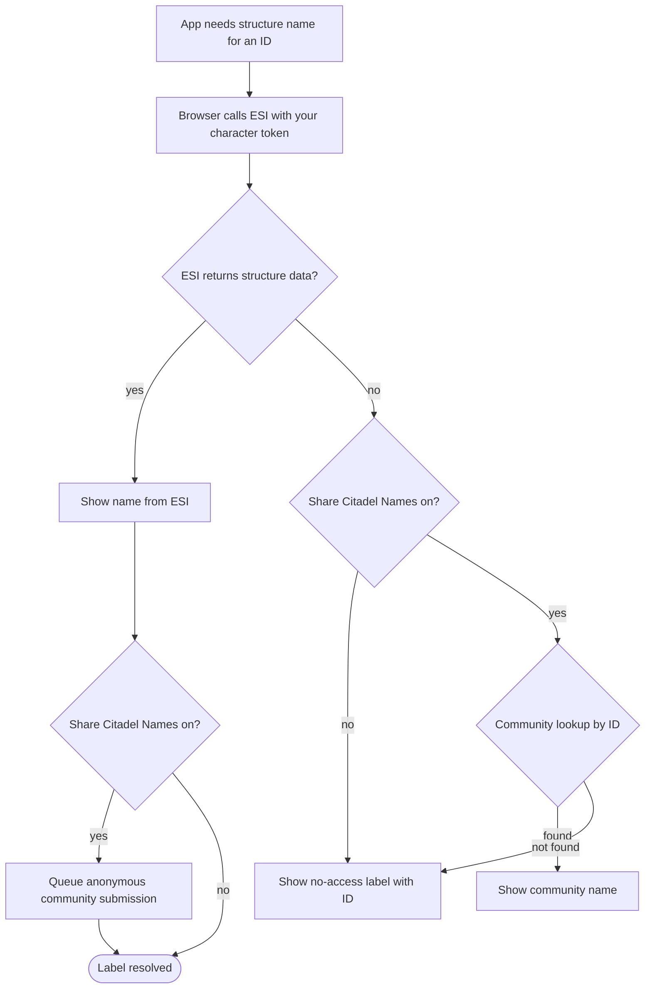

# Citadel Names

In EVE Online, assets and hangars in player-owned structures (citadels, engineering complexes, refineries, and similar) are identified by numeric structure IDs. EVE’s API (ESI) only returns the structure name when one of your linked characters has docking access to that structure in-game.

When you do not have access, asset screens would otherwise show an unknown or generic label. Eve Industry Planner reduces that gap with a community citadel name pool: structure names that other users’ clients have learned via ESI and contributed anonymously.

## Where you control it

- Accounts page — Community Citadel Names panel (switch: Share Citadel Names)
- First-login setup — Same switch under the Citadel names step when you first configure the app

The setting is saved on your account like other preferences and follows you across devices. New accounts default to sharing enabled (opt-out, not opt-in).

## Share Citadel Names — what the switch does

The switch controls both contributing names and using the community pool when ESI cannot resolve a structure for you.

### When the switch is on (default)

1. Your browser asks EVE’s API (ESI) using your character’s access token—the same as any other in-game data the app loads.
2. If ESI returns structure data (your character has access), the app shows that name and may add it anonymously to the community pool (structure ID, name, solar system, type, and position from ESI).
3. If ESI cannot return the name (no access, error, etc.), the app looks up the structure ID in the shared community list. If a name exists, it is shown as a community-sourced label.

Contributions are grouped and sent in the background; they are not linked to your planner account in the community database.

### When the switch is off

1. ESI is still queried the same way when the app needs a structure name.
2. No names are submitted to the community from your client.
3. If ESI fails, the app does not fall back to community data. You see a no-access style label (structure ID only) instead of another player’s submitted name.

Turn the switch off if you want to opt out of both sharing and using community name data.

## Privacy and data handling

- Anonymous storage — Community names are stored by structure ID, not linked to your planner account or character in the shared name list.
- ESI stays on your side — Structure lookups against EVE’s API use your character’s token in the browser. The planner only stores or retrieves community names you or others have contributed—not your ESI credentials for structure reads.
- What gets submitted — When sharing is on and ESI returns a structure, the app contributes the same details ESI gave you: ID, name, solar system, type, and position. You must be logged in to contribute; anyone can look up a name by ID from the shared list.

## How EVE resolves structure names

When the app needs a player structure name, it asks EVE’s API for that structure ID ([Get universe structure information](https://developers.eveonline.com/api-explorer#/operations/GetUniverseStructuresStructureId)). The request uses your character’s access token. EVE only returns a name when your character has docking access; on success you get the structure’s name, system, type, and position.

With Share Citadel Names on, those same details are what can be added to the community pool—nothing extra from your account.

| What EVE returns | Why it matters |
|------------------|----------------|
| Structure ID | How assets and the community list refer to the structure |
| Name | What you see in hangar and asset lists when you have access |
| Solar system | Where the structure is located |
| Structure type | Citadel, engineering complex, refinery, and so on |
| Position | In-system coordinates (stored when contributed) |

Community lookups by ID return at least the name; older entries may also include system, type, and position.

For full API details (scopes, errors, schema), see CCP’s [API Explorer page](https://developers.eveonline.com/api-explorer#/operations/GetUniverseStructuresStructureId).

## Where you see the results

Structure name resolution is used wherever the app needs to label a player structure location, especially in the [Asset Library](asset%20library) and other views that list where items are stored. Typical outcomes:

| Situation | Label you see |
|-----------|----------------|
| Your character has docking access | Official name from ESI |
| No access, sharing on, community has the ID | Community name |
| No access, sharing off | No-access label with structure ID |
| No access, sharing on, community has no entry | No-access label with structure ID |

Community names are cached so repeated views stay fast.

## How it fits together

## Related pages

- [Accounts](accounts) — Main account, linked characters, and the Share Citadel Names switch
- [Asset Library](asset%20library) — Asset locations where structure names matter most
