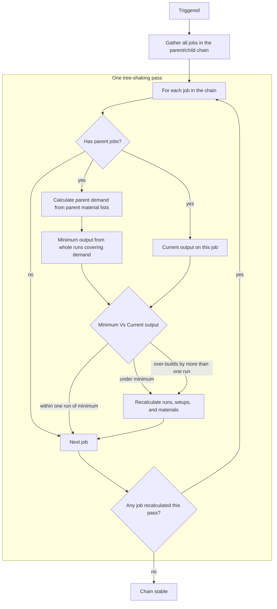

# Material Tree Shaker

When [planner jobs](job%20planner) are linked as [parent and child](parent%20and%20child%20jobs), a job that has parent jobs should plan enough output to cover what those parents list on their material lists. 

The material tree shaker is the app’s process for fixing that. It performs tree shaking over the entire linked chain: for each job that has parent jobs, it looks up at those parents’ material lists and scales planned output up or down to match. [Output jobs](groups#output-jobs--what-you-are-building) (no parent jobs—the final products at the top of the chain) are left as you set them. The process repeats until quantities stabilise and no further changes are made.

## Where it runs

The material tree shaker is not something you click directly. Tree shaking runs automatically in these places:

| Trigger | When | Can you turn it off? |
|---------|------|----------------------|
| [Build Child Jobs](groups#left-menu-actions) (group left menu) | After new child jobs are created and linked for the next ingredient tier | No — tree shaking always runs at end of build |
| [Build Full Tree](groups#left-menu-actions) (group left menu) | After the full material tree is built downward from selected jobs | No — tree shaking always runs at end of build |
| Close [Edit Job](edit%20job) with changes | When you save/close a job whose quantities or parent/child links changed | Yes — [Automatically Recalculate Jobs](settings/blueprint#automatically-recalculate-jobs) in [Blueprint Settings](settings/blueprint) (default on) |

Not included: [Add Ingredient Jobs](job%20planner#left-menu) on the main Job Planner uses a different bulk-build path and does not run the material tree shaker afterward.

## How tree shaking works

Each pass walks every job in the connected parent/child chain (the job you edited plus all jobs linked to it through parent/child relationships).

For each job:

- [Output job](groups#output-jobs--what-you-are-building) (no parent jobs) → skip — tree shaking does not compare or change its quantity.
- Has parent jobs → look up the chain and continue with the steps below.

When a job has parent jobs:

1. Calculate parent demand — Add up how many units of this job’s product appear on parent jobs’ material lists (summed across all parents that consume this item).
2. Calculate minimum whole runs — From parent demand, work out whole blueprint runs and the minimum output used in the comparison below:  
   `needed runs = ceil(parent demand ÷ output per run)` → `minimum output = needed runs × output per run`
3. Minimum vs current output — Compare that minimum to current output on this job:
   - Under minimum → recalculate the job (rebuild setups, runs, and material totals).
   - Over-builds by more than one run (`current > minimum + output per run`) → recalculate down to shake off excess.
   - Within one run of minimum → leave unchanged.
4. Next job — Continue through every job in the chain.

After a full scan, if any job was recalculated, the material tree shaker runs another pass—because changing one job updates material quantities on its parents, which changes parent demand for other linked jobs. The loop stops when a pass changes nothing, or after 100 iterations (safety cap).

Recalculation itself rebuilds job setups and refreshes material and product totals to match the new required quantity.

## Rules worth remembering

| Situation | Tree-shaking behaviour |
|-----------|------------------------|
| Under minimum for parent demand | Recalculated up |
| Over-builds by more than one run | Recalculated down |
| Within one run of minimum | Left unchanged |
| Output job (no parent jobs) | Left unchanged — quantity is your build target, not parent demand |
| Job outside the linked chain | Not included in the pass |

Output jobs are the same term used on [Groups](groups#output-jobs--what-you-are-building). Tree shaking does not change their planned quantity because it has nothing to look up to. You set how many to build; for every other job in the chain, tree shaking reads parent jobs’ material lists and resizes planned output to match.

Practical tip: When editing a chain manually, start at the top (output jobs) and work down. If you edit a job lower in the chain first, a later tree-shaking pass triggered from a parent edit can still resize it to match new parent demand.

## Settings and scope

- Edit Job close — Controlled by [Automatically Recalculate Jobs](settings/blueprint#automatically-recalculate-jobs) on [Blueprint Settings](settings/blueprint). Turn it off if you want full manual control over quantities after each edit.
- Build Child Jobs / Build Full Tree — The material tree shaker always runs after those actions complete inside a [group](groups); it aligns new and existing jobs in the group chain together.

Tree shaking adjusts quantities, setups, and material totals. It does not change market prices, structure choices, or purchasing records—it keeps the production plan consistent across linked jobs.

## Related pages

- [Parent and child jobs](parent%20and%20child%20jobs) — How production links define the chain
- [Groups](groups) — Output jobs, Build Child Jobs, and Build Full Tree
- [Edit Job](edit%20job) — Where manual quantity and link edits can trigger tree shaking on close
- [Blueprint Settings](settings/blueprint) — Automatically Recalculate Jobs toggle
- [Job Planner](job%20planner) — Main board (contrast with group build actions)
