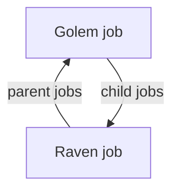

# Parent and child jobs

Planner jobs can be linked into a production chain: what one job produces is used by another.

The app calls these parent/child links—or parent and child jobs—and you will see the terms throughout the app and wiki.

- Parent jobs — Other jobs above this one in the chain: jobs that consume this job’s output on their material lists.
- Child jobs — Other jobs below this one in the chain: jobs that supply materials this job needs.

A job can link to any number of partners in either direction (one-to-many both ways), as long as the item types match.
## What these relationships allow

Linked jobs behave as one chain instead of an individual planner job. You can pass finalised build costs from lower jobs up to parent jobs, allowing you to pass accurate costs automatically without manually inputting each time. Child links let you look the other way: in [planning](edit%20job/planning), [purchasing](edit%20job/purchasing), and [material prices](edit%20job/planning/material%20prices), you can use these links to estimate input costs across the chain at anypoint in time.

These links are also used by the [material tree shaker](material%20tree%20shaker) to read material requirements and keep production quantities accurate.

## Example

A Golem build needs a Raven hull on its material list. Link the two planner jobs:

- On the Golem job → Child jobs lists the Raven hull job (who is supplying my input).
- On the Raven hull job → Parent jobs lists the Golem job (who needs my output).

From the Golem’s side, Raven is a child job; from the Raven’s side, Golem is a parent job. 

## Related pages

- [Edit Job](edit%20job) — Parent jobs row and job layout
- [Material tree shaker](material%20tree%20shaker) — Quantity alignment across linked jobs
- [Groups](groups) — Output jobs and building chains in a project
- [Job Planner](job%20planner) — Add Ingredient Jobs to start from the bottom
