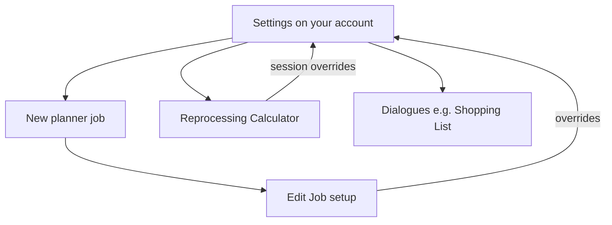

# Settings

The Settings page is where you tune Eve Industry Planner to match how you play—market hubs, structure presets, automatic job building, planner layout, and reprocessing defaults. Open it from the main navigation (`/settings`). Everything here saves to your account and syncs across devices when you are logged in.

## What lives here

The page has five tabs. Each has its own wiki page with full detail:

| Tab | What you configure |
|-----|-------------------|
| [Layout Settings](settings/layout) | Help cards, compact job cards, custom workflow stage names |
| [Job Settings](settings/job) | Default market hub and order type, asset location, citadel broker fee, system indexes, extras categories |
| [Custom Structures](settings/custom%20structures) | Saved manufacturing, reaction, invention, and reprocessing structure presets |
| [Blueprint Settings](settings/blueprint) | Default ME, [automatic recalculation / material tree shaker](material%20tree%20shaker), blueprint skips, materials to ignore |
| [Reprocessing Settings](settings/reprocessing%20settings) | Default character for the [Reprocessing Calculator](reprocessing%20calculator) |

## How defaults flow into the app

Account settings are the fallback layer. Many screens let you override them for one job or one session:

- New jobs inherit market, asset location, blueprint ME, and default custom structures from settings.
- [Edit Job](edit%20job) setups override structure, system, and markets per run.
- [Groups](groups) use the same defaults when you Build Child Jobs or Build Full Tree inside a project.

You do not need to revisit Settings for every build—set sensible defaults once, then adjust individual jobs when a hull runs in a different system or hub.

## How settings are saved

There is no Save button on the Settings page. Changes write to your account and sync across devices when you are logged in.

| Change type | When it saves |
|-------------|----------------|
| Toggles and dropdowns (layout, job, blueprint, reprocessing) | A moment after you change them (debounced) |
| Job stage names | On each edit (debounced) |
| Predefined system indexes | When you add or remove an entry |
| Extras categories | When you add, delete, or restore a category |
| Materials to ignore | Immediately when you add or remove a chip |
| Custom structures | When you add, set default, or remove a preset |

Blueprint dropdowns and switches may save immediately on change rather than debounced—either way you do not need to press Save.

## Related pages

- [Job Planner](job%20planner) — Workflow board affected by layout and blueprint defaults
- [Edit Job](edit%20job) — Per-job overrides for structures and markets
- [Accounts](accounts) — Linked characters used in asset locations and reprocessing defaults
- [Reprocessing Calculator](reprocessing%20calculator) — Uses reprocessing character and structure defaults
- [Material tree shaker](material%20tree%20shaker) — Tree shaking keeps linked job quantities aligned
